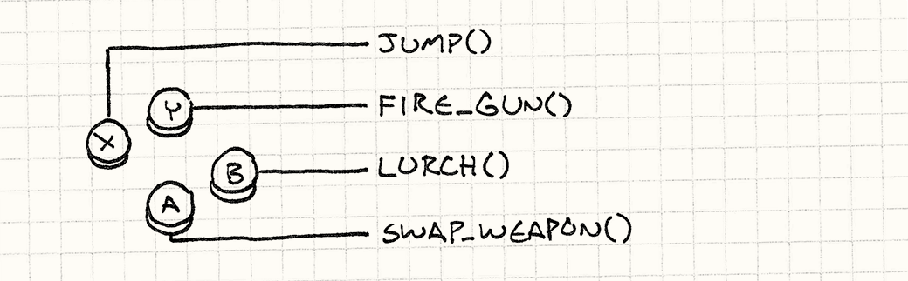
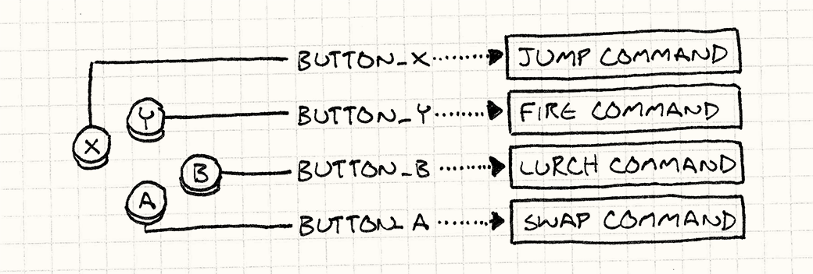
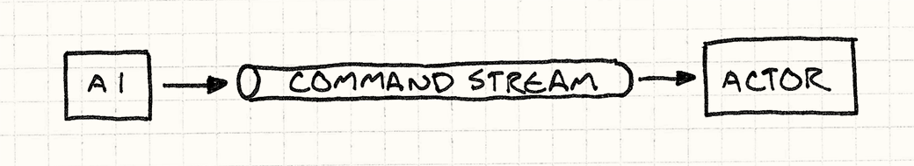
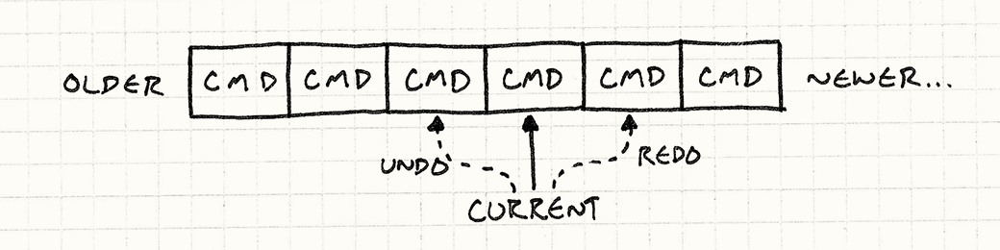

# Команда (Command)

Команда — это один из моих любимых шаблонов. В большинстве программ, которые я писал — и в играх, и в других программах так или иначе находилось применение для этого шаблона. Не раз с его помощью мне удавалось распутать довольно корявый код. Для такого важного шаблона банда четырех приготовила ожидаемо заумное описание:

> Инкапсуляция запроса в внутри объекта, позволяющая пользователю параметризировать клиенты с помощью различных запросов, организовывать в очереди или регистрировать запросы или организовывать поддержку отменяемых операций.

Можно ли согласиться с таким ужасным приговором? Прежде всего он искажает все, что данная метафора способна предложить. За пределами странного мира программ, где слова могут означать что угодно, слово "клиент" означает *личность* — кого-то, с кем вы имеете дело. Причем обычно других людей не принято "параметризировать".

Дальше идет просто перечисление того, где можно применять шаблон. Не слишком очевидно, конечно если ваш вариант использования прямо не указан в этом перечне. *Мое* краткое определение данного шаблона гораздо проще:

**Команда — это материализация вызова метода.**

> Материализовать (по-английски Reify) происходит от латинского "res", что значит "вещь (thing)" с английским суффиксом "-fy". Т.е. можно было бы использовать слово "овеществить (thingfy)", что, честно, было бы более забавным термином.

Конечно, "краткое" не всегда означает "достаточное", так что толку от этого по прежнему мало. Давайте немного углубимся в суть дела. "Материализовать", чтобы вы знали, означает буквально "сделать реальным". Еще один термин материализации — это объявление чего либо "объектом первого класса". 

> *Система отражений* (Reflection systems) в некоторых языках позволяют вам работать с типами в программе императивно. Вы можете создать объект, представляющий собой класс другого объекта и с его помощью понимать, что этот объект может делать. Т.е. мы получаем *овеществленную систему типизации*.

Оба термина означают, что мы возьмем некую *концепцию* и превратим ее в *набор данных* — объект, который можно поместить в переменную, передать в функцию и т.д. Таким образом если мы говорим, что команда — это "материализация вызова метода" — это означает что вызов метода оборачивается некоторым объектом.

Есть много разных названий: "обратный вызов", "функция первого класса", "указатель на функцию", "замыкание (closure)", "частично примененная функция  (partially applied function)", в зависимости от языка, к которому вы привыкли. Однако все это одного поля ягоды. Банда четырех немного дальше уточняет:

*Команда — это объектно- ориентированная замена обратного вызова.*

Это уже гораздо полезнее для осмысленного выбора шаблона.

Но пока это все абстрактно и слишком туманно. Я хочу начать главу с чего-то конкретного, и сейчас я это сделаю. Чтобы это сделать, мне понадобится пример, в котором применение команды будет смотреться идеально.

## Настройка ввода

Внутри каждой игры есть код, отвечающий за считывание пользовательского ввода — нажатия на кнопки, клавиатурные события, нажатия мыши и т.д. Этот код обрабатывает ввод и преобразует его в соответствующие действия в игре:



Самая примитивная реализация выглядит следующим образом:

```C++
void InputHandler::handleInput()
{
  if (isPressed(BUTTON_X)) jump();
  else if (isPressed(BUTTON_Y)) fireGun();
  else if (isPressed(BUTTON_A)) swapWeapon();
  else if (isPressed(BUTTON_B)) lurchIneffectively();
}
```

> Совет профессионала: Не нажимайте B слишком часто.

Такая функция обычно вызывается на каждом кадре внутри [игрового цикла (Game Loop)](../chapter-3/3.2-game-loop.md). Думаю, вам понятно что она делает. Здесь мы видим жесткую привязку пользовательского ввода с действиями в игре. Однако многие игры позволяют пользователям *настраивать* какие кнопки за что отвечают.

Для того, чтобы это стало возможным нам нужно преобразовать прямые вызовы ```jump()``` и ```fireGun()``` в нечто, что мы сможем свободно менять местами. "Менять местами" звучит как присвоение значений переменным, поэтому нам нужен объект, который будет представлять игровое действие. И тут в дело вступает шаблон *Команда*. 

Для начала определим базовый класс, представляющий запускаемую игровую команду:

```C++
class Command
{
public:
  virtual ~Command() {}
  virtual void execute() = 0;
};
```

> Когда у вас появляется интерфейс с единственным методом, который ничего не возвращает — с большой долей вероятности можно предположить что это шаблон *Команда*.

Теперь создадим дочерние классы для каждой из различных игровых команд:


```C++
class JumpCommand : public Command
{
public:
  virtual void execute() { jump(); }
};

class FireCommand : public Command
{
public:
  virtual void execute() { fireGun(); }
};

// Ну вы поняли...
```

В нашем обработчике ввода мы будем хранить указатели на команду для каждой кнопки:

```C++
class InputHandler
{
public:
  void handleInput();

// Методы для привязки команд...

private:
  Command* buttonX_;
  Command* buttonY_;
  Command* buttonA_;
  Command* buttonB_;
};
```

Теперь обработка ввода сводится к делегированию такого вида:

```C++
void InputHandler::handleInput()
{
  if (isPressed(BUTTON_X)) buttonX_->execute();
  else if (isPressed(BUTTON_Y)) buttonY_->execute();
  else if (isPressed(BUTTON_A)) buttonA_->execute();
  else if (isPressed(BUTTON_B)) buttonB_->execute();
}
```

Обратите внимание, что проверки на ```NULL``` здесь нет. Подразумевается, что к каждой кнопке привязана определенная команда.

Если мы и в сам деле хотим иметь кнопку, которая ничего не делает, то нам все равно не нужно добавлять проверку на ```NULL```. Вместо этого нам нужно реализовать команду, метод ```execute()``` которой ничего не делает. И потом вместо установки обработчика кнопки в ```NULL``` мы будем подставлять указатель на этот объект. Такой шаблон носит название [Нулевой объект (Null Object)](http://en.wikipedia.org/wiki/Null_Object_pattern).

Там, где раньше пользовательский ввод напрямую вызывал функции, теперь у нас появился промежуточный слой косвенности:



В этом и заключается сущность шаблона *Команда*. Если вы уже оценили его по-достоинству, оставшуюся часть главы можете рассматривать как бонус.

## Указания для актеров

Классы команд, которые мы только что определили, отлично работают для примера выше, но их возможности все-таки сильно ограничены. Проблема в том, что мы предполагаем что у нас уже есть готовые функции высокого уровня ```jump()```, ```fireGun()``` и т.д., которые сами знают, как найти персонаж игрока и заставить его плясать под нашу дудку.

Такое предположение значительно снижает применимость наших команд. Получается что команда ```JumpCommand``` — это единственное, что способно заставить прыгать только нашего игрока. Давайте избавимся от этого ограничения. Вместо того, чтобы запускать функцию, которая будет сама искать объект для воздействия, мы сами передадим ей объект, которым хотим управлять:

```C++
class Command
{
public:
  virtual ~Command() {}
  virtual void execute(GameActor& actor) = 0;
};
```

Здесь в качестве ```GameActor``` выступает наш класс "игровой объект", представляющий игрока в игровом мире. Мы передаем его в ```execute()``` и таким образом изолированная команда получает возможность вызвать метод выбранного нами актера:

```C++
class JumpCommand : public Command
{
public:
  virtual void execute(GameActor& actor) {
    actor.jump();
  }
};
```

Теперь мы можем использовать этот единственный класс, чтобы заставить прыгать любого в нашей игре. Правда у нас пока еще нет прослойки между обработчиком ввода и командой, которая собственно получает команду и применяет ее к нужному объекту. Для начала мы изменим ```handleInput()``` таким образом, чтобы она возвращала команду:

```C++
Command* InputHandler::handleInput()
{
  if (isPressed(BUTTON_X)) return buttonX_;
  if (isPressed(BUTTON_Y)) return buttonY_;
  if (isPressed(BUTTON_A)) return buttonA_;
  if (isPressed(BUTTON_B)) return buttonB_;
  
  // Если ничего не передано, то ничего и не делаем.
  return NULL;
}
```

Функция не может выполнить команду немедленно, потому что не знает какого актера ей передать. Зато мы можем воспользоваться тем преимуществом команды, что это материализованный вызов — мы можем *отложить* выполнение.

Теперь нам нужен код, который получит команду и передаст в нее актера, представляющего игрока. Нечто наподобие:

```C++
Command* command = inputHandler.handleInput();
if (command)
{
  command->execute(actor);
}
```

Предполагая, что ```actor``` указывает на персонажа игрока, мы получаем корректную реализацию того, чего добивались, т.е. мы вернулись к тому же поведению, что и в самом первом примере. Добавив слой косвенности между командой и актером, который ее выполняет, мы получили еще одну приятную способность: *теперь мы можем позволить игроку управлять любым актером в игре, просто подменяя актера, к которому применяется команда*.

На практике такая возможность используется не слишком часто. Но похожий вариант использования все равно часто всплывает. До сих пор мы упоминали только управляемых игроком персонажей. А что насчет остальных? Тех, которые управляются игровым ИИ. Мы можем использовать тот же самый шаблон в качестве интерфейса между движком ИИ и актерами: код ИИ просто будет вызывать объекты ```Command```.

Уменьшение связности в данном случае, когда ИИ выбирает команду, а код актера ее выполняет, дает нам дополнительную гибкость. Мы получаем возможность использовать разные модули ИИ для разных актеров. Или же мы можем их смешивать и выстраивать ИИ для разных стилей поведения. Вам нужен более агрессивный противник? Просто подключите более агрессивный ИИ, чтобы им управлять. На самом деле мы можем даже передать на попечение ИИ персонаж *игрока*, что довольно удобно для демо-режима, когда игра работает на автопилоте.

Делая команду, управляющую актером объектом первого класса, мы избавляемся от жесткой привязки прямого вызова методов. Вместо этого можете думать об этом,  как об очереди или потоке команд.

> Более подробно о такой очередности можно почитать в [Очереди событий (Event Queue)](../chapter-5/5.2-event-queue.md).



> И почему, интересно, мне захотелось изобразить для вам такой "поток"? И почему он имеет форму трубки?


Некоторый код (обработчик ввода или ИИ) генерирует команды и добавляет их в поток. Другой код (диспетчер или сам актер) поглощает команды и вызывает их. Поместив такую очередь в середину, мы уменьшили связность между производителем с одной стороны и потребителем с другой.

> Если мы сделаем такую команду *сериализуемой*, мы сможем пересылать их очередность по сети. Сможем взять пользовательский ввод, передать его по сети и воспроизвести на другой машине. Именно такой механизм лежит в основе многопользовательских игр.

## Отмена и повтор

Последний пример — это самый известный способ применения данного шаблона. Если объект команда может *выполнять* действия, значит мы уже сделали маленький шаг к тому, чтобы получить возможность их *отменять*. Отмену можно встретить в некоторых стратегических играх, когда вы имеете возможность отменить последнее не понравившееся вам действие. Такая функциональность *обязательно присутствует* и в инструментах, которые используются для *создания* игр. Лучший способ заставить гейм-дизайнера ненавидеть вас — это выдать ему инструментарий, в котором нельзя отменить того, что он наворотил своими толстенькими пальчиками.

> Это я могу утверждать на собственном опыте.

Без шаблона *Команда*, реализация отмены довольно сложна. С ним — пара пустяков. Для примера предположим, что мы разрабатываем однопользовательскую пошаговую игру и хотим разрешить игроку отменять ходы, чтобы он мог больше сосредоточиться на стратегии, а не на угадывании.

Мы уже оценили удобство использования команды для абстрагирования пользовательского ввода, поэтому каждый ход игрока у нас уже инкапсулирован в команду. Например, движение юнита может выглядеть следующим образом:

```C++
class MoveUnitCommand : public Command
{
public:
  MoveUnitCommand(Unit* unit, int x, int y)
  : unit_(unit), x_(x), y_(y)
  {}

  virtual void execute() {
    unit_->moveTo(x_, y_);
  }

private:
  Unit* unit_;
  int x_, y_;
};
```

Обратите внимание на небольшое отличие от нашей предыдущей команды. В предыдущем примере мы хотели *абстрагировать* команду от актера, на которого она действует. В этом же случае мы специально хотим *привязать* ее к актеру, которого она двигает. Экземпляр этой команды — это не обобщенная операция "перемещающая что либо", которую можно применить в самом разном контексте, а конкретный отдельный шаг в очереди шагов игры.

Это показывает насколько вариативным может быть применение данного шаблона. В некоторых случаях, как наша первая парочка примеров, команда — это многоразовый (reusable) объект, представляющий *действие, которое можно выполнить*. Наш первый пример обработки ввода сводился к единственному вызову метода ```execute()``` по нажатию нужной кнопки.

А вот более специфическая команда. Она описывает вещи, которые можно сделать в определенный момент. Это значит, что код обработчика ввода будет *создаваться* каждый раз, когда игрок решит двинутся. Выглядеть это будет следующим образом:

```C++
Command* handleInput()
{
  // Выбираем юнит...
  Unit* unit = getSelectedUnit();

  if (isPressed(BUTTON_UP)) {
    // Перемещаем юнит на единицу вверх.
    int destY = unit->y() — 1;
    return new MoveUnitCommand(unit, unit->x(), destY);
  }

  if (isPressed(BUTTON_DOWN)) {
    // Перемещаем юнит на единицу вниз.
    int destY = unit->y() + 1;
    return new MoveUnitCommand(unit, unit->x(), destY);
  }

  // Другие шаги...

  return NULL;
}
```

> Конечно, в языках без сборщика мусора, наподобие ```C++```, это означает, что выполняющий команды код также должен заботиться и об освобождении памяти, занимаемой командами.

Тот факт, что команды получаются одноразовыми дает нам определенные преимущества. Чтобы сделать команды отменяемыми, мы определим еще одну операцию, которую должен реализовывать каждый класс команд:

```C++
class Command
{
public:
  virtual ~Command() {}
  virtual void execute() = 0;
  virtual void undo() = 0;
};
```

Метод ```undo()``` возвращает игру в то состояние, в котором она была до выполнения соответствующего метода ```execute()```. Вот наша последняя команда, дополненная поддержкой отмены:

```C++
class MoveUnitCommand : public Command
{
public:
  MoveUnitCommand(Unit* unit, int x, int y)
  : unit_(unit), xBefore_(0), yBefore_(0),
  x_(x), y_(y)
  {}

  virtual void execute() {
    // Запоминаем позицию юнита перед ходом
    // чтобы потом ее восстановить.
    xBefore_ = unit_->x();
    yBefore_ = unit_->y();
    
    unit_->moveTo(x_, y_);
  }
  
  virtual void undo() {
    unit_->moveTo(xBefore_, yBefore_);
  }

private:
  Unit* unit_;
  int xBefore_, yBefore_;
  int x_, y_;
};
```

Обратите внимание, что мы добавили в класс больше состояний. После того, как мы переместили юнит, ему неоткуда узнать, где он был раньше. Чтобы иметь возможность отменить перемещение, нам нужно запомнить предыдущую позицию самостоятельно. Вот для этого мы и добавляем в команду ```xBefore_``` и ```yBefore_```.

> Похоже здесь хорошо смотрелся бы шаблон [Хранитель (Memento pattern) <sup>GoF</sup>](http://en.wikipedia.org/wiki/Memento_pattern), но мне не удалось заставить его работать эффективно. Так как целью команды является изменение только небольшой части состояния объекта, сохранение и всех остальных данных тоже — напрасная трата памяти. Дешевле просто вручную хранить только необходимые биты, которые вы меняете.

> Еще один вариант — [Постоянные структуры данных (Persistent data structures)](http://en.wikipedia.org/wiki/Persistent_data_structure). При этом при каждом изменении объекта возвращается новый объект, а старый остается неизменным. В разумной реализации эти новые объекты разделяют данные со старыми и в результате, такой подход гораздо разумнее, чем клонирование объектов целиком.

> При их использовании каждая команда хранит ссылку на объект перед выполнением команды и отмена означает просто возврат к старому объекту.

Чтобы позволить игроку отменить движение, нам нужно сохранить последнюю выполненную им команду. И потом, когда мы жмакнем ```Ctrl-Z```, мы просто вызовем метод ```undo()```. (Если мы уже выполнили отмену, то по нажатию на ту же кнопку можно выполнить команду повтор и выполнить команду снова.)

Поддержка множественной отмены не намного сложнее. Вместо того, чтобы просто запоминать последнюю команду, мы будем хранить список команд и ссылку на "текущую". Когда игрок выполняет команду, она добавляется в список команд и помечается как "текущая".



Когда игрок выбирает "Отмена", мы отменяем текущую команду и сдвигаем указатель на одну позицию назад. Когда мы выполняем повтор, мы перемещаем указатель на позицию вперед и выполняем команду. Когда игрок после отмены выполняет новую команду, все содержимое списка после текущей команды выбрасывается.

Когда я первый раз реализовал это в редакторе уровней, я почувствовал себя волшебником. Я был изумлен насколько прямолинейным является это решение и насколько хорошо оно работает. Конечно вам потребуется некоторая дисциплина, чтобы оформить все модификации в виде команд, но как только вы с этим справитесь — дальше все будет просто.

> Повтор встречается в играх не часто, а вот повторное проигрывание — очень часто. Прямолинейная реализация могла бы записывать состояние всей игры целиком на каждом кадре. Но такой подходи потребует слишком много памяти.

> Вместо этого многие игры записывают набор команд, выполненных на каждом кадре. Чтобы проиграть игру заново, движок просто запускает игру в обычном режиме и выполняет предварительно записанные команды.

## Круто или бесполезно?

Как я говорил раньше, команды похожи на функции первого класса или замыкания, однако во всех примерах мы использовали определение классов. Если вы знакомы с функциональным программированием, вам наверное интересно — где же функции?

Я написал примеры таким образом, потому что поддержка функций первого класса в ```C++``` весьма ограничена. Указатели на функции не имеют состояния, функторы — странные и все равно требуют определения классов, а лямбды в ```C++11``` сложны в работе из-за ограничений ручного управления памятью.

При этом я *не* утверждаю, что вы не можете использовать для реализации шаблона *Команда* функции в других языках. Если вам доступна роскошь в виде языка с поддержкой настоящих замыканий — используйте их конечно! В некоторых случаях шаблон *Команда* вообще используется в языках, не поддерживающих замыкания для их эмуляции.


> Я говорю о некоторых способах, потому что разработка настоящих классов или структур для команд может быть полезна даже в языках, поддерживающих замыкания. Если в вашей команде поддерживается много операций (как в отменяемых командах), привязка их к единственной функции будет смотреться неуклюже.

> Определение настоящего класса с полями дает возможность читающему код явно видеть какие данные содержит команда. Замыкания прекрасны в своей немногословности для оборачивания состояния, но они могут быть настолько автоматизированными, что будет сложно понять что собственно они хранят.


Например, если мы пишем игру на ```JavaScript```, мы можем написать команду движения следующим образом:

```C++
function makeMoveUnitCommand(unit, x, y) {
  // эта функция представляет собой объект команды:
  return function() {
    unit.moveTo(x, y);
  }
}
```

С помощью пары замыканий мы можем реализовать отмену (undo):

```C++
function makeMoveUnitCommand(unit, x, y) {
  var xBefore, yBefore;
  return {
    execute: function() {
      xBefore = unit.x();
      yBefore = unit.y();
      unit.moveTo(x, y);
    },
    undo: function() {
     unit.moveTo(xBefore, yBefore);
    }
 };
}
```

Если вам комфортно работать в функциональном стиле, такой способ покажется для вас естественным. Если нет, я надеюсь эта глава вам немного помогла. Для меня осознание полезности шаблона *Команда* стало важным шагом в понимании полезности всей парадигмы функционального программирования в целом.

## Смотрите также

* Вы можете наплодить достаточно большое количество классов команд. Чтобы упростить их определение, можно создать общий базовый класс с кучей удобных высокоуровневых методов, которые наследующие классы комманд могут комбинировать для формирования своего поведения. В таком случае главный метод команды ```execute()``` превращается в [Подкласс песочница (Subclass Sandbox)](../chapter-4/4.2-subclass-sandbox.md).

* В наших примерах мы явно указывали какой актер должен выполнять команду. В некоторых случаях, особенно когда модель объекта организована иерархически, все может быть не столь очевидно. Объект может ответить на команду, а может перепоручить ее выполнение какому либо другому подчиненному объекту. Если вы это сделаете, вы получите [Цепочку ответственности (Chain of Responsibility)  <sup>GoF</sup>](http://en.wikipedia.org/wiki/Chain-of-responsibility_pattern).

* Некоторые команды представляют собой прямолинейное поведение как в примере с ```JumpCommand```. В этом случае иметь больше одного экземпляра класса — пустая трата памяти, потому что все экземпляры идентичны. В такой ситуации вам пригодится класс [Приспособленец (Flyweight)](../chapter-2/2.2-flyweight.md).

Можно применять и [Синглтон (Singleton)](../chapter-2/2.5-singleton.md), но друзья не позволяют создавать друзьям синглтоны.
