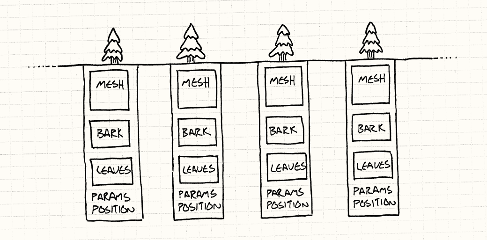
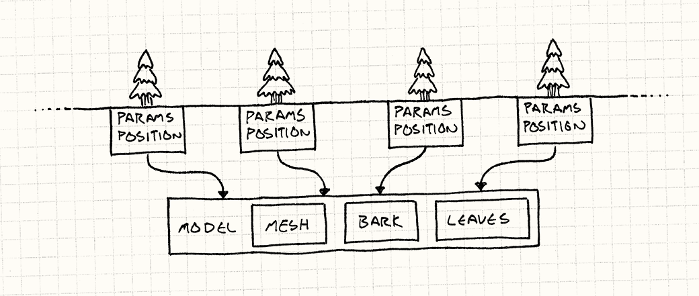
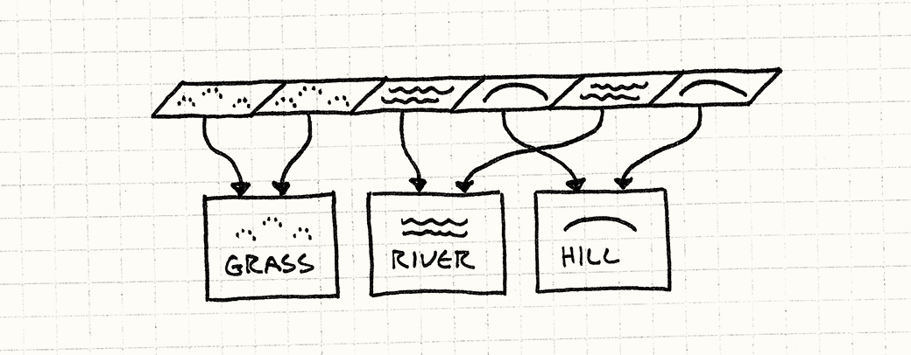

# Приспособленец (Flyweight)

Туман рассеивается, открывая нашему взгляду величественный старый лес. Бесчисленные кедры образуют над вами зеленый свод. Ажурная листва пронизывается отдельными лучиками света, окрашивая туман в желтые цвета. Меж гигантских стволов виден бесконечный лес вокруг.

О таких сценах внутри игры мы как игровые разработчики и мечтаем. И именно для таких сцен как нельзя лучше подходит скромный шаблон с именем *Приспособленец (Flyweight)*.

## Лес для деревьев

Я могу описать целый лес всего несколькими предложениями, но *реализация* его в настоящей игре — совсем другая история. Если вам захочется вывести на экране весь лес из индивидуальных деревьев целиком, любой графический программист сразу увидит миллионы полигонов, которые придется обработать видеокарте на каждом кадре.

Мы говорим именно о тысячах деревьев, геометрия каждого из которых достаточно детализирована и насчитывает тысячи полигонов. Даже, если у вас найдется достаточно *памяти*, чтобы это все уместить, для того, чтобы отрендерить лес целиком, вам нужно будет пропустить это все через шины процессора и видеокарты.

С каждым деревом связаны следующие данные:

* Полигональная сетка, описывающая его ствол, ветви и листву.
* Текстура коры и листьев.
* Положение и ориентация в лесу.
* Индивидуальные настройки, такие как размер и оттенок, благодаря которым каждое дерево в лесу будет выглядеть индивидуально.

Если набросать описывающий все это код, получится нечто подобное:

```C++
class Tree
{
private:
  Mesh mesh_;
  Texture bark_;
  Texture leaves_;
  Vector position_;
  double height_;
  double thickness_;
  Color barkTint_;
  Color leafTint_;
};
```

Целая куча данных и здоровенные полигональная сетка и текстура. Весь лес определенно не получится запихнуть целиком в видеокарту на каждом кадре. К счастью есть проверенный временем способ обойти это ограничение.

Дело тут в том, что даже несмотря на то, что деревьев в лесу тысячи, выглядят они довольно похоже. Потому что все используют одни и те же сетку и текстуру. Это значит, что большинство полей в объекта идентичны для всех его экземпляров.

> Я бы посчитал безумцем или миллиардером того, кто стал бы делать для каждого дерева отдельную модель.



> Обратите внимание, что данные в прямоугольнике одинаковы для всех деревьев.

Мы можем это явно cмоделировать путем разделения объекта пополам. Мы вытаскиваем общие для всех деревьев данные, и перемещаем их в отдельный класс:

```C++
class TreeModel
{
private:
  Mesh mesh_;
  Texture bark_;
  Texture leaves_;
};
```

Игре нужен только один экземпляр этого класса, потому что нам незачем иметь тысячи копий одной и той же сетки и текстуры. Поэтому каждый экземпляр дерева в мире должен иметь *ссылку* на общий ```TreeModel```. Остальные данные являются индивидуальными для каждого экземпляра:

```C++
class Tree
{
private:
  TreeModel* model_;

  Vector position_;
  double height_;
  double thickness_;
  Color barkTint_;
  Color leafTint_;
};
```

Результат можно изобразить следующим образом:



> Это очень напоминает шаблон [Объект тип (Type Object)]](../chapter-4/4.3-type-object.md). Оба основаны на делегировании части состояния объекта другому объекту, разделяемому между многими экземплярами. Только области применения у этих шаблонов разные.

> Область применения шаблона *Объект тип* — это минимизация количества классов, которые вам нужно определять при добавлении "типов" в свою модель объектов. В качестве бонуса вы получаете разделение памяти. А вот шаблон *Приспособленец* в первую очередь предназначен для увеличения эффективности использования памяти.

Это конечно все хорошо и экономит нам кучу памяти, но как это поможет нам в рендеринге? Прежде чем лес появится на экране, его нужно пропустить через память видеокарты. Нам нужно организовать наше разделение ресурсов таким образом, чтобы это было понятно видеокарте.

## Тысяча экземпляров

Для того чтобы минимизировать количество данных, передаваемых видеокарте, мы будем передавать общие данные, т.е. ```TreeModel``` только *один раз*. После этого мы будем по отдельности передавать индивидуальные для каждого экземпляра данные — позицию, цвет и размер. А затем просто скомандуем видеокарте "Используй эту модель для отрисовки всех этих экземпляров".

К счастью, ```API``` современных видеокарт такую возможность поддерживает. Детали конечно гораздо сложнее и выходят за рамки рассмотрения этой книги, однако и в ```Direct3D``` и в ```OpenGL``` присутствует возможность рендеринга экземпляров ([instanced rendering](http://en.wikipedia.org/wiki/Geometry_instancing)).

> Сам по себе этот ```API``` видеокарты свидетельствует о том, что шаблон *Приспособленец* — единственный из шаблонов банды четырех, получивший аппаратную реализацию.

В обеих ```API``` вы формируете два потока данных. Первый — это общие данные, которые используются много раз — сетки и текстуры, как в нашем примере. Второй — список экземпляров и их параметры, которые позволяют варьировать данные из первой группы данных во время отрисовки. Весь лес появляется после единственного вызова отрисовки.

## Шаблон приспособленец

Теперь, когда у нас есть хороший пример, я могу рассказать вам о самом шаблоне. *Приспособленец*, как следует из его имени, вступает в игру когда нам требуется максимально облегченный объект, обычно потому что нам нужно очень много таких объектов.

При использовании метода рендеринга экземпляров (instanced rendering) дело даже не в том, что нужно много памяти, а в том, что требуется слишком много *времени*, чтобы прокачать данные о каждом дереве через шину видеокарты. Главное, что базовая идея общая.

Шаблон решает эту проблемы с помощью разделения данных объекта на два типа: первый тип данных — это неуникальные для каждого *экземпляра* объекта данные, которые можно иметь в одном экземпляре для всех объектов. Банда четырех называет их *внутренним* (intrinsic) состоянием, но мне больше нравится название "контекстно-независимые". В нашем примере это геометрия и текстура дерева.

Оставшиеся данные — это *внешнее* (extrinsic) состояние, все что уникально для каждого экземпляра. В нашем случае это позиция, масштаб и цвет каждого из деревьев. Также, как и в приведенном выше фрагменте кода, этот шаблон предотвращает перерасход памяти с помощью разделения одной копии внутреннего состояния между всеми местами, где оно появляется.

То, что мы до сих пор видели, выглядит как простое разделение ресурсов и вряд ли заслуживает того, чтобы называться шаблоном. Частично это вызвано тем, что в нашем примере присутствует очевидное *свойство* (identity), выделяемое в качестве разделяемого ресурса — ```TreeModel```.

Я считаю этот шаблон менее очевидным (и поэтому более хитрым), когда он используется в случае, где выделить свойства для разделяемого объекта не так легко. В таком случае возникает впечатление, что объект магическим образом оказывается в нескольких местах одновременно. Давайте я продемонстрирую это на примере.

## Место где можно пустить корни

Земля, на которой растут наши деревья, тоже должна быть представлена в игре. Это могут быть участки травы, грязи, холмов, озер и рек и любой другой типа местности, который вы только сможете придумать. Мы сделаем нашу землю *на основе тайлов* (tile - плитка, *прим. перев.*): вся поверхность будет состоять из отдельных маленьких плиток. Каждая плитка будет относиться к какому-либо типу местности.

Каждый из типов местности имеет ряд параметров, влияющих на геймплей:

* Стоимость перемещения, определяющая скорость с которой игроки могут по ней двигаться.
* Флаг, означающий что местность залита водой и по ней можно перемещаться на лодке.
* Используемая для рендеринга текстура.

Так как все мы — игровые программисты параноики в плане эффективности, мы точно не станем хранить все эти данные для каждого тайла в игровом мире. Вместо этого обычно используется перечисление для описания типов местности:

> В конце концов мы усвоили наш урок с этим лесом.

```C++
enum Terrain
{
  TERRAIN_GRASS,
  TERRAIN_HILL,
  TERRAIN_RIVER
  // другие типы местности...
};
```

А сам мир хранит здоровенный массив этих значений:

```C++
class World
{
private:
  Terrain tiles_[WIDTH][HEIGHT];
};
```

> Я использую для хранения 2D сетки многомерный массив. В C++ это эффективно, потому что все элементы упакованы в одном месте. В Java и других managed языках, мы бы получили просто массив строк, каждый из элементов которого был бы ссылкой на массив элементов столбика. Т.е. особой эффективностью в работе с памятью здесь не пахнет.

> В любом случае в реальном коде реализацию ```2D``` сетки лучше спрятать. В примере такой подход выбран исключительно ради простоты.

Чтобы получить полезную информацию о тайле, используется нечто наподобие:

```C++
int World::getMovementCost(int x, int y)
{
  switch (tiles_[x][y])
  {
    case TERRAIN_GRASS: return 1;
    case TERRAIN_HILL: return 3;
    case TERRAIN_RIVER: return 2;
    // другие типы местности...
  }
}

bool World::isWater(int x, int y)
{
  switch (tiles_[x][y])
  {
    case TERRAIN_GRASS: return false;
    case TERRAIN_HILL: return false;
    case TERRAIN_RIVER: return true;
    // другие типы местности...
  }
}
```

Ну вы поняли идею. Такой подход работает, но я нахожу его уродливым. Когда я думаю о скорости перемещения по местности, я предполагаю увидеть *данные* о местности, а они вместо этого внедрены в код. Еще хуже то, что данные об одном типе местности размазаны по целой куче методов. Хотелось бы видеть все это инкапсулированным в одном месте. В конце концов именно для этого и предназначены объекты.

Было бы здорово иметь настоящий *класс* для местности наподобие такого:

```C++
class Terrain
{
public:
  Terrain(int movementCost,
          bool isWater,
          Texture texture)
  : movementCost_(movementCost),
    isWater_(isWater),
    texture_(texture)
  {}

  int getMovementCost() const { return movementCost_; }
  bool isWater() const { return isWater_; }
  const Texture& getTexture() const { return texture_; }

private:
  int movementCost_;
  bool isWater_;
  Texture texture_;
};
```

> Вы можете заметить, что все методы здесь объявлены как ``const```. Это не совпадение. Так как один и тот же объект используется в различном контексте, если мы его изменим, изменения одновременно произойдут и во всех остальных местах.

> Возможно это не то, что вам нужно. Разделение объектов в целях экономии памяти — это оптимизация, не влияющая на видимое поведение приложения. Вот поэтому объект *Приспособленец* практически всегда делают неизменным (immutable).

Но мы не можем согласиться с тем, что нам придется платить производительностью за роскошь иметь экземпляр данного класса для каждого тайла. Если вы внимательно посмотрите на класс, вы обратите внимание на то, что здесь *нет* вообще никакой специфической информации, определяющей *где* находится тайл. Т.е. в терминах приспособленца, все состояние местности является внутренним (intrinsic) или "контекстно-независимым".

Принимая это во внимание, у нас нет причин иметь больше одного объекта для каждого типа местности. Каждый тайл травы идентичен любому другому. Вместо того, чтобы иметь массив перечислений или объектов ```Terrain```, мы будем хранить массив *указателей* на объекты ```Terrain```:

```C++
class World
{
private:
  Terrain* tiles_[WIDTH][HEIGHT];

  // Другие вещи...
};
```

Каждый из тайлов, относящихся к одному типу местности указывает на один и тот же экземпляр местности.



Так как экземпляры местности используется в нескольких местах, управлять их временем жизни будет сложнее, чем если бы создавали их динамически. Вместо этого мы будем прямо хранить их в мире:

```C++
class World
{
public:
  World()
  : grassTerrain_(1, false, GRASS_TEXTURE),
    hillTerrain_(3, false, HILL_TEXTURE),
    riverTerrain_(2, true, RIVER_TEXTURE)
  {}

private:
  Terrain grassTerrain_;
  Terrain hillTerrain_;
  Terrain riverTerrain_;

  // Другие вещи...
};
```

Теперь мы можем использовать их для отрисовки земли следующим образом:

```C++
void World::generateTerrain()
{
  // Заполняем землю травой.
  for (int x = 0; x < WIDTH; x++) {
    for (int y = 0; y < HEIGHT; y++) {
      // Добавляем немного холмиков.
      if (random(10) == 0) {
        tiles_[x][y] = &hillTerrain_;
      } else {
        tiles_[x][y] = &grassTerrain_;
      }
    }
  }

  // Добавляем рекую
  int x = random(WIDTH);
  for (int y = 0; y < HEIGHT; y++) {
    tiles_[x][y] = &riverTerrain_;
  }
}
```

> Могу сказать, что это не самый лучший в мире алгоритм процедурной генерации местности.

Дальше, вместо методов в ```World``` для доступа к параметрам местности, мы можем просто возвращать объект ```Terrain``` напрямую:

```C++
const Terrain& World::getTile(int x, int y) const
{
  return *tiles_[x][y];
}
```

Таким образом ```World``` больше не перегружен различной информацией о местности. Если вам нужны некоторые параметры тайла, вы можете получить их у самого объекта:

```C++
int cost = world.getTile(2, 3).getMovementCost();
```

Мы снова вернулись к приятному ```API``` работы с реальным объектом и добились этого практически без дополнительных накладных расходов: указатель обычно занимает не больше места чем перечисление.

## Что насчет производительности?

Я говорю "почти", потому что для точной оценки производительности нужно проводить точное сравнение по сравнению с использованием перечислений. Обращение к местности через указатели предполагает косвенное обращение. Чтобы получить данные о местности, например скорость перемещения, вам сначала потребуется получить указатель в массиве местностей, чтобы через него получить объект местности и только потом получить у него скорость перемещения. Попытка обращения через массив может привести к промаху кеша, а стало быть к общему замедлению работы.

> Более подробно о прыганье по указателям (pointer chasing) и про промахи кеша (cache misses) можно почитать в главе [Локализация данных (Data Locality)](../chapter-6/6.1-data-locality.md).


Как всегда, при оптимизации стоит пользоваться золотым правилом — *сперва выполняем профилирование*. Современное железо настолько сложно, что производительность уже нельзя оценивать на глазок. Мои собственные тесты показали, что применение шаблона *Приспособленец* не дает падения производительности по сравнению с применением перечислений (enum). Более того, *Приспособленец* даже быстрее. Но тут стоит учитывать и то, насколько часто данные выгружаются из памяти.

В чем я *точно* уверен, так это в том, что использование объекта приспособленца скидывать со счетов не стоит. Он дает вам преимущества объектно-ориентированного стиля без расходов на кучу дополнительных объектов. Если вы ловите себя на создании множества последовательностей, а затем организовываете по ним выбор с помощью ```switch```, попробуйте использовать шаблон. Ну, а если боитесь за производительность, то по крайней мере проверьте свои опасения профайлером, прежде чем приводить свой код в менее поддерживаемую форму.

## Смотрите также

* В примере с тайлами мы сразу создали экземпляры для каждого типа местности и сохранили их в ```World```. Таким образом, мы получили возможность повторно использовать и разделять экземпляры. Во многих других случаях у вас не будет желания создавать сразу *всех* возможных приспособленцев.

    Если вы не можете предугадать какие из них вам понадобятся, возможно лучше создавать их по запросу. Чтобы воспользоваться преимуществом разделения ресурсов вы можете организовать проверку, не загружен ли уже нужный вам экземпляр. Если загружен, вы просто возвращаете этот экземпляр.

    Обычно это значит, что вам следует инкапсулировать их создание внутри некоторого интерфейса, который вначале будет производить поиск уже загруженных объектов. Пример такого сокрытия конструктора демонстрирует шаблон [Фабричный метод (Factory Method)](<http://en.wikipedia.org/wiki/Factory_method_pattern>)<sup>GoF</sup>.

* Чтобы иметь возможность возвратить ранее созданного приспособленцы, вам нужно хранить пул уже загруженных объектов. Если называть имена, то для их хранения можно использовать [Пул объектов (Object Pool)](../chapter-6/6.3-object-pool.md).

* Когда вы используете шаблон [Состояние (State)](../chapter-2/2.6-state.md), у вас часто возникает объект "состояние", который не имеет никаких полей, специфичных для машины, на которой это состояние используется. Для этого вполне достаточна сущность и методы состояния. В этом случае вы можете легко применять этот шаблон и переиспользовать один и тот же экземпляр состояния одновременное во множестве машин состояний.

