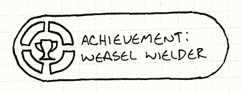
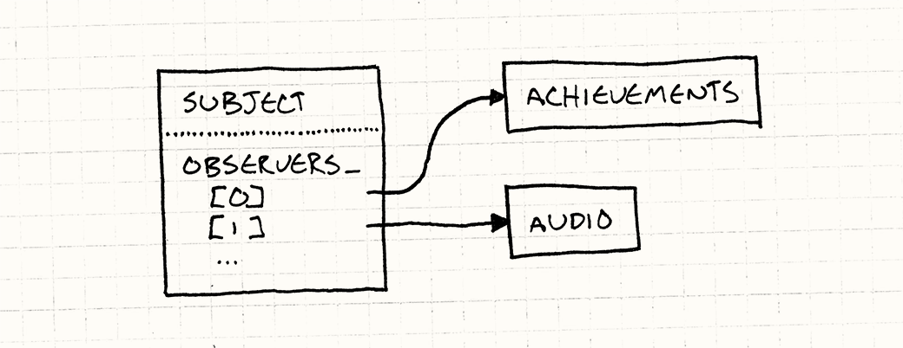
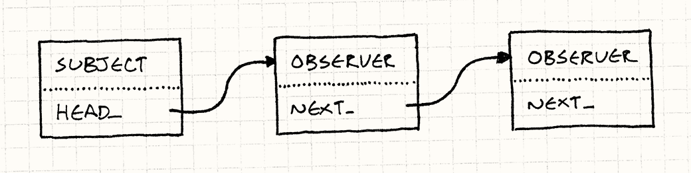
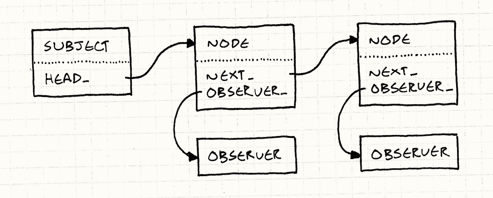

# Наблюдатель (Observer)

Мы не сможете бросить камень в винчестер и не попасть в приложение, построенное с использованием архитектуры [Модель-Вид-Контроллер (Model-View-Controller)](http://en.wikipedia.org/wiki/Model%E2%80%93view%E2%80%93controller), в основе которой как раз и лежит шаблон *Наблюдатель*. *Наблюдатель* настолько распространен, что даже включен в `Java` в библиотеку ядра ([java.util.Observer](http://docs.oracle.com/javase/7/docs/api/java/util/Observer.html)), а в `C#` вообще является частью *языка* (ключевое слово [event](http://msdn.microsoft.com/en-us/library/8627sbea.aspx)).

> Как и многое другое в программировании, `MVC` была изобретена последователями языка `Smalltalk` в 70-х. Вполне возможно что любители `Lisp` пришли к этому еще в 60-е, но не посчитали нужным это задокументировать.

Наблюдатель — один из самых используемых и широко известных шаблонов Банды четырех, но так как по какой-то непонятной причине мир игровой разработки зачастую обособлен, возможно для вас он станет новинкой. Ну а если вы не только что покинули монастырь, у меня для вас припасен мотивирующий пример.

## Достижение разблокировано

Допустим, вам нужно добавить в игру систему достижений. Это будут дюжины значков, которые игрок может заработать "Убив 100 демонических обезьян", "Упав с моста" или "Пройдя уровень, имея на руках только дохлого хорька".



> Готов поклясться, что рисовал эту картинку без всяких задних мыслей.

Реализовать такую систему не так уж просто, потому что к разблокированию достижения может вести самое различное поведение. Если вы не будете осторожны, корни вашей системы достижений расползутся во всему остальному коду. Потому что достижение "Упасть с моста" явно будет связано с работой физического движка, но уверены ли вы, что хотите видеть функцию `unlockFallOffBridge()` прямо в самой гуще алгоритмических вычислений?

Чего мы как обычно хотим, так это того, чтобы весь код, касающийся одного аспекта игры, был максимально сконцентрирован в одном месте. Сложность в том, что на получения достижений влияют самые различные объекты геймплея. Но как этого достичь не внедряя код достижений повсюду?

> Это гипотетический вопрос. Ни один уважающий себя программист физических движков не позволит вам влезать в свой прекрасный математический код с такой приземленной вещью как *геймплей*.


Здесь то нам и поможет шаблон наблюдатель. Он позволяет коду объявлять что произошло нечто интересное *не заботясь о том, кто получит уведомление*.

Например, если у вас есть физический код, который занимается симуляцией гравитации и определяет какие тела лежат на плоскости, а какие стремительно несутся к ней в падении. Чтобы реализовать упомянутое достижение "Упасть с моста", вам нужно внедрить сюда код получения достижения. Но в результате мы получим месиво в коде. Вместо этого мы поступим немного иначе:

```C++
void Physics::updateBody(PhysicsBody& body)
{
  bool wasOnSurface = body.isOnSurface();
  body.accelerate(GRAVITY);
  body.update();
  
  if (wasOnSurface && !body.isOnSurface()) {
    notify(body, EVENT_START_FALL);
  }
}
```

Всё, что этот код делает — это говорит "Ну, мне как бы все равно кому это интересно, но этот объект только что упал. Можете делать с этим фактом что хотите."

> Физический движок просто решает какие уведомления посылать. Поэтому назвать его полностью несвязанным (decoupled) нельзя. Но, к сожалению, при построении своей архитектуры мы стремимся к тому, чтобы сделать ее *лучше*, а не *совершенной*.

Система получения достижений регистрирует себя таким образом, чтобы физический код мог посылать сообщения, а система достижения их получала. Затем она может проверить, что упавшим телом был наш несчастный герой, и если до этого он находился на мосту, выдаст значок с достижением. При этом мы увидим как достижение разблокируется с салютом и фанфарами и все это без вмешательства в физический код.

> Теперь при необходимости вы можете полностью поменять всю систему достижений не трогая ни строчки кода в физическом движке. Он по прежнему посылает свои сообщения и не имеет никакого значения, что эти сообщения никто не принимает.

Конечно, если вам нужно будет полностью убрать достижения и необходимость в генерации уведомлений внутри физического движка исчезнет, вам придется удалять и код этих уведомлений. Но в то время, когда игра еще эволюционирует, такая гибкость не помешает.


## Как это работает

Если вы еще не в курсе как реализовывается этот шаблон, из вышеприведенного описания вы наверное уже обо всем догадались. Но чтобы еще сильнее упростить понимание, я еще раз коротко опишу детали.

### Наблюдатель

Начнем мы с самого любопытного класса, который хочет знать обо всем интересном, что делает другой объект. Этого можно добиться следующей реализацией:

```C++
class Observer
{
public:
  virtual ~Observer() {}
  virtual void onNotify(const Entity& entity, Event event) = 0;
};
```

> Параметры, передаваемые в `onNotify()`, я оставляю на ваше усмотрение. Все-таки наблюдатель — это *шаблон*, а не "готовый код, который вы просто можете вставить в свою игру". Обычно передается объект, который послал уведомление и обобщенный параметр "data", в котором описываются детали.

> Если вы используете язык, поддерживающий дженерики (generics) или шаблоны, вы может использовать их, но все таки неплохо использовать здесь объект, специфичный для варианта использования. В своем примере я жестко закодировал передачу сущности и перечисления (enum), описывающего что произошло.

Каждый конкретный класс, реализовывающий это становится наблюдателем. В нашем примере это система достижений, примерно следующего вида:

```C++
class Achievements : public Observer
{
public:
  virtual void onNotify(const Entity& entity, Event event) {
    switch (event) {
    case EVENT_ENTITY_FELL:
      if (entity.isHero() && heroIsOnBridge_) {
        unlock(ACHIEVEMENT_FELL_OFF_BRIDGE);
      }
      break;
    
    // Обработка остальных событий и обновление heroIsOnBridge_...
    }
  }

private:
  void unlock(Achievement achievement) {
    // Разблокирование если не было разблокировано раньше...
  }

  bool heroIsOnBridge_;
};
```

### Объект

Метод уведомления запускается объектом, над которым ведется наблюдение. Банда четырех называет его в своей манере "объектом" (subject). Он делает две вещи. Во-первых, он хранит список наблюдателей, которые терпеливо ожидают интересных им сообщений:

```C++
class Subject
{
private:
  Observer* observers_[MAX_OBSERVERS];
  int numObservers_;
};
```

> В настоящем коде вы скорее всего будете использовать динамические наборы данных, а не массив фиксированной длины. Я использую здесь массив, чтобы не смущать людей, использующих отличные от `C++` языки и не знакомых со стандартной библиотекой `C++`.

Обратите внимание, что у объекта есть *открытое (public)* `API` для изменения этого списка:

```C++
class Subject
{
public:
  void addObserver(Observer* observer) {
    // Добавление в массив...
  }

  void removeObserver(Observer* observer) {
    // Удаление из массива...
  }

  // Другие вещи...
};
```

Таким образом, сторонний код может управлять тем, кто получает уведомления. Объект общается с наблюдателями, но не *связан* с ними. В нашем примере, ни в одной строчке кода физики достижения не упоминаются. И, тем не менее, система достижений уведомления получает. Это была самая хитрая часть шаблона.

Также крайне важно то, что в объекте хранится *список* наблюдателей, а не просто один из них. Таким образом, мы добиваемся того, что наблюдатели *между собой* даже косвенно не связаны. Возьмем, например, звуковой движок, который тоже будет наблюдать за падением и проигрывать соответствующий звук. Если объект будет поддерживать только одного наблюдателя, то для того, чтобы звуковой движок смог в нем зарегистрироваться, ему придется предварительно *отменить* регистрацию системы достижений.

Это значило бы, что две системы начнут между собой взаимодействовать, причем не самым лучшим образом, так как одна будет мешать работе другой. Поддержка списка наблюдателей позволяет каждому наблюдателю действовать независимо от всех остальных. Каждый из них будет работать таким образом, как будто он единственный в мире.

Теперь объекту остается только передать уведомления:

```C++
class Subject
{
protected:
  void notify(const Entity& entity, Event event) {
    for (int i = 0; i < numObservers_; i++) {
      observers_[i]->onNotify(entity, event);
    }
  }

  // Другие вещи...
};
```

> Обратите внимание, что этот код не предполагает изменение наблюдателем списка в методе `onNotify()`. В более правильной реализации возможность таких изменений будет предотвращена или будет обрабатываться специальным образом.

### Наблюдаемая физика

Теперь нам осталось еще подцепить сюда физический движок так, чтобы он мог посылать уведомления, а система достижений могла на них подписаться. Будем придерживаться оригинального рецепта из *Паттернов проектирования* и наследуем объект `Subject`:

```
class Physics : public Subject
{
public:
  void updateBody(PhysicsBody& body);
};
```

Это позволит нам вызвать `notify()` из `Subject`. Таким образом, унаследованный класс может вызывать `notify()` для отправки сообщений, а внешний код — нет. В то же время, `addObserver()` и `removeObserver()` публичные. Поэтому любой может наблюдать за подсистемой физики.


> Если бы это был реальный код, я бы не стал использовать здесь наследование. Вместо этого я позволил бы Physics иметь экземпляр Subject. Вместо наблюдения за всем физическим движком, объект наблюдателя стал бы отдельным объектом "уведомления о падении". Наблюдатели могут регистрироваться с помощью конструкции наподобие:


```C++
physics.entityFell()
.addObserver(this);
```

> На мой взгляд в этом и заключается разница между системами "наблюдатель" и "события". Первая наблюдает за всем что может быть интересным. Вторая наблюдает за объектом, описывающим что произошло нечто интересное.

Теперь, когда физический движок выполняет нечто стоящее внимания, вызываем `notify()` как в первом мотивирующем примере. Дальше выполняется обход списка наблюдателей и они уже делают все остальное.



Довольно легко, верно? Всего один класс, содержащий список указателей на экземпляры определенного интерфейса. Даже трудно поверить, что такая прямолинейная конструкция является основой бесконечного количества программ и фреймворков.

Впрочем, не обходится и без критики. Когда я начал расспрашивать игровых программистов что они думают об этом шаблоне, я услышал множество нелестных отзывов. Попытаюсь их перечислить.

## "Это слишком медленно"

Я это часто слышу, особенно от тех программистов, которые не разбираются в деталях. Все дело в том, что как только они слышат хоть что-то о шаблонах проектирования, они сразу представляют себе кучу классов, непрямых связей и безумного перерасхода драгоценных процессорных тактов.

Шаблон наблюдатель получил такую плохую репутацию потому, что в связи с ним слишком часто упоминаются имена таких темных личностей как "события" (events), "сообщения" (messages) и даже "привязка данных" (data binding). Некоторые из этих систем *могут* быть медленными (иногда это делается сознательно и на то есть причины). Виной тому очереди и динамическое выделение памяти при каждом уведомлении.

> Вот поэтому я и считаю, что шаблоны стоит документировать. Когда терминология размывается, мы теряем способность общаться кратко и однозначно. Вы говорите "Наблюдатель", а кто-то слышит "События" или "Сообщения", потому что никто не удосужился записать и потом прочитать о разнице.

> Вот для чего я и написал эту книгу. Чтобы не быть голословным — глава об [Очереди событий (Event Queue)](../chapter-5/5.2-event-queue.md) в книге тоже имеется.

Но теперь, когда вы видели как шаблон реализуется на самом деле, вы знаете как обстоит дело. Отсылка уведомления — это всего лишь проход по списку и вызов виртуального метода. Естественно — это немного медленнее, чем статический метод диспетчеризации, но цена настолько незначительна, что может себя проявить только в самом требовательном к производительности коде.

Я считаю, что применять этот шаблон все-таки лучше не в самой горячей части кода, а там, где вы можете себе позволить применить динамическое выделение памяти. В остальном можно сказать, что никаких накладных расходов нет. Мы не создаем объекты для сообщений. У нас нет очередей. Все что у нас есть — это косвенность вместо синхронных вызовов методов.

### Слишком *быстро*?

Не забывайте, что шаблон Наблюдатель работает синхронно. Объект вызывает наблюдателя напрямую, а это значит, что он сам не продолжит работу, пока наблюдатель не вернет свой метод уведомления. Медленный наблюдатель может вообще блокировать выполнение объекта.

Звучит пугающе, но на практике далеко не конец света. Просто следует иметь это в виду. У программистов `UI`, которые занимается событийным программированием годами, даже есть свой лозунг: "никаких потоков в `UI`".

Если вы реагируете на событие синхронно, вам нужно завершить свои дела и передать управление обратно как можно скорее, чтобы не возникла блокировка `UI`. Если вам нужно выполнить что-то долгое — просто поместите это в другой поток или рабочую очередь.

Нужно быть осторожным, если вы планируете использовать наблюдателей вместе с потоками и настоящими блокировками. Если наблюдатель пытается перехватить блокировку в объекте, вы можете разблокировать игру. В движке с активным использованием потоков лучше использовать асинхронные сообщения с помощью [Очереди событий (Event Queue)](../chapter-5/5.2-event-queue.md).

## "Здесь слишком много динамического выделения памяти"

Целые кланы программистов, включая многих игровых программистов, перешли на языки, оснащенные сборщиком мусора и динамическое выделение памяти превратилось для них в пустую страшилку. Однако для программ, для которых критична скорость выполнения, в том числе и игр, управление выделением памяти по прежнему остается серьезной заботой даже в управляемых языках. Динамическое выделение памяти требует времени для переназначения участков памяти, даже если это делается автоматически.

> Многие игровые разработчики беспокоятся не столько о выделении памяти, сколько о ее фрагментации. Если ваша игра должна работать без падений дни напролет чтобы пройти сертификацию, слишком большая фрагментация памяти может не позволить вам выпустить игру.

> Глава [Пул объектов (Object Pool)](../chapter-6/6.3-object-pool.md) посвящена самой этой проблеме и способам ее решения.

В примере выше я использовал массив фиксированной длины для того, чтобы максимально упростить код. В реальной реализации, список наблюдателей обычно представляет собой динамическую коллекцию и во время работы увеличивается и уменьшается по мере добавления и удаления наблюдателей. Многих пугает такое обращение с памятью.

Главное, что нужно понять — это то, что выделение памяти происходит только при настройке наблюдателей. *Посылка* уведомлений вообще не требует выделения памяти — это просто вызов метода. Если вы выполните настройку наблюдателей в начале игры и не будете их больше трогать, количество выделений памяти будет минимальным.

Однако проблема все еще здесь, поэтому я покажу вам способ реализации при котором динамически выделять память вообще не придется.

### Связанные в цепочку наблюдатели

В коде, который был у нас до сих пор, `Subject` хранил в себе список на всех `Observer`, за которыми он наблюдал. У самого класса `Observer` не было ссылки на этот список. Это чисто виртуальный интерфейс. Интерфейсы предпочтительнее чем конкретные, постоянные классы, так что это не так уж плохо.

Но если мы перенесем часть состояния в сам `Observer`, мы сможем решить нашу проблему с выделением памяти, передавая объект *по цепочке самих наблюдателей*. Вместо объекта, хранящего набор указателей, наблюдатели станут узлами связанного списка:



Чтобы это реализовать, мы уберем массив из `Subject` и заменим его указателем на голову списка наблюдателей:

```C++
class Subject
{
  Subject() : head_(NULL)
  {}

  // Методы...
private:
  Observer* head_;
};
```

Сам `Observer` мы дополним указателем на следующего наблюдателя в списке:

```C++
class Observer
{
  friend class Subject;

public:
  Observer() : next_(NULL)
  {}

  // Другие вещи...
private:
  Observer* next_;
};
```

Еще мы сделаем `Subject` другом. У объекта есть `API` для добавления и удаления наблюдателей, но теперь мы будем управлять этим списком изнутри самого класса `Observer`. Самый простой способ позволить ему работать с этим списком — это сделать его другом.

Чтобы зарегистрировать нового наблюдателя, нужно просто добавить его в список. Просто добавим его в начало списка:

```C++
void Subject::addObserver(Observer* observer)
{
  observer->next_ = head_;
  head_ = observer;
}
```

Можно выбрать другой вариант и добавить его в конце списка. Такой вариант получается более сложным: `Subject` должен проходить весь список от начала до конца или хранить еще один указатель `tail_`, который будет указывать на последний элемент.

Добавление в начало списка проще, но имеет один побочный эффект. Когда мы проходим список чтобы отослать уведомления каждому наблюдателю, самые *последние* из зарегистрированных наблюдателей получают уведомления *первыми*. Так, что если вы зарегистрировали наблюдателей в последовательности A,B и C, они получат уведомления в последовательности C,B,A.

В теории вас вообще не должна интересовать последовательность. При использовании наблюдателей хорошим тоном считается написание такого кода, который не зависит от очередности уведомлений. А вот если очередность обработки имеет значение, это значит, что между двумя наблюдателями существует связь, которая может больно вам аукнуться.

Давайте посмотрим как выглядит удаление:

```C++
void Subject::removeObserver(Observer* observer)
{
  if (head_ == observer) {
    head_ = observer->next_;
    observer->next_ = NULL;
    return;
  }
  
  Observer* current = head_;
  while (current != NULL) {
    if (current->next_ == observer) {
      current->next_ = observer->next_;
      observer->next_ = NULL;
      return;
    }
  
    current = current->next_;
  }
}
```

> Удаление узла из связанного списка обычно требует обработки неприглядного особого случая для удаления самого первого узла как в данном примере. Более элегантным решением будет использование указателя на указатель.

> Я не сделал этого здесь, потому что обычно когда я показываю такой код людям, он вводит в замешательство примерно половину из них.

Так как у нас есть единственный связанный список, нам нужно пройтись по нему, чтобы найти нужного наблюдателя и удалить его. С обычным массивом мы поступали бы точно также. А вот если мы используем *двухсвязный* список, где каждый из наблюдателей есть указатель на следующего и предыдущего наблюдателей, мы можем удалить наблюдателя за одну операцию. В настоящем коде я бы так и поступил.

Единственное что осталось реализовать — это уведомление. Это также просто как перемещение по списку:

```C++
void Subject::notify(const Entity& entity, Event event)
{
  Observer* observer = head_;
  while (observer != NULL) {
    observer->onNotify(entity, event);
    observer = observer->next_;
  }
}
```

> Здесь мы проходимся по всему списку и уведомляем каждый наблюдатель в нем. Таким образом мы добиваемся одинакового приоритета для всех наблюдателей и их независимость друг от друга.

> Мы можем изменить этот механизм таким образом, чтобы когда наблюдатель получал уведомление, он возвращал флаг, означающий что объект должен продолжать прохождение по списку наблюдателей или остановиться. Если вы это сделаете, вы вплотную приблизитесь к шаблону [Цепочка ответственности (Chain of Responsibility) <sup>GoF</sup>](http://en.wikipedia.org/wiki/Chain-of-responsibility_pattern).

Не так уж плохо, верно? Объекту может принадлежать любое количество наблюдателей без малейшего динамического использования памяти. Регистрировать и отменять регистрацию также быстро и просто, как и при работе с обычным массивом. Придется пожертвовать только одним маленьким удобством.

Так как мы используем самого наблюдателя в качестве узла списка, мы предполагаем, что он сам и есть часть списка наблюдателей. Другими словами, наблюдатель может наблюдать только за одним объектом в каждый момент времени. В более традиционной реализации, когда каждый объект хранит свой собственный список, каждый наблюдатель может находиться сразу в нескольких списках одновременно.

Вам придется смириться с этим ограничением. Я нахожу более естественной ситуацию, когда у объекта есть много наблюдателей, а не наоборот. Если для вас это проблема — существует более сложное решение, которое также не использует динамическое выделение памяти. Оно слишком большое, чтобы целиком поместиться в эту главу, но я покажу вам небольшой набросок, а в остальном вы разберетесь сами.

### Пул списков узлов

Как и раньше, каждый объект содержит связанный список наблюдателей. Однако сами эти списки не будут состоять из объектов наблюдателей. Вместо этого они сами будут представлять из себя маленький "узел списка", в котором есть указатель на наблюдатель и указатель на следующий узел в списке.



Так как несколько узлов могут указывать на один и тот же наблюдатель, это означает, что один и тот же наблюдатель может одновременно находиться в списках нескольких объектов. И, таким образом, к нам вернулась способность наблюдать за несколькими объектами одновременно.

> Связанные списки бывают двух типов. Тот тип, который вы изучали в школе, состоит из узлов, хранящих данные. В нашем предыдущем примере связанных наблюдателей все было наоборот: *данные* (в нашем случае наблюдатель) содержат *узел* (т.е. указатель `next_`).

> Этот последний тип называется интрузивным (intrusive) связанным списком, потому что использует объекты в списке, вторгающиеся в определение того, что такое представляет из себя сам объект. Интрузивные связанные списки конечно не такие гибкие, но как вы сами видите более эффективные. Их можно часто увидеть например в ядре `Linux`, где понятное дело самое важно — это производительность.

Способ, позволяющий избавиться от динамического выделения памяти прост: так как все узлы у нас одного размера и типа, мы можем предварительно создать для них [Пул объектов (Object Pool)](../chapter-6/6.3-object-pool.md). Вы получаете для работы список узлов фиксированного размера и можете использовать и повторно использовать их как вам нужно без необходимости дополнительного выделения памяти.

## Оставшиеся проблемы

Я думаю мы избавились от трёх главных страшилок, отпугивавших людей от этого  шаблона. Как мы увидели, он простой, быстрый и может хорошо работать без сложных манипуляций с памятью. Но значит ли это, что нужно применять наблюдателей везде и всюду?

Теперь другой вопрос. Как и любой другой шаблон — наблюдатель не панацея от всех бед. Даже если он реализован корректно и эффективно, он может не быть правильным решением. Плохая репутация у некоторых шаблонов возникает потому,  что люди пытаются применить хороший шаблон к неправильной проблеме и только ухудшают свое положение.

Осталось еще две сложности, одна технического плана и вторая, скорее относящаяся к сложности поддержки. Начнем с технической, потому что такие как правило проще.

### Удаление объектов и наблюдателей

Основной код, который мы с вами рассмотрели хорош, но что насчет сопроводительного кода: что происходит, когда мы удаляем объект или наблюдателя? Если просто применить `delete` к любому из наблюдателей, на него останется ссылка в объекте. Теперь это опасный указатель на удаленный объект. И если этот объект попытается послать уведомление... вот почему некоторые люди начинают ненавидеть `C++`.

> Не хотелось бы ни на кого указывать пальцем, но *Паттерны программирования* не говорят об этой проблеме вовсе.

Уничтожать объект проще потому, что в большинстве наших реализаций у нас нет ссылок на него. Но даже в этом случае отправка объекта в мусор может доставить определенные проблемы. Наблюдатели могут ожидать получения уведомлений в будущем и никак не смогут узнать, что этого больше не произойдет. И теперь они вовсе не наблюдатели, как они сами о себе думают.

Справиться с этим можно несколькими способами. Проще всего решить проблему напрямую. Пусть сам наблюдатель и разбирается с тем, чтобы при удалении отменить повсюду свою регистрацию. Чаще всего наблюдатель обладает информацией о том, за какими объектами он наблюдает, и остается только добавить вызов `removeObserver()` в деструктор. 

> Как всегда самое сложно — это не сделать, а *не забыть* сделать.

Если у вас нет желания оставлять наблюдателей висеть в системе, когда объекты превратятся в призраков, это можно легко исправить. Для этого можно заставить каждый объект перед своим уничтожением послать всем финальное уведомление — "последний вздох". Таким образом, все наблюдатели его получат и смогут предпринять соответствующие действия.

> Оплакать, цветочки послать и т.д.

Люди, даже те из нас, которые провели достаточно много времени в обществе машин и обрели некоторые их свойства, по своей природе крайне ненадежны. Вот почему мы придумали компьютеры: они делают ошибки гораздо реже.

Самый правильный ответ состоит в том, чтобы заставить наблюдателей самостоятельно отменять свою регистрацию в объектах при своем удалении. Если вы реализуете эту логику единожды в базовом классе, все остальные, кто будет ее использовать, уже не должны будут заботиться об этом самостоятельно. Сложность при этом конечно увеличивается. Получается, что каждый *наблюдатель* должен хранить список *объектов*, которые за ним следят. Получится двухсторонняя связь с помощью указателей.

### Без паники, у нас есть сборщик мусора

Сейчас все модники, любящие современные языки со сборщиками мусора наверняка самодовольно наблюдали за происходящим. Думаете, если вы напрямую не управляете памятью, вам не нужно ей управлять? Подумайте еще раз.

Представьте себе, что у вас есть экран интерфейса, на котором отображается статистика игрока типа его здоровья и т.д. Когда игрок вызывает этот экран, вы создаете новые экземпляр объекта. Когда экран закрывается, вы просто забываете о нем и дальше его удаляет сборщик мусора.

Каждый раз когда игрок получает удар в лицо (или еще куда либо), он посылает уведомления. Экран интерфейса наблюдает за этим и обновляет полосу здоровья. Отлично. А теперь, что произойдет, если игрок закроет окно, а вы не отмените регистрацию наблюдателя?

Интерфейс больше не виден, но сборщик мусора не может его удалить, потому что на него до сих пор есть активная ссылка в наблюдателе. Каждый раз, когда будет загружаться экран, будет создаваться его новый экземпляр.

И все время, пока игрок будет играть, бродить по миру, сражаться, его персонаж будет отсылать уведомления всем экземплярам экрана. Их не видно на экране, но они есть в памяти и тратят такты процессора на обработку невидимых элементов интерфейса. А если, например, при этом издаются звуки, вы получите и реальное подтверждение неправильного поведения.

Эта проблема в системах уведомления настолько распространена, что даже имеет собственное имя: *проблема бывших слушателей (lapsed listener problem)*. Так как объекты остались подписанными на своих слушателей, у вас образовался интерфейс-зомби, занимающий память. Мораль здесь простая — соблюдайте дисциплину при отмене регистрации.

> О важности этой проблемы свидетельствует даже [отдельная статья в видипедии](http://en.wikipedia.org/wiki/Lapsed_listener_problem).

### Что происходит?

Еще одна более глубокая проблема с шаблоном Наблюдатель — это прямое следствие его основного назначения. Мы используем его для того, чтобы избавиться от связности между двумя частями кода. Это позволяет объекту не напрямую общаться с наблюдателем без статической связи между ними.

Это большая победа, когда вам нужно сосредоточиться на поведении объектов и когда лишние связи будут только раздражать и отвлекать вас от главного. Если вы ковыряетесь с физическим движком, вы не хотите забивать свой редактор и свой мозг тоже информацией о каких-то достижениях.

С другой стороны, если ваша программа не работает и баг распространяется на несколько звеньев наблюдателя, разобраться с такой организацией потоков гораздо сложнее. В сильносвязанном коде достаточно просто заглянуть в вызываемый метод. Для вашей среды разработки это детский лепет, потому что связь статическая.

А вот если связность организована через список наблюдателей, единственным способом узнать, кто получил уведомление является просмотр списка во *время выполнения* (runtime). Вместо того, чтобы иметь возможность *статически* видеть структуру коммуникаций в программе, нам приходится изучать ее *императивное*, *динамическое* поведение.

Мой совет о том, как с этим справиться предельно прост. Если вам часто приходится размышлять об *обоих* участниках коммуникации для того, чтобы понять работу программы, не используйте для реализации этой связи шаблон Наблюдатель. Выберите нечто более явное.

Когда вы копаетесь в какой-то большой программе, вы обычно имеете дело с большими кусками, которые нужно заставить работать вместе. Для этого есть много терминов "разделение внимания" и "когерентность и сцепка" и "модульность", но все сводится примерно к "эти штуки собираются вместе и не хотят работать вот с этими штуками".

Шаблон наблюдатель является отличным способом позволить несвязанным кускам кода общаться друг с другом без объединения в еще больший кусок. *Внутри* одного куска, посвященного одному конкретному аспекту, он уже не так эффективен.

Вот почему он так хорошо вписывается в наш пример: достижения и физика являются наименее связанными областями, зачастую даже реализуемые разными людьми. Нам нужно добиться минимума общения между ними и чтобы ни одной из них не нужны были дополнительные знания о другой.

## Наблюдатели сегодня

*Паттерны проектирования* вышли еще в 90-е (1994). Тогда объектно-ориентированное программирование было *горячей* парадигмой. Каждый программист в мире надеялся "Выучить ООП за 30 дней", а менеджеры среднего звена платили зарплату в зависимости от того, кто сколько классов создал. Крутость программиста определялась глубиной иерархии наследования, которую он наворотил.

> Примерно в тоже самое время Ace of Base записали *три* своих главных хита. Это я к тому, чтобы вы могли судить о вкусах того времени.

Популярность шаблона Наблюдатель пришлась как раз в духе того времени. Поэтому не удивительно, что его классы тяжеловесны. Правда в наше время программисты чувствуют себя уже гораздо комфортнее в функциональном программировании. Реализовывать только ради получения уведомлений целую системы интерфейсов — это не вписывается в сегодняшнее понятие об эстетике.

Сегодня такой подход кажется громоздким и негибким. Он и правда громоздкий и негибкий! Например, вы не можете иметь единственный класс, использующий разные методы уведомления для разных объектов.

> Вот почему объект обычно передает себя наблюдателю. Так как у наблюдателя только один метод уведомления `onNotify()`, если он наблюдает за несколькими объектами, ему нужно иметь возможность указать какой из них его вызвал.

Более современный вариант реализации "наблюдателя" — это просто ссылка на метод или функцию. В языках с поддержкой функций первого класса и особенно с поддержкой замыканий, так чаще всего наблюдатель и реализуют.

> В наше время замыкания есть в *любом* языке. `C++` преодолел ограничения на замыкания в языке без сборщика мусора и даже `Java` в `JDK8` смогла с ними подружиться.

А, например, в `C#` вообще существует "событие" (event), интегрированное в сам язык. С его помощью вы регистрируете наблюдателя — "делегата", который в терминах данного языка является ссылкой на метод. В системе сообщений `JavaScript` наблюдателями *могут* быть как объекты, поддерживающие специальный протокол `EventListener`, так и обычные функции. Чаще всего используют последнее.

Если бы я разрабатывал систему наблюдателя сегодня, я бы выбрал основанную на функциях, а не на классах систему. Даже в `С++` я стремлюсь к системе, которая позволяет регистрировать указателей на функции-члены в качестве наблюдателей, вместо экземпляров некоего интерфейса `Observer`.

> Вот [интересный пост](http://molecularmusings.wordpress.com/2011/09/19/generic-type-safe-delegates-and-events-in-c/) в блоге о их реализации на C++.

## Наблюдатели завтра

Система событий и другие подобные наблюдателю шаблоны сейчас чрезвычайно распространены. Это довольно избитый пусть. Как только у вас появится опыт их использования в нескольких крупных приложения, вы непременно кое-что заметите. Большое количество кода в ваших наблюдателях выглядит одинаково. Обычно он делает примерно следующее:

1. Получает уведомление о произошедшем изменении.
2. Заставляет какой либо участок `UI` отобразить это новое состояние.

В духе "О, здоровье у нас теперь равно 7? Давайте значит установим длину для полоски здоровья в 70 пикселей." Через некоторое время это становится довольно нудным. Академики компьютерных наук и простые программисты *всегда* старались бороться с этой нудностью. Их попытки известны нам под названиями "программирование потоков данных" (dataflow programming), "функциональное реактивное программирование" (functional reactive programming) и т.д.

Несмотря на некоторые успехи, особенно в отдельных областях, таких как обработка звука или проектирование микрочипов, Святой Грааль до сих пор не найден. Сейчас наиболее популярны наименее амбициозные варианты. Многие современные фреймворки используют "привязку данных" (data binding).

В отличие от радикальной модели, привязка данных не стремится к полному устранению императивного кода и не пытается построить всю архитектуру вокруг гигантского графа потока данных. Все что она делает — это автоматизирует бесполезную работу по настройке интерфейса или пересчету свойств, отражающих изменение какого либо значения.

Как и другие декларативные системы, привязка данных пожалуй слишком медленная для того, чтобы внедрять ее в игровой движок. Но я не удивляюсь, если увижу ее в каких либо менее критичных в плане производительности областях, таких как интерфейс.

И тем временем, старый добрый Наблюдатель по прежнему с нами и ждет нас. Конечно сейчас он уже не выглядит таким захватывающим, как свежие технологии, объединяющие в своем названии слова "функциональные" и "реактивные", зато он крайне прост и точно работает. А для меня это зачастую главные критерии выбора.
