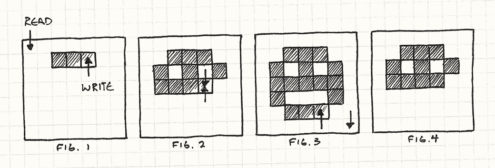

#Двойная буферизация (Double Buffering)

##Задача
*Дать возможность ряду последовательных операций выполняться мгновенно или одновременно.*

##Мотивация
В своем сердце компьютер отсчитывает последовательность ударов. Его мощь заключается в способности разбивать громадные задания на мелкие шаги, которые можно выполнять один за другим. Однако пользователю зачастую нужно видеть как вещи выполняются за один шаг или несколько задач выполняются одновременно.

>В потоковой и многоядерной архитектуре это уже не совсем верно, но даже при наличии нескольких ядер, всего только несколько операций могут выполняться в конкурентном режиме.

Типичный пример, встречающийся в любом игровом движке — это рендеринг. Когда игра отрисовывает мир, видимый пользователем, она делает это отдельными кусочками: горы вдали, крутые холмы, деревья, все по очереди. Если пользователь *увидит* этот процесс отрисовки в таком инкрементном режиме, иллюзия когерентности мира теряется. Сцена должна обновляться плавно и быстро, образуя последовательность законченных кадров, появляющихся мгновенно.

Двойная буферизация решает эту проблему, но чтобы понять как, нам нужно для начала вспомнить как компьютер показывает графику.

###Как работает компьютерная графика (коротко)
Видео дисплей как и компьютерный монитор рисует пиксель за пикселем. Они обновляются один за другим слева направо в каждом ряду, а затем происходит переход вниз к следующему ряду. Когда нижний правый угол достигнут, происходит переход к левому верхнему углу и процесс начинается заново. Происходит это так быстро - по крайней мере 60 раз в секунду, что наш глаз этого пробегания по рядам не замечает. Для нас все выглядит, так как будто сменяются статичные картинки на весь экран.

Можно думать об этом как о крошечном шланге, из которого мы поливаем экран пикселями. Отдельные цвета подводятся к этому шлангу и распыляются на экран по одному биту цвета за раз. Но каким образом этот шланг знает куда какой цвет направлять?

>Такое объяснение конечно несколько... упрощено. Если вы хорошо разбираетесь в работе железа - можете спокойно пропустить следующий раздел. У вас уже есть все необходимые знания для понимания оставшейся части главы. А если вам это *незнакомо*, я дам вам необходимый минимум знания для понимания шаблона.

В большинстве компьютеров ответ кроется в применение *буфера кадра* (framebuffer). Буфер кадра - это массив пикселей в памяти, участок RAM, где каждые несколько байтов представляют собой отдельный пиксель. И в то время когда шланг распыляет пиксели по экрану, он считывает значения цветов из массива по одному байту за раз.

Для того чтобы наша игра появилась на экране, все что мы на самом деле предпринимаем - это просто записываем значения в этот массив. Все самые изощренные графические алгоритмы сводятся к этому: установке значения байтов в буфере кадра. Но есть тут одна проблема.

Как я сказал ранее, компьютеры работают последовательно. Если машина выполняет кусок нашего кода рендеринга, мы не ожидаем что делаем в тот же самый момент что-то еще. В целом это верно, но некоторые вещи все-таки происходят во время выполнения нашей программы. Один из таких процессов - это постоянное считывание информации из буфера кадра. И это уже может быть проблемой.

>Соответствие между значениями байтов и цветами описывается *форматом пикселей* (pixel format) и *глубиной цвета* (color depth) системы. В большинстве современных игр используется 32 битный цвет: по восемь бит на красный, зеленый и синий канал и еще восемь для специального дополнительного канала.

Предположим что мы хотим отобразить на экране смайлик. Наша программа начинает в цикле двигаться по буферу кадра, окрашивая пиксели. Что мы до сих пор не уяснили - так это то что видео драйвер производит считывание из буфера кадра в то же самое время когда мы ведем в него запись. И когда он проходит по записанным пикселям, на экране начинает появляться смайлик. А потом он нас обгоняет и считывает данные из тех пикселей, куда мы еще ничего не записали. Результат паршивый: результатом будет баг, когда картинка отрисовывается только в верхней части экрана.

Вот здесь нам и пригодится наш шаблон. Наша программа рендерит пиксели по одному за раз, но драйверу нам нужно передавать всю картинку целиком - один кадр без смайлика и один кадр со смайликом. Именно для этого и нужна двойная буферизация. Попробую подобрать понятную аналогию.

>Мы начинаем отрисовывать пиксели из буфера кадра также как видео драйвер (Рис. 1). Видеодрайвер настигает рендер и попадает туда, куда пиксели еще не записывались (Рис. 2). Дале мы заканчиваем отрисовку (Рис. 3), но драйвер этого уже не видит.

>Вот результат, который пользователь увидит на экране (Рис. 4). Название "разрыв" возник потому что нижняя часть картинки как будто оторвана.
