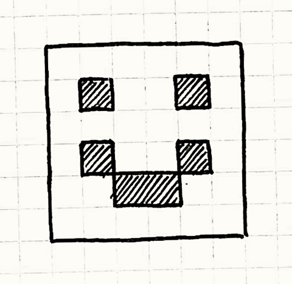

#Двойная буферизация (Double Buffering)

##Задача
*Дать возможность ряду последовательных операций выполняться мгновенно или одновременно.*

##Мотивация
В своем сердце компьютер отсчитывает последовательность ударов. Его мощь заключается в способности разбивать громадные задания на мелкие шаги, которые можно выполнять один за другим. Однако пользователю зачастую нужно видеть как вещи выполняются за один шаг или несколько задач выполняются одновременно.

>В потоковой и многоядерной архитектуре это уже не совсем верно, но даже при наличии нескольких ядер, всего только несколько операций могут выполняться в конкурентном режиме.

Типичный пример, встречающийся в любом игровом движке — это рендеринг. Когда игра отрисовывает мир, видимый пользователем, она делает это отдельными кусочками: горы вдали, крутые холмы, деревья, все по очереди. Если пользователь *увидит* этот процесс отрисовки в таком инкрементном режиме, иллюзия когерентности мира теряется. Сцена должна обновляться плавно и быстро, образуя последовательность законченных кадров, появляющихся мгновенно.

Двойная буферизация решает эту проблему, но чтобы понять как, нам нужно для начала вспомнить как компьютер показывает графику.

###Как работает компьютерная графика (коротко)
Видео дисплей как и компьютерный монитор рисует пиксель за пикселем. Они обновляются один за другим слева направо в каждом ряду, а затем происходит переход вниз к следующему ряду. Когда нижний правый угол достигнут, происходит переход к левому верхнему углу и процесс начинается заново. Происходит это так быстро - по крайней мере 60 раз в секунду, что наш глаз этого пробегания по рядам не замечает. Для нас все выглядит, так как будто сменяются статичные картинки на весь экран.

Можно думать об этом как о крошечном шланге, из которого мы поливаем экран пикселями. Отдельные цвета подводятся к этому шлангу и распыляются на экран по одному биту цвета за раз. Но каким образом этот шланг знает куда какой цвет направлять?

>Такое объяснение конечно несколько... упрощено. Если вы хорошо разбираетесь в работе железа - можете спокойно пропустить следующий раздел. У вас уже есть все необходимые знания для понимания оставшейся части главы. А если вам это *незнакомо*, я дам вам необходимый минимум знания для понимания шаблона.

В большинстве компьютеров ответ кроется в применение *буфера кадра* (framebuffer). Буфер кадра - это массив пикселей в памяти, участок RAM, где каждые несколько байтов представляют собой отдельный пиксель. И в то время когда шланг распыляет пиксели по экрану, он считывает значения цветов из массива по одному байту за раз.

Для того чтобы наша игра появилась на экране, все что мы на самом деле предпринимаем - это просто записываем значения в этот массив. Все самые изощренные графические алгоритмы сводятся к этому: установке значения байтов в буфере кадра. Но есть тут одна проблема.

Как я сказал ранее, компьютеры работают последовательно. Если машина выполняет кусок нашего кода рендеринга, мы не ожидаем что делаем в тот же самый момент что-то еще. В целом это верно, но некоторые вещи все-таки происходят во время выполнения нашей программы. Один из таких процессов - это постоянное считывание информации из буфера кадра. И это уже может быть проблемой.

>Соответствие между значениями байтов и цветами описывается *форматом пикселей* (pixel format) и *глубиной цвета* (color depth) системы. В большинстве современных игр используется 32 битный цвет: по восемь бит на красный, зеленый и синий канал и еще восемь для специального дополнительного канала.

Предположим что мы хотим отобразить на экране смайлик. Наша программа начинает в цикле двигаться по буферу кадра, окрашивая пиксели. Что мы до сих пор не уяснили - так это то, что видео драйвер производит считывание из буфера кадра в то же самое время, когда мы ведем в него запись. И когда он проходит по записанным пикселям, на экране начинает появляться смайлик. А потом он нас обгоняет и считывает данные из тех пикселей, куда мы еще ничего не записали. Результат паршивый: результатом будет баг, когда картинка отрисовывается только в верхней части экрана.


>Мы начинаем отрисовывать пиксели из буфера кадра также как видео драйвер (Рис. 1). Видеодрайвер настигает рендер и попадает туда, куда пиксели еще не записывались (Рис. 2). Дале мы заканчиваем отрисовку (Рис. 3), но драйвер этого уже не видит.

>Вот результат, который пользователь увидит на экране (Рис. 4). Название "разрыв" возник потому что нижняя часть картинки как будто оторвана.

Вот здесь нам и пригодится наш шаблон. Наша программа рендерит пиксели по одному за раз, но драйверу нам нужно передавать всю картинку целиком - один кадр без смайлика и один кадр со смайликом. Именно для этого и нужна двойная буферизация. Попробую подобрать понятную аналогию.

###Акт первый. Сцена первая
Представьте что мы смотрим нашу собственную пьесу. Как только заканчивается первая сцена и начинается вторая, нам нужно сменить декорации. Если мы просто начнем перетаскивать реквизит, иллюзия когерентности пространства пропадет. Мы конечно можем просто приглушить свет на этот период (так в театре тоже делают), но аудитория по прежнему будет понимать что что-то происходит. Мы же хотим чтобы между сценами не было провалов.

В реальности мы можем прибегнуть к оригинальному решению: Построим две декорации таким образом, что они обе будут видны публике. У каждой сцены свое освещение. Назовем их A и B. Первая сцена демонстрируется в декорации A. В это время декорация B затемнена и работники сцены готовят ее к показу сцены два. Как только сцена первая завершается, мы выключаем свет в декорации A и включаем его в декорации B. Внимание публики сразу переключается к декорации B, где уже начинается сцена вторая.

>С помощью полупрозрачного зеркала и очень маленького макета, можно добиться того чтобы зрители видели обе сцены одновременно в одном и том же месте. Как только освещение поменяется, они будут смотреть уже на другую сцену не меняя при этом направление взгляда. Предлагаю вам провести такой эксперимент самостоятельно.

В это время наши работники сцены занимаются затемненной декорацией A, подготавливая ее для сцены три. Как только сцена два закончится, мы снова переключим свет на декорацию A. Этот процесс будет повторяться на протяжении всей пьесы, используя затемненную декорацию для подготовки следующей сцены. Для перехода между сценами мы просто затемняем одну и освещаем другую. В результате наша публика получает возможность видеть спектакль без задержек между сценами. И никогда не видит работников сцены.

###Вернемся к графике
Точно также работает и двойная буферизация и именно такой процесс скрывается за системой рендеринга практически любой современной игры. Вместо единственного буфера кадра у нас есть два. Один из них представляет текущий кадр - аналогию декорации A. Это то место, откуда считывает данные видеодрайвер. GPU может производить из него считывание сколько угодно и когда угодно.

>Хочу заметить, что не все игры и консоли пользуются таким методом. Старые и самые простые из консолей были настолько ограничены в плане памяти, что вынуждены были синхронизировать отрисовку с обновлением картинки. Довольно хитрая задача.

В это время наш код рендеринга пишет в другой буфер. Это наша затемненная декорация B. Когда код рендеринга заканчивает отрисовку сцены, мы переключаем свет подменяя (swapping) буфера. Этим самым мы говорим видеобуферу чтобы он теперь считывал данные из второго буфера вместо первого. И пока мы будем выполнять переключение в конце обновления экрана, никаких разрывов мы не увидим и сцена будет отображаться целиком.

А в это самое время наш старый буфер кадра становится готовым к использованию. Мы начинаем рендерить в него новый кадр. Вуаля!

##Шаблон

**Класс буфера** инкапсулирует **буфер** - часть состояния, которое можно изменить. Буфер изменяется постепенно, но мы хотим чтобы внешний код увидел изменение как единый атомарный процесс. Чтобы это стало возможным, класс хранит *два* буфера: **следующий** и **текущий**.

Когда требуется *считать информацию из* буфера - всегда используется *текущий*. А когда информация *записывается* - используется *следующий* буфер. Когда изменения закончены, операция **обмена** (swap) мгновенно меняет местами следующий и текущий буферы, так что новый буфер становится видным публично. Старый текущий буфер теперь доступен для повторного использования в качестве следующего буфера.

##Когда его использовать

Это шаблон из тех, про который вы сами поймете, когда его нужно будет использовать. Если у вас есть система, в которой не хватает двойной буферизации, это обычно заметно (как в случае с разрывом) или приводит к некорректной работе. Но просто сказать "Вы поймете когда он вам пригодится" - недостаточно. Если говорить конкретнее этот шаблон стоит применять если справедливо одно из следующих утверждений:


* У нас есть состояние, изменяющееся постепенно.

* К состоянию есть доступ посередине процесса его изменения.

* Мы хотим предотвратить код, считывающий состояние от чтения незаконченного изменения.

* Мы хотим иметь возможность считывать состояние, не дожидаясь когда оно будет изменено.

##Имейте в виду

В отличие от больших архитектурных шаблонов, двойная буферизация существует на низкоуровневом слое реализации. Поэтому последствия на всю кодовую базу в целом не слишком велики - большая часть игры даже не заметит разницы. Но и здесь не обошлось без подводных камней.

###Переключение само по себе требует времени

Двойная буферизация требует этапа *переключения* (swap), как только изменение будет закончено. Само это переключение должно быть атомарным - остальной код не должен иметь доступ во время этой операции *ни к одному* из состояний. Чаще всего переключение выполняется также быстро как переназначение указателя. А вот если переключение требует больше времени чем собственно изменение состояния, то толку от шаблона не будет никакого.

###Нам нужно иметь два буфера

Втрое следствие применения шаблона - увеличение потребления памяти. Как явственно следует из названия нам нужно постоянно держать именно *две* копии состояния в памяти. На устройствах с ограниченным объемом памяти это довольно дорогая цена за применение шаблона. Если вы не можете позволить себе иметь два буфера, вам стоит присмотреться к другим способам обеспечения недоступности состояния для чтения во время изменения.

##Пример кода

Теперь, когда мы разобрались с теорией, давайте перейдем к практике. Мы напишем очень приблизительную графическую систему вывода пикселей в буфер кадра. В большинстве консолей и ```PC``` всю эту низкоуровневую графическую работу делает видеодрайвер, однако ручная реализация позволит нам лучше разобраться в происходящем. Для начала сам буфер:

```C++
class Framebuffer
{
public:
  Framebuffer() { clear(); }

  void clear()
  {
    for (int i = 0; i < WIDTH * HEIGHT; i++)
    {
      pixels_[i] = WHITE;
    }
  }

  void draw(int x, int y)
  {
    pixels_[(WIDTH * y) + x] = BLACK;
  }

  const char* getPixels()
  {
    return pixels_;
  }

private:
  static const int WIDTH = 160;
  static const int HEIGHT = 120;

  char pixels_[WIDTH * HEIGHT];
};
```

У него есть базовые операции очистки всего буфера в указанный цвет и установки цвета отдельного пикселя. Еще у него есть функция ```getPixels()```, скрывающая за собой массив сырых данных в памяти, хранящий данные пикселей. Мы не увидим ее в примере, но видеодрайвер будет часто использовать такую функцию для пересылки содержимого буфера на экран.

Обернем этот сырой буфер классом ```Scene```. Его задача заключается в отрисовке чего-либо с помощью вызовов ```draw()``` своего буфера:

```C++
class Scene
{
public:
  void draw()
  {
    buffer_.clear();

    buffer_.draw(1, 1);
    buffer_.draw(4, 1);
    buffer_.draw(1, 3);
    buffer_.draw(2, 4);
    buffer_.draw(3, 4);
    buffer_.draw(4, 3);
  }

  Framebuffer& getBuffer() { return buffer_; }

private:
  Framebuffer buffer_;
};
```

>Конкретно этот код рисует вот такой замечательный шедевр:
>

На каждом кадре игра командует сцене отрисоваться. Сцена очищает буфер и затем отрисовывает один за другим кучу пикселей. Еще она предоставляет доступ к внутреннему буферу через ```getBuffer()```, чтобы видеодрайвер мог получить нужные ему данные.

Выглядит достаточно прямолинейно, но если оставить все как есть, у нас буду серьезные проблемы. Проблема в том что видеодрайвер может вызвать ```getPixels()``` у буфера в *любое* время, даже здесь:

```C++
buffer_.draw(1, 1);
buffer_.draw(4, 1);
// <- Здесь видеодрайвер считывает пиксели!
buffer_.draw(1, 3);
buffer_.draw(2, 4);
buffer_.draw(3, 4);
buffer_.draw(4, 3);
```

Когда такое происходит, пользователь увидит глаза на лице, а рот на один кадр пропадет. На следующем кадре отрисовка прервется в какой либо еще точке. В результате у нас получится ужасно моргающая графика. Исправить это можно добавлением второго буфера.
```C++
class Scene
{
public:
  Scene()
  : current_(&buffers_[0]),
    next_(&buffers_[1])
  {}

  void draw()
  {
    next_->clear();

    next_->draw(1, 1);
    // ...
    next_->draw(4, 3);

    swap();
  }

  Framebuffer& getBuffer() { return *current_; }

private:
  void swap()
  {
    // Just switch the pointers.
    Framebuffer* temp = current_;
    current_ = next_;
    next_ = temp;
  }

  Framebuffer  buffers_[2];
  Framebuffer* current_;
  Framebuffer* next_;
};
```

Теперь у ```Scene``` есть два буфера, хранящиеся в массиве ```buffers_```. Мы не ссылаемся на них из массива напрямую. Вместо этого у нас есть два члена класса ```next_``` и ```current_```, указывающие на массив. Когда мы рисуем, мы выполняем отрисовку на следующий буфер, на который ссылается ```next_```. А когда видеодрайверу нужно считать значение пикселя, он всегда обращается к другому буферу через ```current_```.

Таким образом видеодрайвер никогда не видит буфер с которым мы в данный момент работаем. Единственный оставшийся кусочек пазла - это вызов ```swap()``` после того как сцена заканчивает отрисовывать кадр. Он меняет местами два буфера, просто обменивая между собой указатели в ```next_``` и ```current_```. В следующий раз, когда видеодрайвер вызовет ```getBuffer()```, он обратится к новому буферу в который мы только что закончили рисовать и выведет последний кадр на экран. И никаких больше разрывов и неприятных глитчей.

###Не только графикой единой

Суть проблемы, решаемой двойной буферизацией заключается в доступе к состоянию во время его модификации. На это есть две причины. Первую мы упоминали в примере с графикой: код из другого потока или прерывания напрямую получает доступ к состоянию.

А вот еще одна распространенная причина: когда код *производит модификацию*, он получает доступ к тому же состоянию, которое изменяет. Это встречается во множестве областей, особенно в физике и ```ИИ```(Искусственный интеллект) , где сущности друг с другом взаимодействуют. Двойная буферизация поможет и в этом случае.

###Искусственный неинтеллект

Давайте представим себе что мы разрабатываем поведенческую систему для игры по мотивам гротескной буффонады(http://ru.wikipedia.org/wiki/Буффонада или http://en.wikipedia.org/wiki/Slapstick). В игре имеется сцена, в которой участвует куча актеров, творящих всякие шутки и трюки. Вот базовый актер:
```C++
class Actor
{
public:
  Actor() : slapped_(false) {}

  virtual ~Actor() {}
  virtual void update() = 0;

  void reset()      { slapped_ = false; }
  void slap()       { slapped_ = true; }
  bool wasSlapped() { return slapped_; }

private:
  bool slapped_;
};
```
На каждом кадре игра отвечает за то чтобы вызвать update() актера. Таким образом он может что-либо сделать. С точки зрения игрока критически важно чтобы *обновления всех актеров выглядели одновременными*.

>А это уже пример шаблона [Метод обновления (Update Method)](3.3-update-methods.md).


Кроме этого актеры могут взаимодействовать друг с другом и под "взаимодействовать" я понимаю "давать друг другу пощечины". Во время обновления актер вызывает метод ```slap()``` другого актера чтобы дать ему пощечину и вызывает ```wasSlapped()```, чтобы определить получил ли пощечину сам.

Актерам потребуется декорация, в которой они будут взаимодействовать:
