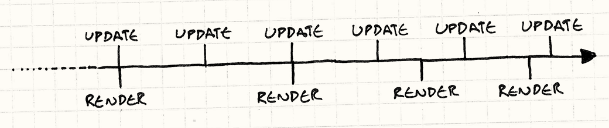
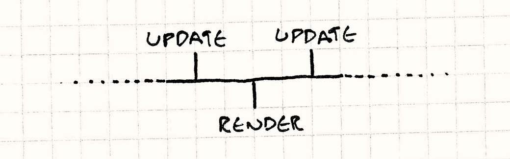

#Игровой цикл(Game Loop)

##Задача

*Устранить зависимость игрового времени от пользовательского ввода и скорости процессора.*

##Мотивация

Если бы меня спросили, без какого шаблона из этой книги я не смог бы жить, я вспомнил бы именно об этом. Игровой цикл — это квинтэссенция примера "шаблона в игровом программировании". Он есть практически в каждой игре и двух одинаковых практически нет. И при этом в не играх он встречается крайне редко.

Чтобы увидеть насколько он полезен, давайте вспомним прошлое. В старые времена компьютерного программирования у всех были бороды, а программы работали как посудомоечные машины: вы загружали в нее код, нажимали кнопку, ждали и забирали результат. Готово. Это называлось *пакетным режимом* (batch mode): как только работа была сделала, программа останавливалась.

>У Ады Лавлейс и контр-Адмирала Грейс Хоппер бороды были почетными.

Такое можно увидеть и поныне. Слава богу хотя бы с перфокартами больше заморачиваться не нужно. Скрипты терминалов, консольные программы и даже маленькие скрипты на ```Python``` для форматирования кода в этой книге — это все примеры работы в пакетном режиме.

###Интервью с процессором

В конце концов программисты поняли, что отправка программы в вычислительный центр и получение результатов через несколько часов- не самый лучший способ работы и отлова багов в программах. Хотелось немедленного отклика. И тогда появились *интерактивные* программы. Одними из первых интерактивных программ были игры:

```
YOU ARE STANDING AT THE END OF A ROAD BEFORE A SMALL BRICK
BUILDING . AROUND YOU IS A FOREST. A SMALL
STREAM FLOWS OUT OF THE BUILDING AND DOWN A GULLY.

> GO IN
YOU ARE INSIDE A BUILDING, A WELL HOUSE FOR A LARGE SPRING.
```

>Это [Colossal Cave Adventure](http://en.wikipedia.org/wiki/Colossal_Cave_Adventure) — первый текстовый квест.


Теперь вы могли общаться с программой вживую. Она ожидала вашего ввода и затем реагировала на него. Затем наступала ваша очередь реагировать — ну прямо как в детском саду учат. Когда была ваша очередь действовать — программа ничего не делала. Примерно вот так:

```C++
while (true)
{
  char* command = readCommand();
  handleCommand(command);
}
```

###Циклы событий

Современные программы с графическим пользовательским интерфейсом, если снять с них оболочку, поразительно напоминают старые текстовые квесты. Ваш текстовый процессор обычно просто сидит и ничего не делает до тех пор, пока вы не нажмете какую-либо клавишу:

```C++
while (true)
{
  Event* event = waitForEvent();
  dispatchEvent(event);
}
```

Единственное различие здесь в том, что вместо *текстовых команд*, программа ожидает пользовательского ввода — нажатия мыши и клавиш. Но в основе лежит тоже самое, что и в текстовых квестах, где программа *блокируется* в ожидании пользовательского ввода, что на самом деле является проблемой.

В отличие от других программ, игры продолжают работать даже когда пользователь не предоставляет никакого ввода. Если вы будете просто смотреть на экран, игра не остановится. Анимации продолжат проигрываться. Визуальные эффекты танцуют и блестят. А если вам не повезет, монстр продолжит понемногу грызть вашего героя.

>Большинство циклов событий содержат события "простой (idle)", во время которых можно продолжать работать без пользовательского ввода. Для мигающего курсора или прогресс бара это нормально, но для игры не годится.

Вот мы и подошли к первой ключевой особенности игрового цикла: *он обрабатывает пользовательский ввод, но не ожидает его*. Цикл продолжает крутиться всегда:

```C++
while (true)
{
  processInput();
  update();
  render();
}
```

Позже мы рассмотрим его подробнее, но в основе лежат именно эти вещи. ```processInput()``` обрабатывает пользовательский ввод с момента прошлого вызова. ```update()``` продвигает симуляцию игры на один шаг. Сюда входят ```ИИ``` и физика (обычно именно в таком порядке). И наконец ```render()``` рисует игру, чтобы игрок увидел происходящее.

>Как можно догадаться из имени ```update()``` — это подходящее место для применения шаблона [Метод обновления ( Update Method)](3.3-update-methods.md)


###Мир вне времени

Если этот цикл не блокируется при вводе — возникает резонный вопрос: насколько *быстро* он крутится? На каждом шаге игрового цикла состояния игры немного продвигается вперед. С точки зрения обитателей игрового мира это заставляет их время идти вперед.

>Обычно единица игрового цикла называется "тиком" или "кадром".

При этом у *игрока* время тоже тикает. Если мы измерим скорость выполнения циклов в единицах реального времени, мы получим единицу измерения "кадры в секунду" или ```FPS```. Если игровые циклы сменяются быстро, ```FPS``` высок, а игра работает быстро и плавно. Если медленно — игра подтормаживает и становится похожей на кино в замедленном воспроизведении.

В нашем примитивном игровом цикле, который старается сменяться как можно чаще, частоту кадров определяют два фактора. Первый — это *сколько работы нужно выполнять на каждом кадре*. Сложная физика, куча игровых объектов и детализированная графика могут настолько нагрузить ваши процессор и видеокарту, что на обработку кадра понадобится очень много времени.

Второй фактор — это *производительность платформы*. Быстрые чипы могут перемалывать гораздо больше кода за то же время. Количество ядер, видеокарта, дискретный аудио чип и планировщик ОС — все это влияет на количество действий, которые можно успеть выполнить за один тик.

###Секунды в секунду

В каждой игре второй фактор всегда фиксирован. Если вы пишете игру для ```NES``` или ```Apple II```, вы *точно* знаете какой процессор у вас будет и можете на него рассчитывать. Все о чем вам нужно заботиться — это каким объемом работы вы его нагружаете.

Старые игры разрабатывались таким образом, чтобы выполняемая работа позволяла игре работать с нужной скоростью. Но если бы вы попробовали поиграть в ту же самую игру на более быстром или медленном компьютере, сама игра стала бы работать быстрее или медленнее.

Сейчас редко кто из разработчиков может позволить себе роскошь знать на каком железе будет работать их игра. Вместо этого играм приходится адаптироваться под большое разнообразие конфигураций.

>У старых компьютеров для этого даже была отдельная кнопка "[turbo](http://en.wikipedia.org/wiki/Turbo_button)". Новые компьютеры были быстрее и не позволяли играть в старые игры, потому что те работали слишком быстро. *Отключение* режима ```turbo``` замедляло компьютер и игра снова становились нормальной.


Таким образом мы подошли еще к одной важной особенности игрового цикла: *он обеспечивает постоянную скорость игры в независимости от аппаратного обеспечения*.

##Шаблон

**Игровой цикл** работает на протяжении всей игры. На каждом своем цикле игровой цикл **обрабатывает пользовательский ввод** без блокировки, **обновляет состояние игры** и **рендерит игру**. А еще он следит за ходом времени и **управляет скоростью игрового процесса**.

##Когда использовать

Использовать неподходящий шаблон — хуже, чем не использовать никаких шаблонов вовсе, так что обычно этот раздел призван предостеречь вас от излишнего энтузиазма. Задачей шаблонов проектирования не является проникновение в вашу кодовую базу в максимальном количестве.

Но этот шаблон не такой как другие. Я с уверенностью могу сказать, что вы *будете* его использовать. Если вы используете готовый движок, вы его не пишете сами, но он все равно присутствует.

>На мой взгляд в этом и заключается отличие "движка" от "библиотеки". Используя библиотеку, вы организуете игровой цикл самостоятельно и используете из него библиотеку. Движок наоборот организует игровой цикл самостоятельно и вызывает из него *ваш* код.

Вам может показаться, что для пошаговой игры он не нужен. Но даже там, несмотря на то, что *состояние игры* не обновляется до того как игрок сделает шаг, *визуальное* и *аудио* состояние все равно продолжают обновляться. Анимации и музыка все равно продолжают проигрываться, даже если игра ждет, пока вы сделаете свой шаг.

##Имейте в виду

Цикл, о котором мы все время тут говорим — это самая главная часть кода в вашей игре. Говорят что 90% времени в программе используется 10% кода. Ваш игровой цикл определенно попадает в эти 10%. Заботьтесь о нем и обращайте внимание на его производительность.

>Вот из-за подобной статистики "настоящие" инженеры и механики и не принимают нас всерьез.


###Вам придется взаимодействовать с циклом сообщений вашей платформы

Если вы строите вашу игру поверх ОС или платформы с графическим интерфейсом и встроенным циклом сообщений, вашей игре придется взаимодействовать с двумя циклами. Нужно заставить их уживаться между собой.

Иногда у вас есть возможность взять ситуацию под контроль и ограничиться одним циклом. Например, если вы пишете игру и не хотите связываться с почтенным ```Windows API```, внутри вашей функции ```main()``` может находиться игровой цикл. Внутри вы можете вызвать ```PeekMessage()``` для обработки и удаления сообщений от ```ОС```. В отличие от ```GetMessage()```, ```PeekMessage()``` не блокируется в ожидании пользовательского ввода и ваш игровой цикл не будет тормозиться.

Другие платформы не позволяют вам обращаться с циклом сообщений столько вольно. Если вы пишете игру для браузера, цикл сообщений вшит глубоко внутри самого браузера. Так как цикл сообщений заправляет всем самостоятельно, вам придется использовать его и в качестве игрового цикла. Вы вызываете нечто наподобие ```requestAnimationFrame()``` и он уже через калбек (callback) вызовет ваш код, чтобы игра продолжала работать.

##Пример кода

Несмотря на такое длинное вступление, сам код игрового цикла довольно прямолинеен. Мы рассмотрим несколько вариантов и отметим их достоинства и недостатки.

Игровой цикл управляет ```ИИ```, рендерингом и другими игровыми системами, но они ни в коей мере не являются частью самого шаблона. Они просто из него вызываются. Так что реализация (непростая!) ```render()```, ```update()``` и остальных оставляется читателю.

##Беги, беги настолько быстро, насколько можешь

Мы уже видели самый примитивный игровой цикл:

```C++
while (true)
{
  processInput();
  update();
  render();
}
```

Его главная проблема в том, что он никак не управляет скоростью игры. На быстрой машине он будет работать так быстро, что пользователь даже не разберет, что происходит. На медленной машине игра будет просто тормозить. Если в какой-то части игры у вас есть сложный ```ИИ``` или физика, игра тоже будет замедляться в этих местах.

###Передохнем немного

Первый вариант, который мы рассмотрим добавляет простой фикс. Скажем мы хотим чтобы наша игра работала с ```FPS``` 60. Это около 16 миллисекунд на кадр. 

>1000мс/FPS = mc на кадр

Пока вы сможете уложить все свои вычисления и рендеринг в это время, у вас будет постоянный фреймрейт. Все что вам нужно будет сделать — это после обработки каждого кадра ожидать, пока наступит время для следующего примерно таким образом:


Код изменится таким образом:

```C++
while (true)
{
  double start = getCurrentTime();
  processInput();
  update();
  render();

  sleep(start + MS_PER_FRAME - getCurrentTime());
}
```

```sleep()``` здесь контролирует, чтобы игра не работала слишком быстро, если успела обработать кадр раньше времени. Но это *не поможет*, если ваша игра работает слишком *медленно*. Если игра будет тратить на цикл больше 16 мс, время сна станет *отрицательным*. Если бы у нас был компьютер, способный перемешаться во времени в прошлое, все было бы просто, но увы.

Вместо этого игра просто замедляется. Вы можете избежать этого делая меньше работы на каждом цикле: урезать и упростить графику или оглупить ```ИИ```. Но это повлияет на качество игрового процесса даже на быстрых машинах.

###Один маленький шаг и один гигантский шаг

Давайте попробуем кое-что посложнее. Проблема, с которой мы столкнулись, разбивается на следующие:

1. На каждом цикле время игры немного продвигается вперед.

2. Этот процесс требует некоторого количества реального времени.

Если шаг второй займет больше времени, чем первый, игра замедлится. Если на то, чтобы продвинуть время в игре на 16 мс придется потратить больше 16 мс — это не годится. А вот если за один шаг мы сможем обработать *больше* чем 16 мс игры, мы сможем обновлять игру уже не так часто.

Идея выбора длины шага основывается на количестве *реального* времени, прошедшего с прошлого кадра. Чем больше времени занял кадр, тем больше шагов делает игра. Мы всегда будем успевать за реальным временем потому что будем выполнять все больше и больше шагов. Такое время шага можно назвать *переменным* или *гибким*. Выглядит это следующим образом:

```C++
double lastTime = getCurrentTime();
while (true)
{
  double current = getCurrentTime();
  double elapsed = current - lastTime;
  processInput();
  update(elapsed);
  render();
  lastTime = current;
}
```

На каждом кадре мы определяем сколько реального времени прошло с момента последнего обновления игры (```elapsed```). А когда мы обновляем состояние игры, мы передаем это значение внутрь. Далее движок отвечает за то, чтобы обновить игру на переданное количество времени.

Представим, что у нас через весь экран летит пуля. При фиксированной длительности шага, на каждом кадре она будет двигаться в соответствии со своей скоростью. С переменой длительностью шага вам придется *масштабировать скорость в зависимости от прошедшего времени*. Как только шаг увеличивается, пуля летит быстрее, чем на прошлом кадре. Главное, что экран целиком пуля пролетит за *одно* и то же количество *реального* времени, независимо от того, произойдет это за 20 маленьких быстрых шагов или за четыре больших медленных.
Похоже на то, что нужно:

* Игра работает с одинаковой скоростью на любом оборудовании.

* Игроки с более мощными компьютерами вознаграждаются более плавным геймплеем.

Но, к сожалению, у нас появляется и одна серьезная проблема: игра получается недетерминированной и нестабильной. Вот пример того, в какую ловушку мы угодили:

Предположим, у нас идет сетевая игра, и Фред играет на ультрамощном PC, а Джордж на старом нетбуке своей бабушки. Упомянутая выше пуля пролетает по экрану у них обеих. На компьютере Фреда игра летает и каждый шаг занимает очень мало времени. У него пуля пролетает экран за секунду и происходит это за 50 кадров. У бедняги Джорджа на весь этот процесс отводится только пять кадров.

Это значит, что на компьютере Фреда физический движок обновляет позицию пули 50 раз в секунду, а у Джорджа — всего пять. Большинство игр используют при расчетах вещественные числа, которые очень подвержены *ошибкам округления*. Каждый раз, когда вы складываете два вещественных числа, результат получается немного другим. Машина Фреда работает в десять раз быстрее и на ней накапливается большая ошибка чем у Джорджа. В результате через секунду полета *пуля* окажется на этих двух машинах в *разных местах*.

>"Детерминированность" означает, что каждый раз когда вы будете запускать программу и подавать на вход один и тот же пользовательский ввод, вы получите один и тот же результат на выходе. Как вы понимаете, в детерминированной программе куда проще искать баги: достаточно найти входные данные, порождающие баг и его можно будет воспроизводить каждый раз.

>Компьютеры по своей сути детерминированы: они просто механически следуют инструкциям. Недетерминированность начинается там, где вмешивается внешний мир. Например, сеть, системное время и планировщик потоков опираются на внешние вещи за пределами контроля программы.

Это одна из самых неприятных проблем, возникающих при переменном временном шаге, но есть и другие. Для того, чтобы физический движок работал в реальном времени, правила реальной механики приходится аппроксимировать. Чтобы эти аппроксимации не взорвались, их приходится глушить. Такое приглушение требует крайне чувствительной подстройки к конкретному временному шагу. Стоит изменить этот шаг, и физика станет нестабильной.

>"Взорвались" — это конечно образно. Когда физический движок начинает глючить, объекты получают совершенно неверное ускорение и улетают в небеса.

Вся эта нестабильность настолько плоха, что я упомянул здесь этот пример только в качестве предупреждения и как шаг к гораздо лучшему решению...

###Догонялки

Обычно рендеринг — это та часть движка, на которую переменное время *не влияет*. Так как рендеринг происходит в конкретное время, для него не важно сколько времени прошло с момента прошлого рендеринга. Вещи рендерятся в том состоянии, в котором находятся в данный момент.

>Это более-менее справедливое утверждение. Эффекты типа размытия движения могут зависеть от результата предыдущего рендеринга. Но если время с момента прошлого рендеринга будет постоянно немного варьироваться, игрок вряд ли заметит разницу.

Мы можем использовать этот факт в свою пользу. *Обновлять* игру мы будем фиксированными шагами, потому что это проще и в плане ```ИИ``` и физики гораздо стабильнее. Но вот в плане *рендеринга* мы позволим себе некоторую гибкость для того, чтобы сэкономить немного процессорного времени.

Поступим следующим образом. С момента окончания прошлого игрового цикла у нас прошло некоторое время. Именно столько времени нам нужно просимулировать в игре, чтобы отобразить текущее состояние игроку. Добьемся мы это с помощью *серии фиксированных* временных шагов. У нас получится такой код:

```C++
double previous = getCurrentTime();
double lag = 0.0;
while (true)
{
  double current = getCurrentTime();
  double elapsed = current - previous;
  previous = current;
  lag += elapsed;

  processInput();

  while (lag >= MS_PER_UPDATE)
  {
    update();
    lag -= MS_PER_UPDATE;
  }

  render();
}
```

Он состоит из нескольких частей. В начале каждого кадра мы обновляем ```lag``` на основе прошедшего реального времени. Это значение обозначает насколько наше игровое время отстало от реального. Далее мы будем обновлять состояние игры шагами фиксированной длины до тех пор, пока не догоним реальное время. Как только мы его догнали, выполняем рендеринг и начинаем процедуру снова. Визуализировать это можно следующим образом:


Обратите внимание, что временной шаг теперь не соответствует *видимому* фреймрейту. ```MS_PER_UPDATE``` — это *дробность* наших обновлений игры. Чем короче этот шаг, тем больше процессорного времени нужно для того, чтобы нагнать реальное время. Чем он длиннее — тем грубее геймплей. В идеале он должен быть довольно коротким, чтобы ```FPS``` был не ниже 60 и игра на быстрых машинах работала плавно.

Но будьте осторожны и не сделайте его *слишком* коротким. Нам нужно быть уверенными, что временной шаг будет больше, чем время, необходимое на обработку ```update()``` даже на медленном оборудовании. В противном случае игра всегда будет опаздывать и никогда не догонит реальное время.

К счастью, теперь у нас есть пища для размышлений. Хитрость здесь в том, что мы *выдернули рендеринг из цикла обновлений*. Это освобождает кучу процессорного времени. В результате сама игра *симулируется* с константной скоростью обновления на самом разном оборудовании. А если игрок видит подтормаживания на слабой машине, то подтормаживает только видимая часть игры.

Я на этом остановлюсь, но вы можете подстраховаться, ограничив количество временных шагов, которые могут выполняться друг за другом некоторым максимумом. Игра замедлится, но по крайней мере не заблокируется насовсем.

###Застрять в середине

У нас осталась одна проблема и это остаточный лаг. Мы обновляем игру фиксированными временными шагами, а рендеринг выполняем в произвольные моменты времени. Это значит, что с точки зрения игрока, игра будет часто рендериться между двумя обновлениями.

Посмотрите на таймлайн:



Как вы видите, мы выполняем обновления довольно частыми, фиксированными интервалами. И время от времени выполняем рендеринг. Он выполняется реже, чем обновления и с не очень стабильным интервалом. И то и другое приемлемо. Не очень хорошо то, что мы не всегда выполняем рендеринг сразу после обновления. Посмотрите на время третьего рендеринга. Он оказался прямо между двумя обновлениями:



Представьте себе летящую через экран пулю. На момент первого обновления она находится слева. На момент второго — справа. Рендеринг произошел ровно посередине между этими двумя событиями, так что игрок может ожидать увидеть пулю прямо в центре экрана. Но в нашей реализации она по прежнему будет находиться слева. И поэтому движение будет смотреться дерганным и запинающимся.

На наше счастье, мы *точно* знаем в какой момент между обновлениями происходит рендеринг: значение хранится в ```lag```. Мы пережили предыдущее обновление, с тех пор прошло меньше времени, чем наш шаг обновления и длительность этого времени больше *нуля*. Так где мы оказались? Мы слегка залезли в следующее обновление.

Когда мы попадаем в рендер, мы передаем следующее:

```
render(lag / MS_PER_UPDATE);
```

Наш рендер обладает информацией обо всех объектах *и их текущей скорости*. Скажем пуля находится на 20 пикселей от левого края экрана и двигается со скоростью 400 пикселей за кадр. Если мы на полпути до следующего обновления, мы должны передать в ```render()``` 0.5. И пулю мы соответственно рисуем в позиции 220 пикселей. Та-дам! Плавное движение.

>Мы разделили здесь ```MS_PER_UPDATE``` чтобы получить *нормализованное* значение. Значение, передаваемое в ```render()``` может варьироваться от 0(сразу после прошлого обновления) до 1(прямо перед следующим обновлением), независимо от временного шага обновления. Поэтому рендеру не нужно волноваться о фреймрейте. Он просто оперирует значениями от 0 до 1.

Конечно такая экстраполяция тоже может быть ошибочной. Когда мы на самом деле будем просчитывать следующий кадр, мы можем обнаружить что пуля наткнулась на препятствие или замедлилась чем-то. А мы уже рендерили ее в позиции, полученной интерполяцией предыдущего положения и предполагаемого будущего. Но верно это или нет мы сможем узнать только на следующем полном обновлении физики и ```ИИ```.

Не удивительно, что такие попытки игры в угадывание не всегда заканчиваются успешно. К счастью, они обычно малозаметны. И по крайней мере, они не так заметны, как запинания, которые можно увидеть, если вообще не применять интерполяцию.

##Архитектурные решения

Несмотря на длину этой главы, я еще много о чем не рассказал. Если сразу заморачиваться синхронизацией с ходом луча дисплея, мультипоточностью и работой видеокарты, игровой цикл может показаться довольно запутанной штукой. Но на высшем уровне осталось еще несколько вопросов.

###Контролируете ли вы игровой цикл сами или это делает платформа?

Зачастую этот выбор уже сделан за вас. Если вы пишете игру для браузера, у вас скорее всего *не получится* написать классический игровой цикл. Событийная модель браузера диктует свои правила. Аналогично, если вы используете готовый движок, вы скорее всего будете использовать встроенный в него игровой цикл, а не писать собственный.

* **Использование цикла событий платформы:**

    * *Это просто*. Вам не придется заботиться о написании и оптимизации собственного игрового цикла.

    * *Хорошо сопрягается с платформой*. Вам не придется заботиться о выделении процессорного времени на нужды платформы, кешировании событий, или наоборот бороться с несоответствием между моделью ввода платформы и вашей.

    * *Вы теряете управление таймингом*. Платформа будет вызывать ваш код по своему усмотрению. И к сожалению, скорее всего это будет происходить не так часто, и не так плавно, как вам хотелось бы. Гораздо хуже то, что большинство циклов событий разработаны без учета нужд игр и обычно работают медленно и грубо.

* **Использование игрового цикла движка:**

    * *Вам не придется его писать.* Написание игрового цикла — дело довольно хитрое. Так как этот код выполняется на каждом кадре, любые баги или проблемы с производительностью будут серьезно влиять на всю вашу игру. Надежный игровой цикл — это одна из причин использовать уже готовый движок.

    * *Вам не удастся его написать*. У предыдущего достоинства есть и обратная сторона. Вам не удастся подстроить игровой цикл под свои нужды, если у вас есть к нему специфические требования.


* **Написание самостоятельно:**

    * *Полный контроль*. Вы можете делать все что хотите. Архитектуру можно специально разрабатывать исходя из нужд вашей игры.

    * *Вам нужен интерфейс для взаимодействия с платформой*. Фреймворки приложения и сама операционная система обычно рассчитывают на периодическое получение отрезка времени для обработки сообщений и другой работы. Если всем управляет только ваш собственный цикл, то ресурсы больше никому не достанутся. Поэтому периодически вам придется отдавать из своих рук управление, чтобы фреймворки нигде не застопорились.

###Как это отразится на потреблении энергии?

Еще лет пять назад такой проблемы вообще не существовало. Игры работали на устройствах, постоянно подключенных к сети или специализированных портативных системах. Но теперь, когда так расплодились смартфоны, ноутбуки и вообще мобильный гейминг, вам придется это учитывать. Хорошо работающая игра, но быстро превращающая телефон в печку и сжирающая за полчаса аккумулятор — это не та игра, которая может порадовать людей.

Сейчас вам нужно не только думать о том как сделать игру красивой, но и следить за потреблением процессорного времени. Стоит задуматься о *верхнем* пределе производительности, после которого вы позволите процессору немного поспать, если он сделал все, что было нужно на текущем кадре.

* **Работа с максимальной скоростью:**

    Так мы обычно ведем себя на стационарных компьютерах (даже если игра потом будет запускаться на ноутбуке). Игровой цикл никогда не будет стараться заснуть или передать управление ОС. Вместо этого все свободное время будет посвящено увеличению FPS или улучшению качества графики.

    В результате игра выглядит максимально привлекательно, но использует энергию без всякой меры. Если играть в такую игру на ноутбуке, можно обжечь коленки.

* **Ограничение фреймрейта:**
    
    Мобильные игры чаще всего концентрируются на геймплее, а не на качестве графики. Многие из этих игр устанавливают предел для фреймрейта (обычно 30 или 60 FPS). Если игровой цикл справляется с обработкой кадра быстрее, чем отведено пределом, он засыпает чтобы передохнуть.

    Таким образом игрок получает "довольно хорошо" работающую игру и не так быстро разряжающуюся батарею.

###Каким образом можно управлять скоростью игры?

Игровой цикл состоит из двух частей: неблокирующего пользовательского ввода и обработки прошедшего времени. Ввод — это просто. А вот в работе со временем есть свои хитрости. Существует практически бесконечное количество платформ, на которых могут работать игры и каждая игра работает хотя бы на нескольких. Основная хитрость в том, как справиться с этим разнообразием.

>Похоже игроделанье заложено в человеческую природу, потому что каждый раз когда люди создают вычислительную машину, для нее сразу начинают писать игры. У PDP-1 было всего 4096 слов памяти и процессор 2kHz, а Стив Рассел с компанией все равно написали для нее Spacewar.

* **Фиксированный временной шаг без синхронизации:**

    Это у нас уже было в самом первом примере кода. Вы просто повторяете игровой цикл так быстро, насколько это возможно.

    * *Это просто*. Главное (да и пожалуй единственное) достоинство.

    * *Скорость игры напрямую зависит от скорости железа и сложности самой игры*. Отсюда и главный недостаток — на скорость игры может влиять что угодно. Это такой аналог велосипеда с одной передачей (fixie) в семье игровых циклов.

* **Фиксированные временные шаги с синхронизацией:**

    На следующей ступени по степени сложности находится работа игры с фиксированным временным шагом, но с добавлением задержки или точки синхронизации в конце цикла, чтобы игра не работала слишком быстро.

    * *Все еще достаточно просто*. Одна дополнительная строка кода — это конечно слишком просто для примера реализации из настоящей игры. В большинстве игровых циклов, вы так или иначе, но все равно занимаетесь синхронизацией. Ведь вы скорее всего используете двойную буферизацию для графики и синхронизируете переключение буфера с частотой обновления монитора.

    * *Приемлемо с точки зрения энергосбережения*. Для мобильных игр это на удивление важное преимущество. Нет никакой необходимости убивать батарею пользователя. Позволив игре поспать несколько миллисекунд, вместо того чтобы выгрести всю процессорную мощность, вы сохраняете энергию.

    * *Игра больше не работает слишком быстро*. Такой подход решает проблему постоянства скорости работы по сравнению с фиксированным циклом.

    * *Игра не может работать слишком медленно*. Если игре придется потратить слишком много времени на обновление и рендеринг, она начнет тормозить. Так как в таком варианте игрового цикла обновление не отделено от рендеринга, он больше подвержен такой проблеме чем более совершенные варианты реализации. Вместо того, чтобы пропустить рендеринг какого-либо кадра и компенсировать отставание, игровой процесс просто замедлится.

* **Переменная длительность временного шага:**

    Я упоминаю здесь этот вариант, но хочу сказать, что все разработчики кого я знаю настоятельно рекомендуют его не использовать. Тем не менее, я считаю, что будет полезно сказать почему это плохо.

    * *Адаптируется как к слишком медленной игре, так и к слишком быстрой*. Если игра не успевает работать в реальном времени, шаги будут становиться все дольше и дольше.

    * *Геймплей становится недетерминированным и нестабильным*. И это уже реальная проблема. Физика и сетевой код при переменой длительности временного шага становятся гораздо сложнее для реализации.


* **Фиксированный временной шаг обновления и непостоянный рендеринг:**

Последнему решению мы посветили больше всего примеров кода, как самому применимому. При этом игра обновляется фиксированными временными шагами, но может пропускать рендеринг кадров, если это нужно для компенсации отставания.


Адаптируется как к слишком медленной игре, так и к слишком быстрой. Если игра успевает обновляться в реальном времени — отставания не будет. Так что чем более мощный у игрока компьютер, тем плавнее будет работать игра.

Этот метод самый сложный. Основной недостаток его в том что слишком много чего нужно предусмотреть в реализации. Нужно настроить длительность временного шага таким образом, чтобы он был достаточно коротким для быстрых машин, но и не слишком замедлял слабые машины.


Смотрите также


Очень рекомендую классическую статью Гленна Фидлера на эту же тему "Fix Your Timestep". Без него эта глава не состоялась бы.

Немногим хуже статья Виттера про игровой цикл.

Внутри Unity есть очень сложный игровой цикл, работа которого отлично проиллюстрирована здесь.

