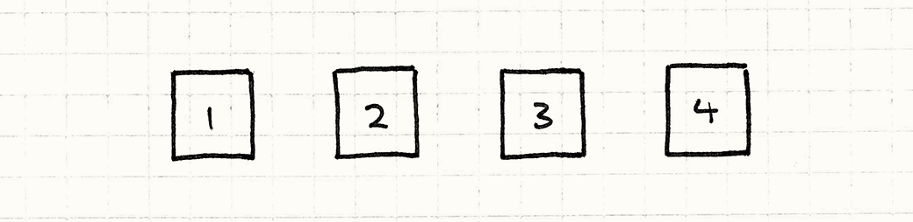
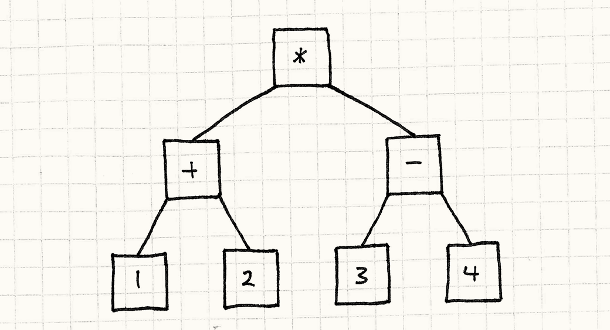
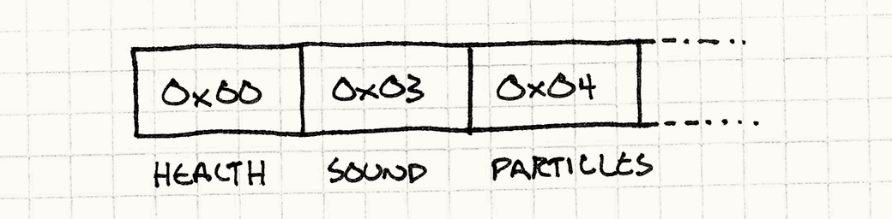
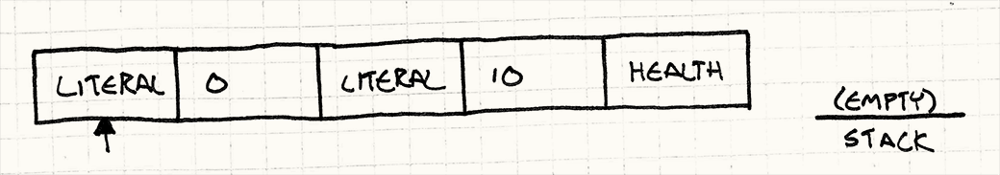
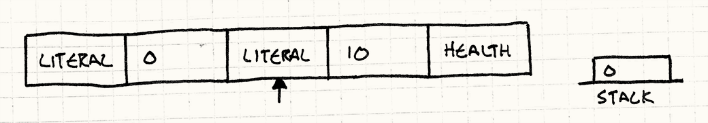
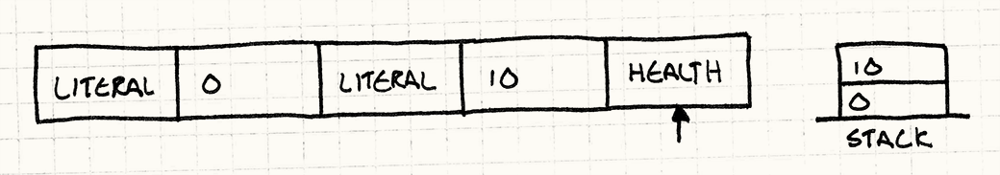
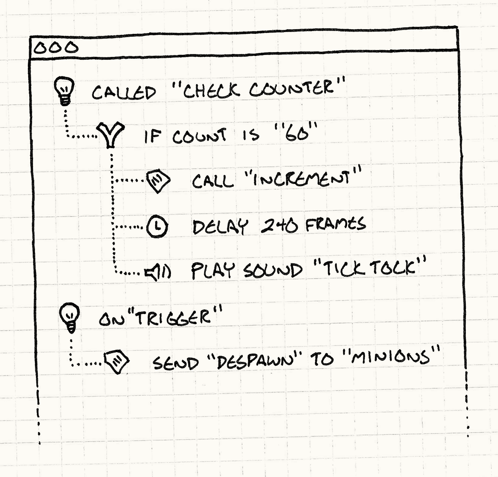

#Байткод (Bytecode)

##Задача

*Обеспечить поведению гибкость данных, декодируемых в виде инструкций для виртуальной машины.*

##Мотивация

Создавать игры бывает весело, но не очень то и легко. Современные игры требуют гигантской сложнейшей кодовой базы. Производители консолей и владельцы магазинов приложений постоянно ужесточают требования к качеству и даже единственный баг может не дать вашей игре выйти на рынок.

>Я работал над играми, в которых было шесть миллионов строк кода на ```C++```. Для сравнения код, управляющий марсоходом Mars Curiosity примерно в половину меньше.

В то же время мы хотим выжать из существующего железа всю производительность до последней капли. Игры нагружают железо как никакие другие программы, и нам нужно постоянно заниматься оптимизацией, чтобы просто угнаться за конкурентами.

Чтобы соответствовать этим высоким требованиям стабильности и производительности, мы используем тяжеловесные языки типа ```C++```, в которых есть достаточная низкоуровневая выразительность чтобы напрямую работать с железом и богатая система типизации, предотвращающая или хотя бы ограничивающая появление багов.

Мы гордимся своими навыками работы с ними, но у всего есть своя цена. Чтобы стать профессиональным программистом нужно потратить немало лет на учение, после которых вы сможете справиться со сложностью собственной кодовой базы. Время сборки больших игр может варьироваться от "можно пойти попить кофе" до "пожарьте кофе бобы, размелите их вручную, сварите эспрессо, приготовьте молоко и потренируйтесь в приготовлении латте."

Помимо всех этих сложностей в играх обязательно должен присутствовать еще один компонент: *веселье*. Игроки требуют игровой процесс, который будет и новаторским и отлично сбалансированным. Для этого нужно множество итераций, но даже небольшая настройка требует от программиста залазить в низкоуровневый код и потом ожидать перекомпиляцию, что в результате во многом убивает творческий процесс.

###Война заклинаний!

Скажем, мы работаем над магическим файтингом. Двое волшебников борются между собой с помощью заклинаний, пока не останется только победитель. Мы можем определить эти заклинания в коде, но это будет означать что каждый раз когда нужно будет настроить их параметры, придется беспокоить программиста. Если геймдизайнер хочет немного изменить числа чтобы попробовать что получится, для этого придется перекомпилировать всю игру, перезагружать ее и повторять бой заново.

Как часто бывает с современными играми, нам нужно иметь возможность обновлять игру после продажи чтобы исправлять баги и добавлять новый контент. Если заклинание будет жестко закодированным, то для обновления нужно будет патчить сам исполнимый файл игры.

Давайте пойдем дальше и представим себе что мы хотим поддерживать *моды*. Мы хотим дать игрокам возможность создавать собственные заклинания. Если они будут находиться в коде, это значит что каждому моддеру нужно иметь всю цепочку инструментов для сборки игры и нам нужно выкладывать свои исходники. Еще хуже то, что если в заклинании будет баг, он будет способен обрушить всю игру целиком на машине игрока.

###Данные > Код

Понятно, что наша реализация на языке программирования нам подходит не очень. Нам нужно выделить для заклинаний отдельную от игры песочницу. Нам нужно, чтобы они легко редактировались и перезагружались, а также были физически отделены от остальной части исполнимого файла.

Не знаю как вам, а мне это напоминает *данные*. Если мы сможем определить наше поведение в отдельном файле данных, которые движок игры будет каким-то образом загружать и "выполнять" — это и будет то что нам нужно.

Нужно определиться с тем что значит "выполнить" данные. Как несколько байтов из файла можно превратить в поведение. Есть несколько способов. Я думаю нам легче будет оценить сильные и слабые стороны шаблона, если мы сравним его с другим шаблоном: [Интерпретатор (Interpreter)<sup>GoF</sup>](http://en.wikipedia.org/wiki/Interpreter_pattern).

###Шаблон Интерпретатор

Я мог бы написать об этом шаблоне целую главу, но до меня это сделали четыре известные вам мужика. Вместо этого я ограничусь совсем кратким его описанием. Он начинается с языка — я имею в виду языка программирования — который вы хотите выполнять. Скажем он будет поддерживать математические выражения следующего вида:

````C++
(1 + 2) * (3 — 4)
````

Мы берем каждый из фрагментов этого выражения и превращаем его в соответствии с правилами языка в *объект*. Числовые литералы будут объектами:



По идее, это просто небольшая обертка над сырыми значениями. Операторы тоже будут объектами и у них будут ссылки на свои операнды. Если учитывать родителей и наследников, это выражение превращается в небольшое дерево объектов:



>Что это за "магия"? Очень просто: *парсинг*. Парсер получает строку символов и превращает ее в *абстрактное синтаксическое дерево*, т.е. коллекцию объектов, представляющих грамматическую структуру текста.

>Как только у нас будет парсер — считай пол компилятора готово.

Шаблон интерпретатор не о том как *создавать* это дерево. Он о том как его *выполнять*. Действует он весьма разумно. Каждый объект в дереве — это выражение или подвыражение. В полностью объектно-ориентированной манере мы позволяем выражениям вычислять самих себя.

Для начала определим базовый интерфейс, реализуемый всеми выражениями.

```C++
class Expression
{
public:
  virtual ~Expression() {}
  virtual double evaluate() = 0;
};
```

Далее определяем класс, реализующий это для всех типов выражений в словаре нашего языка. Самые простые из них — это числа.

```C++
class NumberExpression : public Expression
{
public:
  NumberExpression(double value) 
  : value_(value)
  {}

  virtual double evaluate()
  {
    return value_;
  }

private:
  double value_;
};
```

Выражение числовой литерал вычисляет свое значение. Сложение и умножение немного сложнее, потому что содержат подвыражения. До того как они смогут вычислить свое значение, они должны рекурсивно вычислить все подвыражения. Примерно таким образом:

>Я уверен, что вы догадаетесь как выглядит реализация умножения.

```C++
class AdditionExpression : public Expression
{
public:
  AdditionExpression(Expression* left, Expression* right)
  : left_(left), right_(right)
  {}

  virtual double evaluate()
  {
    // Вычисляем операнды.
    double left = left_->evaluate();
    double right = right_->evaluate();

    // Складываем их.
    return left + right;
  }

private:
  Expression* left_;
  Expression* right_;
};
```

Довольно изящно, не правда ли? Всего несколько простых классов и теперь у нас есть возможность вычислять достаточно сложные арифметические выражения. Нам просто нужно будет создать правильные объекты и корректно их подключить.

Это отличный, простой шаблон, но имеющий значительные недостатки. Посмотрите на иллюстрацию. Что вы видите? Кучу прямоугольников и кучу стрелок между ними. Код представляется как развесистое фрактальное дерево мелких объектов. Это порождает некоторые неприятные последствия:

>```Ruby``` был реализован именно таким образом около 15 лет назад. В версии 1.9 он перешел на байткод по типу того, что описан в этой главе. Смотрите сколько времени я вам сэкономил!

* Загрузка с диска требует создания экземпляров и связывание множества мелких объектов.

* Эти объекты и указатели между ними занимают кучу памяти. На 32-битной машине даже такое маленькое выражение занимает не меньше 68 байт, не считая выравнивания.

>Если вы играете дома, не забудьте принять во внимание виртуальную таблицу указателей (vtable pointers).

* Путешествие по указателям подвыражений убивает данные в кеше. Да и вообще все вызовы виртуальных методов сеют панику в кеше инструкций.

> См. главу [Локализация данных (Data Locality)](./chapter-6/6.1-data-locality), где подробнее описано что такое кеш и как он влияет на производительность.

Если соединить все это вместе, то что получится? S-L-O-W (медленно). Вот почему большинство языков программирования, которые мы используем не основаны на шаблоне *Интерпретатор*. Он просто слишком медленный и требует слишком много памяти.

###Машинный код, виртуальный

Вспомним нашу игру. Когда мы ее запускаем, компьютер игрока не пытается построить в реальном времени словарь C++ кода. Вместо этого у нас есть машинный код, который выполняется на процессоре. В чем же особенность машинного кода?

* *Он компактен*. Это цельное, сплошное скопление бинарных данных, в котором зазря не тратится ни единый бит.

* *Он линеен*. Инструкции собраны вместе и выполняются одна за другой. Никаких прыжков по памяти (если вы конечно не управляете порядком выполнения).

* *Он низкоуровневый*. Каждая инструкция выполняет относительно минимальную вещь и более сложное поведение получается путем их комбинирования.

* *Он быстрый*. Следствием всего этого (ну и еще конечно потому, что это реализовано в железе) является то, что машинный код выполняется со скоростью ветра.

Звучит здорово, но ведь мы не собираемся писать настоящий машинный код для нашего заклинания. Позволять пользователю писать машинный код, который мы будем выполнять — это крайне небезопасно. Что нам нужно — так это некий компромисс между машинным кодом и безопасностью шаблона *Интерпретатор*.

Что если вместо загрузки настоящего машинного кода и прямого его выполнения, мы определим наш собственный *виртуальный* машинный код? Далее мы просто напишем небольшой эмулятор для нашей игры. Он будет похож на машинный код — компактный, линейный, сравнительно низкоуровневый, но будет интерпретироваться нашей игрой и значит его можно будет выполнять в режиме песочницы.

> Вот почему многие игровые консоли и iOS не позволяют программам выполнять машинный код, загружаемый или генерируемый во время выполнения программы. Это не очень хорошо, потому что самые быстрые реализации языков именно так и работают. Они содержат в себе компилятор на лету (just-in-time) или JIT, преобразующий язык в оптимизированный машинный код на лету.

Наш маленький эмулятор будет называться *виртуальной машиной* (или "VM" если коротко), а наш синтетический машинный код, который на ней выполняется будет называться *байткодом*. Он обладает гибкостью и простотой использования описания вещей с помощью данных, но обладает лучшей производительностью чем высокоуровневые реализации типа шаблона *Интерпретатор*.

> В программистских кругах "виртуальная машина" и "интерпретатор" — синонимы и я использую эти слова во взаимозаменяемом значении. Но когда мы говорим о шаблоне Интерпретатор от банды четырех, я специально пишу шаблон, чтобы было понятно о чем я говорю.

Звучит довольно сложно. Оставшуюся часть главы я посвящу тому, чтобы продемонстрировать, что если ограничиться только самыми главными функциями, это вполне посильная задача. Даже если вы сами не будете использовать этот шаблон, вы будете лучше понимать ```Lua``` и другие языки, основанные на этом шаблоне.

##Шаблон

**Набор инструкций** определяет низкоуровневые операции, которые можно выполнить. Они кодируются в виде **последовательности байтов**. **Виртуальная машина** выполняет эти инструкции по одной за раз, используя **стек промежуточных значений**. Комбинируя инструкции можно определить сложное высокоуровневое поведение.

##Как использовать

Это самый сложный шаблон из описанных в книге и его не так уж просто вставить в игру. Использовать его стоит только если вам нужно определить очень много разнообразного поведения и язык, на котором вы пишете игру не слишком для этого подходит потому что:

* Он слишком низкоуровневый и программировать на нем сложно или чревато ошибками.

* Итеративная работа с ним получается слишком медленной из-за долгой компиляции или других проблем со сборкой.

* Он слишком доверителен. Если вы хотите быть уверенными что определенное поведение не обрушит игру, вам нужно организовать для него песочницу, отдельную от остальной кодовой базы.

Конечно, все это подходит практически к любой игре. Кто же не хочет более быстрых циклов или большей безопасности? К сожалению, ничто не достается даром. Байткод медленнее настоящего, так что в критических для производительности частях движка игры его применять не стоит.

##Имейте в виду

Есть что-то притягательное в идее создания собственного языка или системы в системе. Я приведу здесь минимальный пример, но в реальном мире такие вещи обычно разрастаются подобно виноградной лозе.

> Для меня игровая разработка сама по себе привлекательна. В любом случае я создаю виртуальное пространство для других людей, в котором они могут играть и заниматься созиданием.

Каждый раз, когда я вижу как кто-то реализует язык или систему скриптов, они говорят "Не волнуйся, она будет совсем маленькой". А потом они неизбежно начинают добавлять все новые и новые маленькие возможности, пока не получится полноценный язык. И в отличие от других языков, он растет прямо там, где появился как некий живой организм и в результате его архитектура получается подобной городским трущобам.

> Для примера можете посмотреть любой язык шаблонов.

Конечно, ничего *плохого* в создании полноценного языка нет. Но только если вы делаете это сознательно. Иначе не забывайте контролировать возможности своего байткода. Наденьте на него поводок, прежде чем он от вас не убежал.

###Вам нужен интерфейс для байткода (front-end)

У низкоуровневых инструкций байткода впечатляющая производительность, но бинарный формат — это не то что хотели бы видеть ваши пользователи. Одна из причин, почему мы убираем описание поведения из кода — это потому что мы хотим его описывать на *более высоком* уровне. Если ```C++``` — слишком низкий уровень, позволяющий писать практически на уровне ассемблера — даже ваша собственная архитектура — это еще не улучшение!

Также, как в шаблоне *Интерпретатор* от банды четырех, мы подразумеваем, что у нас есть способ *генерации* байткода. Обычно пользователи описывают поведение на довольно высоком уровне и потом специальная утилита превращает результат в байткод, понятный виртуальной машине. Другими словами компилятор.

> Оспаривать это утверждение берется почтенная игра RoboWar. В этой игре игрок пишет маленькую программу для управления роботом на языке, очень похожем на ассемблер и с набором инструкций, подобным здесь описываемому.

> С ее помощью я впервые познакомился с ассемблеро-подобными языками.

Я знаю что звучит пугающе. Вот почему я об этом и упоминаю. Если у вас нет возможности писать дополнительный инструментарий — значит байткод не для вас. Но как вы скоро увидите, все не так уж и плохо.

#Вам будет не хватать вашего отладчика

Программирование — это сложно. Мы знаем чего хотим от машины, но не всегда правильно сообщаем ей об этом — т.е. допускаем появление багов. Для того чтобы их устранять мы вооружаемся кучей инструментов, помогающих нам понять что в коде работает неправильно и как это исправить.

У нас есть отладчик, статический анализатор, декомпилятор и т.д. Все эти инструменты разработаны для каких-либо существующих языков: либо машинного кода, либо для чего-то более высокоуровневого.

Когда вы определяете собственную виртуальную машину для байткода, эти инструменты становятся для вас недоступными. Конечно вы можете отлаживать саму виртуальную машину. Но таким образом вы ведь видите только что делает *сама* виртуальная машина, а не байткод, который она интерпретирует. И конечно она не позволит вам увидеть что делается с байткодом в его исходной высокоуровневой форме, из которой он компилировался.

Если поведение, которое мы определяем довольно простое, вы вполне можете обойтись без всяких дополнительных инструментов. Но как только объем контента будет расти, думайте о том что вам придется потратить время на инструменты, помогающие пользователям видеть что их байткод делает. Они могут не поставляться в комплекте с игрой, но они могут быть критичными для того чтобы вы вообще смогли выпустить игру.

> Конечно, если вы хотите чтобы ваша игра была модифицируемой, тогда вам *придется* оставить в игре эти возможности и это только увеличивает их важность.

##Пример кода

После предыдущих нескольких разделов вы наверное будете удивлены тем насколько прямолинейна реализация. Для начала нам нужно сформировать набор инструкций для виртуальной машины. Прежде чем начать думать о байткоде и прочем, давайте подумаем о нем как об ```API```.

###Магический API

Если мы описываем заклинания обычным ```C++``` кодом, какой ```API``` нам нужен для его вызова? Что за базовые операции определены в движке игры, с помощью которых можно определять заклинания?

Большинство заклинаний в конце концов меняют одну из статистик волшебника, так что мы начнем с функций для такого изменения:

```C++
void setHealth(int wizard, int amount);
void setWisdom(int wizard, int amount);
void setAgility(int wizard, int amount);
```

Первый параметр указывает на какого волшебника мы влияем, например ```0``` для игрока, а ```1``` для его противника. Таким образом можно, например, лечить своего волшебника и наносить урон противнику. С помощью всего трех этих методов можно описать очень много магических эффектов.

Если заклинание будет просто тихо изменять состояния, игровая логика будет работать, но играть будет скучно до слез. Давайте это исправим:

```C++
void playSound(int soundId);
void spawnParticles(int particleType);
```

Эти функции не влияют на геймплей, но улучшают *восприятие* игры. Мы можем добавить тряску камеры, анимации и т.д., но для начала хватит и этого.

###Набор магических инструкций

Теперь посмотрим как мы можем превратить *программный* ```API``` в нечто, что можно контролировать из данных. Начнем с малого, а потом будем дорабатывать то что получается. Сейчас мы считаем что в методы никаких параметров не передается. Скажем метод ```set___()``` всегда будет влиять на волшебника игрока и устанавливать параметр в максимальное значение. Аналогично операции спецэффектов (FX) будут проигрывать жестко заданный звук или систему частиц.

Теперь мы можем описать наше заклинание как набор инструкций. Каждая указывает какую операцию нужно выполнить. Перечислим их:

```
enum Instruction
{
  INST_SET_HEALTH = 0x00,
  INST_SET_WISDOM = 0x01,
  INST_SET_AGILITY = 0x02,
  INST_PLAY_SOUND = 0x03,
  INST_SPAWN_PARTICLES = 0x04
};
```

Чтобы закодировать заклинание в данных, мы просто сохраняем массив со значениями enum. У нас всего несколько примитивов так что диапазон значений enum помещается в один байт. Это значит что наше заклинание — это всего лишь список байтов — следовательно "байткод".



> Некоторые виртуальные машины используют больше чем один байт для каждой инструкции и декодируют их по более сложным правилам.

> Тем не менее одного байта достаточно для [Java Virtual Machine](http://en.wikipedia.org/wiki/Java_virtual_machine) и для Microsoft’s [Common Language Runtime](http://en.wikipedia.org/wiki/Common_Language_Runtime), на котором основана платформа ```.NET``` и нас вполне устраивает работа этих машин.

Чтобы выполнить одну инструкцию, мы смотрим что у нас за примитив и вызываем соответствующий метод ```API```:

```C++
switch (instruction)
{
  case INST_SET_HEALTH:
    setHealth(0, 100);
    break;

  case INST_SET_WISDOM:
    setWisdom(0, 100);
    break;

  case INST_SET_AGILITY:
    setAgility(0, 100);
    break;

  case INST_PLAY_SOUND:
    playSound(SOUND_BANG);
    break;

  case INST_SPAWN_PARTICLES:
    spawnParticles(PARTICLE_FLAME);
    break;
}
```

Таким образом, наш интерпретатор формирует мост между мирами кода и данных. Мы можем поместить его в небольшую обертку виртуальной машины, которая выполняет все заклинание следующим образом:

```C++
class VM
{
public:
  void interpret(char bytecode[], int size) {
    for (int i = 0; i < size; i++) {
      char instruction = bytecode[i];
      switch (instruction)
      {
         // Случаи для каждой инструкции...
      }
    }
  }
};
```

Теперь у нас есть своя виртуальная машина. К сожалению,  она не очень то и гибкая. Мы не можем описать заклинание которое действует на персонаж противника или понижает статистику. И звук мы можем играть всего только один!

Чтобы получить что-то похожее на настоящий язык, нам нужно добавить параметры.

###Машина стеков

Чтобы выполнить сложное выражение с вложениями, нужно начинать с подвыражений. Вычисляем их и передаем результаты вверх в качестве аргументов содержащих их выражений до тех пор, пока все выражение не будет вычислено.

Шаблон *Интерпретатор* моделирует это явно в виде дерева вложенных объектов, но нас интересует скорость и плоский список инструкций. Мы все равно хотим чтобы результат подвыражений попадал в правильное ограничивающее выражение. Но так как наши данные теперь плоские, чтобы этим управлять нам нужно использовать порядок инструкций. Мы будем делать это также как работает процессор: с помощью стека.

Такая архитектура без всякой фантазии названа [стековой машиной](http://en.wikipedia.org/wiki/Stack_machine). Языки программирования типа ```Forth```[[1]](http://en.wikipedia.org/wiki/Forth_(programming_language)), ```PostScript```[[2]](http://en.wikipedia.org/wiki/PostScript) и ```Factor```[[3]](http://en.wikipedia.org/wiki/Factor_(programming_language)) предоставляют эту модель пользователю напрямую.

```C++
class VM
{
public:
  VM() 
  : stackSize_(0)
  {}

  // Other stuff...

private:
  static const int MAX_STACK = 128;
  int stackSize_;
  int stack_[MAX_STACK];
};
```

Виртуальная машина содержит внутренний стек значений. В нашем примере единственный тип значений, с которыми работают наши инструкции — это числа. Поэтому мы можем использовать простой массив целых чисел. Как только любому биту данных нужно будет быть переданным из одной инструкции в другую — это будет происходить через стек.

Как следует из имени, значения могут помещаться и извлекаться из стека. Добавим методы для этих операций:

```C++
class VM
{
private:
  void push(int value) {
    // Поверяем переполнение стека.
    assert(stackSize_ < MAX_STACK);
    stack_[stackSize_++] = value;
  }

  int pop() {
    // Проверяем что стек не пустой.
    assert(stackSize_ > 0);
    return stack_[--stackSize_];
  }

  // Другие вещи...
};
```

Когда инструкции требуется получить параметры, она берет их из стека:

````C++
switch (instruction)
{
  case INST_SET_HEALTH:
  {
    int amount = pop();
    int wizard = pop();
    setHealth(wizard, amount);
    break;
  }

  case INST_SET_WISDOM:
  case INST_SET_AGILITY:
    // Аналогично, как сверху...

  case INST_PLAY_SOUND:
    playSound(pop());
    break;

  case INST_SPAWN_PARTICLES:
    spawnParticles(pop());
    break;
}
```

Чтобы извлечь значение *на* стек, нам нужна еще одна инструкция: литерал. Она представляет собой сырое целое значение. Но откуда берется *это* значение? Как нам избежать здесь бесконечной регрессии вниз?

Можно воспользоваться тем фактом, что наш поток инструкций — это всего лишь последовательность байт: мы можем добавить число прямо в поток инструкций. Определим еще один тип инструкций для численных литералов:

```C++
case INST_LITERAL:
{
  // Считываем следующий байт из байткода.
  int value = bytecode[++i];
  push(value);
  break;
}
```

> Здесь я просто считываю один байт для получения значения числа чтобы не заморачиваться с кодом, считывающим многобайтные целые значения, но в настоящей реализации вам понадобятся литералы, способные покрывать полный диапазон численных типов.


Она считывает следующий байт в потоке байткода *как число* и помещает его на стек.

Давайте сформируем строку из нескольких инструкций и посмотрим как интерпретатор будет ее выполнять чтобы понять как работает стек. Начнем с пустого стека и интерпретатора, указывающего на первую инструкцию.



Первой выполняется инструкция ```INST_LITERAL```. Она считывает следующий байт из баткода (```0```) и помещает его в стек.



Далее выполняется второй ```INST_LITERAL```. Он считывает ```10``` и тоже помещает в стек.



И наконец вызывается ```INST_SET_HEALTH```. Она берет со стека значение ```10``` и сохраняет его в ```amount```. Далее берет со стека ```0``` и сохраняет в ```wizard```. После этого происходит вызов ```setHealth()``` с этими параметрами.

Та-да! У нас получилось заклинание, устанавливающее здоровье волшебника игрока в значение десять единиц. Мы получили достаточную гибкость для того, чтобы устанавливать здоровье любого из волшебников в любое значение. Аналогично мы можем проигрывать разные звуки и порождать частицы.

Но... это все еще похоже на формат *данных*. Мы не можем, например, установить здоровье волшебника равным половине его мудрости. А нашим дизайнерам было бы интересно указывать *правила* для заклинаний, а не просто *значения*.

###Поведение = композиция

Если думать о нашей маленькой виртуальной машине как о языке программирования, все что он поддерживает — это всего несколько встроенных функций и константных параметров для них. Чтобы описывать на байткоде *поведение*, нам не хватает *композиции*.

Нашим дизайнерам нужно иметь возможность создавать выражения, комбинирующие различные значения интересным образом. Простой пример — это возможность модифицировать характеристики персонажа *на* определенное значение, а не устанавливать *в* конкретное значение.

Для этого нам нужно учитывать текущее значение характеристики. У нас есть инструкции для *установки* значений. А теперь нам нужно добавить инструкции для *чтения* значений:

```C++
case INST_GET_HEALTH:
{
  int wizard = pop();
  push(getHealth(wizard));
  break;
}

case INST_GET_WISDOM:
case INST_GET_AGILITY:
  // Ну вы поняли...
```

Как вы видите, они работают со стеком в обе стороны. Они берут со стека параметр чтобы узнать для какого волшебника нужно получить характеристику, получают это значение и помещают его обратно в стек.

Теперь мы можем написать заклинание, которое будет копировать характеристики. Мы можем создать заклинание, которое будет устанавливать ловкость волшебника равной его мудрости или чары, которые будут приравнивать здоровье одного волшебника здоровью другого.

Уже лучше, но все равно ограничения остаются. Нам нужна арифметика. Пришло время для нашей маленькой виртуальной машины научиться складывать ```1+1```. Добавим еще несколько инструкций. Теперь вам уже наверное проще будет понять как они работают. Просто покажу сложение:

```C++
case INST_ADD:
{
  int b = pop();
  int a = pop();
  push(a + b);
  break;
}
```

Как и остальные наши инструкции, она берет со стека пару значений, выполняет с ними работу и помещает результат обратно в стек. До сих пор каждая новая наша инструкция давала нам фиксированный прирост в выразительности, а теперь мы сделали большой шаг. Это не очевидно, но теперь мы можем обрабатывать любые типы сложных, многоуровневых вычислений.

Перейдем к более сложному примеру. Скажем, мы хотим создать заклинание, которое будет устанавливать значение здоровья волшебника равным среднему арифметическому между его ловкостью и мудростью. Вот его код:

```C++
setHealth(0, getHealth(0) +
    (getAgility(0) + getWisdom(0)) / 2);
```

Вы можете подумать, что нам нужна инструкция для обработки явной группировки, которая управляет подчиненностью в данном выражении, но стек косвенно уже все это поддерживает. Вот как мы стали бы вычислять значение вручную:

1. Получаем текущее значение здоровья волшебника и сохраняем его.
2. Получаем ловкость волшебника и сохраняем ее.
3. Делаем тоже самое с мудростью.
4. Складываеп последние два значения и запоминаем результат.
5. Делим его на два, сохраняем результат.
6. Вспоминаем значение здоровья волшебника и прибавляем к нему результат.
7. Берем результат и устанавливаем в качестве текущего значения здоровья волшебника.

Обратили внимания на все эти "сохраним" и "вспомним"? Каждое "сохраним" — это помещение в стек (push), а каждое "вспомним" — это получение значения со стека (pop). Это значит что мы достаточно просто можем перевести наши действия в байткод. Например, первая строка для получения текущего значения здоровья волшебника выглядит так:

```C++
LITERAL 0
GET_HEALTH
```

Этот фрагмент байткода помещает значение здоровья волшебника в стек. Если мы механически транслируем каждую строку таким образом, мы получим фрагмент байткода, вычисляющий наше оригинальное выражение. Чтобы почувствовать как комбинируются инструкции, я продемонстрирую вам это ниже.

Чтобы показать как стек меняется со временем, мы проследим за примером выполнения, в котором у волшебника здоровье будет равно ```45```, ловкость — ```7``` и мудрость — ```11```. После выполнения каждой инструкции видно как выглядит стек и приведен небольшой комментарий.

```C++
LITERAL 0   [0]             # индекс волшебника
LITERAL 0   [0, 0]          # индекс волшебника
GET_HEALTH  [0, 45]         # getHealth()
LITERAL 0   [0, 45, 0]      # индекс волшебника
GET_AGILITY [0, 45, 7]      # getAgility()
LITERAL 0   [0, 45, 7, 0]   # индекс волшебника
GET_WISDOM  [0, 45, 7, 11]  # getWisdom()
ADD         [0, 45, 18]     # сложение ловкости и мудрости
LITERAL 2   [0, 45, 18, 2]  # Divisor
DIVIDE      [0, 45, 9]      # вычисление среднего ловкости и мудрости
ADD         [0, 54]         # добавление среднего к текущему значению
SET_HEALTH  []              # установка здоровья равным результату
```

Если вы посмотрите на состояние стека на каждом шаге, вы увидите каким магическим образом мы управляем потоком инструкций. Мы помещаем в стек ```0``` в качестве индекса волшебника в начале и он таки будет болтаться в самом низу до тех пор пока не понадобится нам в самом конце для инструкции ```SET_HEALTH```.

> Возможно эпитет "магия" здесь даже недостаточен.

###Виртуальная машина

Я могу и дальше добавлять новые и новые инструкции, но думаю на этом стоит остановиться. На данный момент у нас уже есть маленькая виртуальная машина, позволяющая довольно свободно определять поведение в простом, компактном формате данных. Хотя "байткод" и "виртуальная машина" и звучат пугающе, вы можете убедиться сами что все что здесь есть — это стек, цикл и управляющие переключатели.

Помните нашу исходную задачу о том что поведение нужно определять в режиме песочницы? Теперь когда вы знаете как вы реализовали виртуальную машину мы эту задачу выполнили. Байткод не может сделать ничего злонамеренного и не может выбраться за пределы своего места в движке, так как общаться с остальным кодом он может только через свои инструкции.

Мы сами контролируем сколько памяти виртуальная машина использует и какой у нее размер стека. Поэтому нам нужно тщательно следить за тем чтобы не было переполнения. Мы даже можем управлять тем сколько времени она использует. В нашем цикле инструкций мы можем подсчитать сколько всего выполнили и прерваться когда достигнем установленного предела.

> Управлять временем выполнения в нашем примере необязательно, потому что у нас нет никаких инструкций для организации циклов. Мы можем ограничить время выполнения только ограничением общего размера байткода. Из этого кстати следует что наш байткод не является полным по Тьюрингу.

Осталась всего одна проблема: само создание байткода. До сих пор мы составляли псевдокод и компилировали его вручную. Если у вас конечно нет *кучи* свободного времени, на практике так работать не получится.


###Утилита для волшебства

Нашей изначальной задачей было получение *высоко*уровневого способа задания поведения, но в результате у нас получилось нечто еще более *низко*уровневое чем ```C++```. У этого решения есть нужная нам производительность и безопасность, которые мы хотели, но никакого удобства работы для дизайнера.

Чтобы устранить это препятствие нам нужен инструмент. Нам нужна программа, позволяющая пользователям определять поведение для заклинания на высоком уровне, а затем генерировать низкоуровневый байткод для стековой машины.

Звучит еще страшнее, чем создание виртуальной машины. Многие программисты изучали компиляторы в качестве дисциплины в колледже и начинают испытывать симптомы посттравматического синдрома от одного вида книжки с драконом или слов "[lex](http://en.wikipedia.org/wiki/Lex_(software))" и "[yacc](http://en.wikipedia.org/wiki/Yacc)".

> Я говорю конечно о классической книге [Компиляторы. принципы технологии и инструментарий](http://en.wikipedia.org/wiki/Compilers:_Principles,_Techniques,_and_Tools)


По правде говоря, компиляция текстоподобного языка не настолько страшная задача, но пожалуй чересчур обширная, чтобы говорить о ней подробно в этой главе. Однако вам это может и не понадобиться. Я ведь говорил об *инструменте* — т.е. *компиляторе*, исходниками для которого должен быть *текстовый файл*.

Я скорее призываю вас к созданию инструмента с графическим интерфейсом, в котором люди смогут определить нужное им поведение, даже если они не слишком технически подкованы. Написание текста, свободного от синтаксических ошибок слишком сложно для неподготовленных людей, у которых нет опыта когда на них годами ругается компилятор.

Вместо этого вы можете создавать приложение, которое позволит пользователю "скриптовать", кликая и перетаскивая маленькие кирпичики или выбирая варианты из меню или работать с другими подобными объектами, удобными для определения поведения.



> Скриптовая система, которую я писал для [Henry Hatsworth and the Puzzling Adventure](http://en.wikipedia.org/wiki/Henry_Hatsworth_in_the_Puzzling_Adventure) работает именно так.

Это хорошо тем, что, пользуясь только пользовательским интерфейсом, невозможно создать "некорректную" программу. Вместо того чтобы извергать на пользователей сообщения с ошибками, вы можете блокировать кнопки или ограничивать вводимые значения чтобы создаваемые скрипты всегда были корректными.

> Хочу еще раз напомнить насколько важна обработка ошибок. Как программисты мы привыкли рассматривать человеческие ошибки как недопустимые недостатки, которые необходимо в себе искоренять.

> Чтобы создать систему, с которой пользователю было бы приятно работать, вам придется принять его человечность, включая склонность ошибаться. Люди только тем и занимаются что делают ошибки и это фундаментальная основа творческого процесса. Корректная их обработка с такими полезными функциями как отмена позволяет пользователям быть более креативными и делать работу лучше.

Таким образом, вам не нужно разрабатывать словарь и писать парсер для маленького языка. Но я знаю что не всем по душе программирование пользовательских интерфейсов. Ну значит в таком случае у меня нет для вас хороших новостей.

В конце концов шаблон ведь о том чтобы иметь возможность описывать поведение в дружественной пользователю высокоуровневой форме. Вам нужно разнообразить игровой опыт. Чтобы эффективно выполнять поведение вам нужно преобразовывать результат в низкоуровневую форму. Это серьезная работа, но при должном усилии она окупится.

http://live13.livejournal.com/471440.html