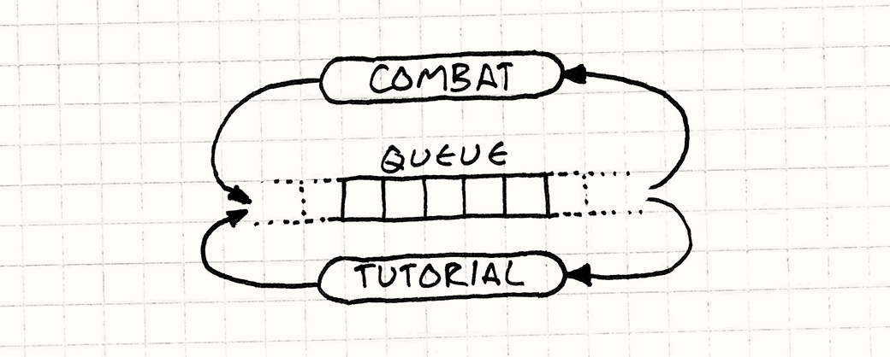
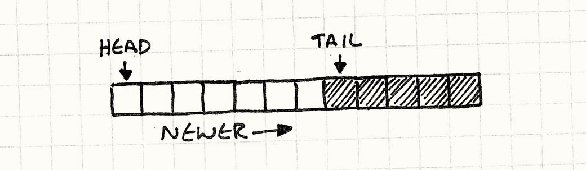
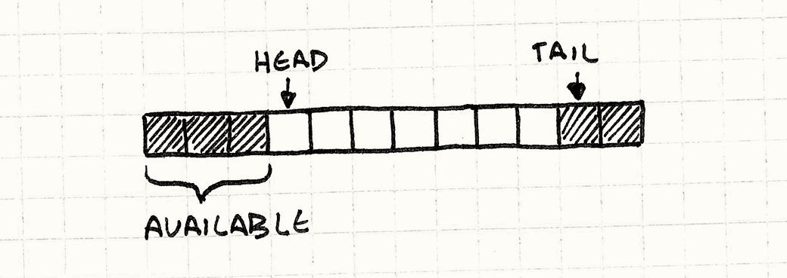

# Очередь событий (Event Queue)

## Задача

*Позволяет одной сущности охватывать несколько областей, не связывая их между собой.*

## Мотивация

Если вы не живете до сих под камнем, где нет доступа к интернету, вы наверняка уже слышали об "очереди событий (event queue)". Ну или хотя бы об "очереди сообщений (message queue)", или "цикле событий (event loop)", "конвейере (обработки) сообщений (message pump)" и т.д. Чтобы освежить вашу память, я хочу познакомить вас с несколькими проявлениями шаблона.

> В большинстве других глав я использую "события" и "сообщения" в качестве синонимов. Но когда это будет необходимо, я буду указывать на их различия.

## Цикл событий графического пользовательского интерфейса

Если вы когда-либо занимались программированием графического интерфейса, тогда вы наверняка уже знакомы с *событиями*. Каждый раз, когда пользователь взаимодействует с вашей программой — нажимает кнопку, открывает меню или нажимает клавишу — операционная система генерирует событие. Она вбрасывает этот объект в приложение, а ваша забота — это подхватить его и увязать с каким либо интересным поведением.

> Такой стиль программирования является общепринятым. Такая парадигма называется [Событийно-ориентированное программирование](http://en.wikipedia.org/wiki/Event-driven_programming) (event-driven programming).


Для того, чтобы получать такие послания, где-то глубоко в недрах вашего кода должен находиться *цикл событий (event loop)*. Выглядит он примерно так:

```C++
while (running)
{
  Event event = getNextEvent();
  // Обработка события...
}
```

Вызов ```getNextEvent()``` отправляет порцию необработанного пользовательского ввода в ваше приложение. Вы перенаправляете его в обработчик событий, и ваша программа магическим образом оживает. Самое интересное здесь в том, что приложение *изымает (pulls)* событие когда вам это нужно. Операционная система не сразу перескакивает к определенному коду в вашем приложении, как только пользователь тыкает в периферийное устройство.

> И наоборот, *прерывания* от операционной системы *именно* так и работают. Когда происходит прерывание, операционная система останавливается, чтобы ваша программа не делала, и переходит сразу к обработчику прерываний. Именно из-за такой непредсказуемости с прерываниями так сложно работать.

Это значит, что когда поступает пользовательский ввод, он должен куда-то попасть, так чтобы операционная система не потеряла его между устройством, зарегистрировавшим ввод и следующим вызовом ```getNextEvent()``` в вашей программе. Это "куда-то" и называется *очередью*.


Когда поступает пользовательский ввод, ОС добавляет необработанные события в очередь. Когда вы вызываете ```getNextEvent()```, эта функция вытаскивает самое старое событие из очереди и передает его приложению.

### Центральная шина событий

Большинство игр не работает в таком событийно-ориентированном стиле, но для игр является нормальным иметь собственную очередь событий в качестве нервной системы. Обычно ее описывают эпитетами "центральная", "глобальная" или "главная". Используется она для высокоуровневого общения между игровыми системами, остающимися несвязанными.

> Если хотите понять почему не используются — посмотрите в главе [Игровой цикл(Game Loop)](../chapter-3/3.2-game-loop.md).

Предположим, что в вашей игре есть система обучения, показывающая окна с подсказками после определенных игровых действий. Например, после того как игрок первый раз побеждает глупое чудовище, вы хотите показать ему маленький овал с надписью "Нажмите X, чтобы собрать добычу!" 

> Изящная система обучения мучительна для реализации и большинство игроков практически не обращают на нее внимания, так что можно подумать, что она не стоит ваших усилий. Но, если игроку все-таки *захочется* воспользоваться обучением, оно будет для него неоценимой помощью в освоении вашей игры.

Ваш игровой процесс и боевой код и без того достаточно сложны. Последнее, что вам хотелось бы делать — это помещать внутрь кучу триггеров для запуска обучения. Вместо этого в некоторых играх существует центральная очередь событий. Любая игровая система может посылать в нее события, так что боевая система добавляет в нее событие "враг убит" каждый раз, когда вы расправляетесь с врагом.

В свою очередь, каждая игровая система получает события из очереди. Движок обучения регистрируется в очереди и сообщает о том, что хочет получать события "враг убит". Таким образом, знание о том, что врага убили поступило из боевой системы в движок обучения, при том что эти две подсистемы друг о друге не знают.

> Такая модель, когда у вас есть общее пространство, в котором сущности могут размещать информацию и получать от нее уведомления похожа на систему классной доски ([blackboard systems](http://en.wikipedia.org/wiki/Blackboard_system)), применяемую в области ИИ.



Я хотел остановиться на этом примере для оставшейся части главы, но я не слишком большой любитель глобальных систем. Это достаточно распространенная техника, но я не хочу, чтобы у вас складывалось впечатление, что очередь событий обязательно должна быть глобальной.

### Так о чем мы?

Давайте лучше добавим в нашу игру звук. Люди — скорее визуальные существа, но то, что мы слышим, значительно влияет на наши эмоции и наше ощущение окружающего пространства. Правильно смоделированное эхо может помочь нам представить темную пещеру вместо черного экрана, а вовремя проигранное адажио на скрипке может вызвать у вас учащенное сердцебиение и эмоциональный отклик.

Чтобы наша игра смогла воспроизводить звуки, мы начнем с простейшего подхода и будем его постепенно развивать. Добавим небольшой "аудио движок", позволяющий проигрывать звук с определенным идентификатором и громкостью:

> Несмотря на то, что я очень скептически отношусь к шаблону [Синглтон(Singleton) <sup>GoF</sup>](../chapter-2/2.5-singleton.md), в данном случае он вполне уместен. Но я буду использовать еще более простое решение и просто сделаю метод статичным.

```C++
class Audio
{
  public:
  static void playSound(SoundId id, int volume);
};
```

Он отвечает за загрузку нужного аудио ресурса, поиск свободного канала для его проигрывания и запуск. Этот раздел не посвящен какому-то реальному ```API``` конкретной платформы, так что я буду предполагать что он реализован где-то еще. С его помощью мы напишем собственный метод:

```C++
void Audio::playSound(SoundId id, int volume)
{
  ResourceId resource = loadSound(id);
  int channel = findOpenChannel();
  if (channel == -1) return;
  startSound(resource, channel, volume);
}
```

Мы проверяем его, добавляем внутрь несколько звуковых файлов и начинаем разбрызгивать вызовы ```playSound()``` по всей кодовой базе подобно аудио фее. Например, в нашем коде пользовательского интерфейса, когда выбранный элемент меню изменяет свое значение, мы проигрываем бип.

```C++
class Menu
{
public:
  void onSelect(int index) {
    Audio::playSound(SOUND_BLOOP, VOL_MAX);
    // Другие вещи...
  }
};
```

После этого, мы обнаруживаем, что иногда, когда мы переклюем элемент меню, у нас замирает экран на целых несколько кадров. Вот и первая проблема:

* **Проблема 1: ```API``` блокирует вызывающий код до тех пор, пока аудио движок не закончит свои приготовления.**

Наш метод ```playSound()``` — *синхронный*. Он не возвращается в вызывающий код до тех пор, пока из динамиков не послышится бип. А если для этого придется сначала подгрузить файл с диска, потребуется еще больше времени.

Пока что проигнорируем это и двинемся дальше. В коде ИИ мы добавляем вызов, позволяющий нам запускать вопль страдания каждый раз, когда враг получает урон от игрока. Ничто так не радует сердце игрока, как причинение страдания виртуальной форме жизни.

Это работает, но иногда, когда наш герой наносит мощный удар, он бьет сразу двух монстров на одном и том же кадре. В таком случае игра запускает звук сразу два раза. А если вы знаете хоть что-то о звуке, вы понимаете что запуск двух звуков одновременно означает смешивание их волновой формы. И когда их форма волны совпадает, это означает что играется тот же самый звук, только *в два раза громче*. Раздражающе громко.

> Я столкнулся с этой проблемой когда работал над [Henry Hatsworth in the Puzzling Adventure](http://en.wikipedia.org/wiki/Henry_Hatsworth_in_the_Puzzling_Adventure). Тогда я поступил так, как опишу дальше.

Мы встретимся с той же проблемой и во время битвы с боссом, когда по экрану бегает множество его миньонов. Наше железо может играть ограниченное количество звуков одновременно. Когда мы превышаем этот предел, звук игнорируется или обрезается.

Для обработки таких ошибок нам нужно посмотреть на весь набор вызовов звуков, чтобы агрегировать их и распределить по приоритетам. К сожалению наш аудио ```API``` обрабатывает каждый вызов ```playSound()``` по отдельности. Он видит запрос через замочную скважину, по одному за раз.

* **Проблема 2: Запросы невозможно обрабатывать в агрегированной форме.**

Эта проблема выглядит даже более серьезной, чем та с которой мы познакомимся дальше. Но сейчас у нас по всей кодовой базе в самых разных системах распределено множество вызовов ```playSound()```. При этом наша игра работает на современном многоядерном железе. Чтобы задействовать все ядра, мы распределяем наши системы по разным потокам — рендеринг в один, ИИ в другой и т.д.

Так как наш ```API``` является асинхронным, он запускается в потоке *вызывающего* кода. Когда мы вызываем его из другой системы игры, мы сталкиваемся с конкуренцией за наш ```API``` со стороны нескольких потоков. Посмотрите на код примера. Видите код для потоковой синхронизации? Вот и я нет.

Это особенно очевидно потому, что мы хотим иметь *отдельный* поток для аудио. Он просто будет сидеть там и ожидать всех остальных, пока остальные потоки заняты борьбой и ломкой друг друга.

* **Проблема 3: Запросы обрабатываются в неправильном потоке.**

Обычно эта проблема связана с тем, что аудио движок интерпретирует вызов ```playSound()``` как "Бросить все и проиграть звук прямо сейчас!". Проблема в этой *немедленности*. Остальные системы игры вызывают ```playSound()`` когда *им* удобно, но не обязательного в тот момент, когда это удобно аудио движку. Чтобы это исправить, мы отвяжем *получение* запроса от его *обработки*.

## Шаблон

**Очередь** хранит **набор уведомлений или запросов** в порядке первым пришел — первым ушел (```FIFO```). Отсылка уведомлений **ставит запрос в очередь и возвращает управление**. Далее обработчик запросов **обрабатывает элементы очереди**, но несколько позже.

Запросы могут **обрабатываться напрямую** или **перенаправляются заинтересованным сторонам**. Таким образом, мы **снижаем связность отправителя и получателя**, как **статически**, так и **во время** работы.

## Когда использовать

Если вы хотите просто отвязать того, кто получает уведомления от их отправителя, проще всего будет воспользоваться помощью шаблонов [Наблюдатель (Observer)](../chapter-2/2.3-observer.md) или [Команда (Command)](../chapter-2/2.1-command.md). Очередь вам понадобится только, если вы хотите убрать связность между чем-либо *во время* работы.

> Я уже писал об этом в предыдущих главах, но позволю себе повториться. Сложность вас замедляет, поэтому берегите простоту как драгоценный ресурс.

Я думаю об этом в терминах помещения (pushing) и извлечения (pulling). У вас есть некий код A, который хочет, чтобы другой код B выполнил некую работу. Естественным образом для A инициировать это действие будет *помещение* запроса в B.

В то же время, естественным способом обработки такого запроса для B будет *извлечение* запроса в удобное *ему* время, когда наступит *его* время выполниться. Когда у вас с одной стороны образуется модель помещения, а с другой стороны — модель извлечения, вам нужен некий буфер посередине. Это именно то, что предоставляет очередь в отличие от более простых шаблонов.

Очереди передают управление коду, который извлекает из них элементы: получатель может отложить обработку, агрегировать запросы или полностью их удалить. При этом мы *отбираем* управление у отправителя. Все, что он может сделать — это вбросить запрос в очередь и надеяться на лучшее. В этом заключается слабость очередей, если отправителю нужен отклик.

## Имейте в виду

В отличие от более современных шаблонов в этой книге, очередь событий довольно сложный шаблон и как правило оказывающий далеко идущие последствия на всю архитектуру игры. Это значит, что вам стоит крепко подумать перед тем, как решить как его применять и применять ли вообще.

### Центральная очередь событий — это глобальная переменная

Один из обычных способов применения этого шаблона — это организация Центральной станции, через которую будут проходить сообщения для всех частей игры. Это мощнейший элемент инфраструктуры, но *мощная* не всегда значит *хорошая*.

Пусть это и занимает много времени, но со временем все мы убеждаемся на собственном опыте, что глобальные переменные — это плохо. Когда у вас есть часть состояния, с которой может работать кто угодно, могут возникнуть любые ползучие зависимости. Этот шаблон окружает состояние небольшим удобным протоколом, но он по прежнему глобален, со всеми сопутствующими опасностями.

### Состояние мира может изменяться

Предположим, что некий ИИ код отправляет в очередь событие "сущность мертва", когда виртуальный миньон избавился от бренности бытия. Это событие болтается в очереди неизвестно сколько кадров, пока внезапно не оказывается первым и попадает на обработку.

В то же самое время система начисления опыта решает подсчитать количество убитых игроком и вознаградить его устрашающую эффективность. Она получает события "сущность мертва", определяет тип сущности и в зависимости от сложности ее убийства начисляет причитающееся вознаграждение.

Для этого требуется наличие в мире различных частей состояния. Нам нужна умершая сущность, чтобы определить насколько сильной она была. У нас может возникнуть желание посмотреть, что ее окружает и какие препятствия или миньоны находятся рядом. Но если событие было получено гораздо позже, вся эта информация уже пропала. Сущность была удалена, а находящиеся рядом враги разбежались.

Когда вы получаете событие, вы должны быть крайне осторожны с предположением, что *текущее* состояние игрового мира полностью отражает состояние мира в тот момент, *когда событие было порождено*. Это значит что события в очереди должны быть более тяжеловесными, чем в синхронных системах. Мгновенному сообщению достаточно просто сказать что "что-то произошло", а получатель может оглянуться вокруг и получить детали. Когда мы пользуемся очередью, все эти эфемерные детали нужно собрать сразу и отправить вместе с событием, и только в этом случае ими можно будет воспользоваться в дальнейшем.

### Вы рискуете застрять в циклах обратного вызова

Все системы событий и сообщений должны опасаться циклов:

1. A Отсылает событие.
2. B получает его и реагирует, отсылая событие.
3. Это событие принадлежит к тому типу, который интересен A. Поэтому A получает его. В свою очередь A отсылает сообщение...
4. Переходим к пункту 2.

Когда наша система сообщений работает *синхронно*, вам будет легко обнаружить циклы: они переполнят стек и обрушат игру. В случае с очередью, асинхронность затрагивает и стек, так что игра будет продолжать работать, несмотря на то, что по ней будут бродить ложные события. Общепринятым способом от этого избавиться является отказ от *отсылки* событий из *обработчиков* событий.

> А еще неплохой идеей будет добавить в вашу систему событий вывод отладочной информации.

## Пример кода

У нас уже есть некий код. Он не совершенен, но обладает правильной базовой функциональностью: нужный нам публичный аудио ```API``` и работающие низкоуровневые аудио вызовы. Все что нам осталось — это исправить проблемы.

Первая — это *блокировка* нашего ```API```. Когда фрагмент кода проигрывает звук, он не может ничего сделать пока ```playSound()``` не закончит загрузку и начнет издавать звуки через динамик.

Мы хотим отложить эту работу на потом, чтобы ```playSound()``` мог возвращать управление сразу. Чтобы это сделать, нам нужно *реализовать (reify)* запрос на проигрывание звука. Нам потребуется маленькая структура, хранящая детали формируемого запроса, которые понадобятся позже.

```C++
struct PlayMessage
{
  SoundId id;
  int volume;
};
```

Теперь нам нужно добавить в ```Audio``` место для отслеживания этих добавляемых сообщений. Профессор по алгоритмам сказал бы вам, что нужно использовать структуры данных типа [Кучи Фибоначчи (Fibonacci heap)](http://en.wikipedia.org/wiki/Fibonacci_heap) или [списка с пропусками (skip list)](http://en.wikipedia.org/wiki/Skip_list) или, черт побери, по крайне мере *связанный* список. Но на практике практически всегда хранить однородные структуры данных лучше в старом добром линейном массиве:

> Разработчики алгоритмов зарабатывают на публикации анализа новых структур данных. Они точно не заинтересованы в сохранении основ.

* Никакого динамического выделения памяти.

* Никаких накладных расходов на хранение дополнительной информации или указателей.

* Дружелюбное для кеша последовательное использование памяти.

> Более подробно о том, что такое дружелюбность для кеша написано в главе [Локализация данных (Data Locality)](../chapter-6/6.1-data-locality.md).


Приступим:

```C++
class Audio
{
public:
  static void init() {
    numPending_ = 0;
  }

  // Другие вещи...
private:
  static const int MAX_PENDING = 16;

  static PlayMessage pending_[MAX_PENDING];
  static int numPending_;
};
```

Мы можем настроить размер массива из расчета на самый худший сценарий. Чтобы проиграть звук, мы просто помещаем в него в конце новое сообщение:

```C++
void Audio::playSound(SoundId id, int volume)
{
  assert(numPending_ < MAX_PENDING);

  pending_[numPending_].id = id;
  pending_[numPending_].volume = volume;
  numPending_++;
}
```

В результате ```playSound()``` может возвращать управление сразу, но нам конечно все равно придется проигрывать звук. Этот код нужно куда-то перенести и этим куда-то будет метод ```update()```:

```C++
class Audio
{
public:
  static void update() {
    for (int i = 0; i < numPending_; i++) {
      ResourceId resource = loadSound(pending_[i].id);
      int channel = findOpenChannel();
      if (channel == -1) return;
      startSound(resource, channel, pending_[i].volume);
    }

    numPending_ = 0;
  }

  // Другие вещи...
};
```

> Как следует из имени — это шаблон [Метод обновления (Update Method)](../chapter-3/3.3-update-method.md).

Теперь нам просто нужно вызвать его из удобного для нас места. Это "удобно" зависит от вашей игры. Это может значить как вызов прямо из [Игрового цикла (Game Loop)](../chapter-3/3.2-game-loop.md) или из выделенного звукового потока.

Все это хорошо работает, но не подразумевает того, что мы можем обработать все звуковые запросы в едином вызове ```update()```. Если вы делаете нечто в духе асинхронной обработки запросов после загрузки нужного звукового ресурса, это не сработает. Чтобы ```update()``` обрабатывал запросы по одному, ему нужно иметь возможность извлекать запросы из буфера.

### Кольцевой буфер

Существует куча способов реализации очереди, но мне больше всего нравится  называемая *кольцевой буфер*. Он сохраняет все достоинства массивов, но позволяет инкрементно удалять элементы из начала очереди.

Я знаю, что вы подумали. Если мы удаляем элементы из начала очереди, не приходится ли нам сдвигать все оставшиеся элементы? Не будет ли это слишком медленно?

Вот почему нам советуют учить связные списки: вы можете удалять из них узлы без необходимости передвигать элементы. Вы в конце концов тоже можете реализовать очередь без сдвигов массива. Я через это тоже проходил, но для начала немного терминологии.

* **Голова** очереди — это откуда *считываются* запросы. Голова — это самый старый поступивший запрос.

* **Хвост** — это другой конец очереди. Это слот в массиве, в который *записывается* следующий запрос. Обратите внимание, что он находится *после* конца очереди. Вы можете думать о нем как о полуоткрытом диапазоне, если вам так будет удобнее.

Так как ```playSound()``` добавляет новые запросы в конец массива, голова начинается с нулевого элемента, а хвост растет вправо.



Давайте это закодируем. Для начала изменим немного наши поля, чтобы сделать эти два маркера явными в классе:

```C++
class Audio
{
public:
  static void init() {
    head_ = 0;
    tail_ = 0;
  }

  // Методы...
private:
  static int head_;
  static int tail_;

  // Массив...
};
```

В реализации ```playSound()```, ```numPending_``` заменяется на ```tail_```, но в целом все то же:

```C++
void Audio::playSound(SoundId id, int volume)
{
  assert(tail_ < MAX_PENDING);

  // Добавление в конец списка.
  pending_[tail_].id = id;
  pending_[tail_].volume = volume;
  tail_++;
}
```

Гораздо интереснее изменения внутри ```update()```:

```C++
void Audio::update()
{
  // Если запросов в очереди нет — ничего не делаем.
  if (head_ == tail_) return;

  ResourceId resource = loadSound(pending_[head_].id);
  int channel = findOpenChannel();
  if (channel == -1) return;
  startSound(resource, channel, pending_[head_].volume);

  head_++;
}
```

Мы обрабатываем запросы начиная с головы и затем удаляем их, смещая указатель головы вправо. То, что очередь пустая, мы обнаружим когда у нас не будет никакого расстояния между головой и хвостом.

> Вот поэтому хвост и находится *после* последнего элемента. Это и значит, что если очередь будет пустой, индекс головы и хвоста будут совпадать.

Теперь, когда у нас есть очередь, мы можем добавлять элементы в конец и удалять их из начала. Здесь есть очевидная проблема. По мере того, как мы будем идти по очереди запросов, голова и хвост будут смещаться вправо. В конце концов ```tail_``` достигнет конца массива и вечеринка закончится. И здесь придется подумать.

> Мы ведь не хотим, чтобы вечеринка закончилась? Нет. Конечно нет.



Обратите внимание, что пока хвост ползет вправо, *голова* ползет тоже. Это значит, что у нас в *начале* массива образуются элементы, которые мы больше не используем. И поэтому все, что мы делаем — это переносим хвост назад в начало массива после того как достигли его конца. Вот почему буфер называется *кольцевым*: он работает как циклический массив ячеек.


Реализация максимально проста. Когда мы добавляем в очередь элемент, нам нужно удостовериться, что хвост перейдет на начало массива, когда достигнет его конца:

```C++
void Audio::playSound(SoundId id, int volume)
{
  assert((tail_ + 1) % MAX_PENDING != head_);

  // Добавление в конец списка.
  pending_[tail_].id = id;
  pending_[tail_].volume = volume;
  tail_ = (tail_ + 1) % MAX_PENDING;
}
```

```tail_++``` заменяется на деление инкремента по модулю на размер массива чтобы он переходил в начало. Еще одно изменение — это добавление ```assert```. Нам нужно быть уверенными, что очередь не переполнена. Пока у нас в очереди будет меньше запросов чем ```MAX_PENDING```, у нас будет оставаться промежуток между головой и хвостом. Если очередь будет полной, этот промежуток исчезнет и у нас получится странный Уроборос. Хвост пересечется с головой и начнет ее перезаписывать. ```assert``` проверяет чтобы этого не случилось.

Добавляем в ```update()``` и перенос головы:

```C++
void Audio::update()
{
  // Если запросов в очереди нет — ничего не делаем.
  if (head_ == tail_) return;

  ResourceId resource = loadSound(pending_[head_].id);
  int channel = findOpenChannel();
  if (channel == -1) return;
  startSound(resource, channel, pending_[head_].volume);

  head_ = (head_ + 1) % MAX_PENDING;
}
```

Вот что у нас получилось: очередь с динамическим выделением памяти, никакого копирования элементов и кеш-дружелюбное поведение. И все это с помощью простого массива.

> Если вас беспокоит максимальная вместимость, вы можете использовать растущий массив. Когда очередь переполняется, мы выделяем массив в два раза больше чем предыдущий (или используем другой множитель) и копируем в него все элементы.

> Даже если при увеличении массива использовать копирование, добавление элемента все равно имеет константную *амортизированную* сложность.

### Агрегация запросов

Теперь, когда мы разобрались с очередью, мы можем перейти к следующей проблеме. Первая заключается в том, что два запроса на проигрывание одного и того же звука приведут к проигрыванию звука один раз, но слишком громко. Так как мы знаем какие запросы ожидают обработки, все что нам нужно сделать — это объединить запросы, которые совпадают с уже обрабатываемым:

```C++
void Audio::playSound(SoundId id, int volume)
{
  // Обход ожидающих запросов.
  for (int i = head_; i != tail_;
      i = (i + 1) % MAX_PENDING) {
    if (pending_[i].id == id) {
      // Использование большего из двух значений.
      pending_[i].volume = max(volume, pending_[i].volume);

      // Не нужно добавлять.
      return;
    }
  }

  // Предыдущий код...
}
```

Если у нас есть два запроса на проигрывание одного и того же звука, мы объединяем их в один запрос с наибольшей громкостью. "Агрегация" здесь довольно рудиментарна, но мы можем использовать ту же идею и для более интересных серий.

Обратите внимание, что мы объединяем запросы когда запрос *добавляется*, а не *обрабатывается*. Это лучше и для очереди, потому что нам не нужно тратить слоты на лишние запросы, которые придется удалять позже. И для реализации это проще.

К сожалению такое решение увеличивает время обработки вызова. Вызов ```playSound()``` обходит всю очередь перед тем, как вернуть управление, что может подтормаживать на больших очередях. Поэтому возможно агрегацию лучше перенести в ```update()```.

> Еще одним способом избежать O(n) стоимости сканирования очереди является использование другой структуры данных. Если мы будем использовать хеш таблицу с ```SoundId``` в виде ключа, мы сможем выполнять поиск дубликатов за константное время.

Здесь есть еще одна важная вещь, о которой нужно помнить. Окно "одновременности" запросов, которые мы можем агрегировать, не может превышать размер очереди. Если мы обрабатываем запросы быстрее и размер очереди остается маленьким, у нас остается меньше шансов на то, чтобы объединить ее элементы. И наоборот, если обработка происходит с лагами и наша очередь переполняется, мы сможем объединить больше элементов.

Этот шаблон избавляет отправителя от необходимости знать когда будет обработан запрос, но когда вы трактуете всю очередь как живую структуру данных с которой вы работаете, тогда лаг между запросом и обработкой может иметь видимое влияние на поведение. Так что прежде чем поступать таким образом подумайте — устраивает ли вас такое поведение.

### Разделение потоков

И наконец самая страшная проблема. В нашем синхронном ```API``` в каком потоке вызывалась ```playSound()```, в том же потоке запрос и обрабатывается. А это не всегда то, что мы хотим.

На современном многоядерном оборудовании, вам нужно использовать больше одного потока, если вы хотите использовать все возможности своего оборудования. Есть бесчисленное количество вариантов распределения кода по потокам, но общепринятой стратегией является размещение каждой системы в отдельном потоке — аудио, рендер, ИИ и т.д.

> Прямолинейный код работает только на одном ядре. Если вы не используете потоки, то даже если используете модный сейчас асинхронный стиль программирования, вы все равно можете нагрузить только одно ядро, т.е. используете только часть возможностей вашего процессора.

> Серьезные программисты компенсируют это разделением приложения на множество независимых *процессов*. Это позволит ОС работать с ним в конкурентном режиме на нескольких ядрах. Игры почти всегда работают в виде одного процесса, так что потоки действительно полезны.

Теперь, когда у нас есть три критических элемента, мы к этому готовы:

1. Код для запроса звука отвязывается от кода, который его проигрывает.

2. У нас есть очередь для общения между этими двумя.

3. Очередь инкапсулирована от остальной программы.

Все, что осталось — это сделать изменяющие очередь методы — ```playSound()``` и ```update()``` потоко-безопасными. Обычно я не стал бы это делать с помощью конкретного кода, но так как эта книга посвящена архитектуре, я не хочу углубляться в детали конкретного ```API``` или механизмов блокировки.

На самом высоком уровне все, что нам нужно сделать — это убедиться в том, что очередь не изменяется в конкурентном режиме. Так как ```playSound()``` делает совсем немного работы — попросту заполняет всего несколько полей — эта функция может выполнять ```lock```, не блокируя обработку надолго. В ```update()``` нам понадобится нечто наподобие условной переменной, чтобы мы не тратили впустую процессорные циклы, пока не появятся запросы для обработки.

## Архитектурные решения

Многие игры используют очередь событий в качестве ключевой части их коммуникационной структуры и вы также можете потратить кучу времени на проектирование различных типов сложных маршрутов и фильтрации сообщений. Но прежде, чем вы решитесь построить нечто столь же громадное, как телефонный коммутатор Лос-Анджелеса. Рекомендую начать с простого. Вот несколько вопросов, над которыми нужно подумать:

### Что происходит в очереди?

Я использовал до сих пор слова "событие" и "сообщение" как взаимозаменяемые, потому что разница практически не имела значения. На снижение связности и агрегацию это не влияет.

* **Если вы используете очередь событий:**

    "Событие" или "уведомление" описывает нечто что уже случилось в духе "монстр помер". Вы помещаете их в очередь так что объекты смогут реагировать на события, примерно как в асинхронном шаблоне [Наблюдатель(Observer) <sup>GoF</sup>](../chapter-2/2.3-observer.md).
    
    * *Вы можете позволить себе несколько слушателей.* Так как очередь содержит вещи, которые уже случились, отправителя мало беспокоит кто их получает. С этой точки зрения, события находятся в прошлом и уже забыты.

    * *Область видимости очереди стремится к расширению.* Очередь событий часто используется для широкополосного вещания (broadcast) событий во все заинтересованные стороны. Чтобы обеспечить максимальную гибкость для всех заинтересованных частей, такую очередь стоит сделать глобальной.

* **Если вы используете очередь сообщений:**

    "Сообщение" или "запрос" описывают действие, которое мы хотим чтобы случилось *в будущем*. Например, "проиграть звук". Вы можете думать об этом, как об асинхронном ```API``` для сервиса.

    > Еще одно название для "запроса" — это "команда", как в шаблоне [Команда(Command) <sup>GoF</sup>](../chapter-2/2.1-command.md) и с ним тоже можно использовать очередь.

    * *У вас скорее всего будет всего один слушатель.* В нашем примере, помещенные в очередь сообщения — это запросы специально для *аудио*  ```API``` для проигрывания звука. Если другие случайные части игрового движка начнут похищать сообщения из очереди, ни к чему хорошему это не приведет. 

        > Я говорю "скорее всего", потому что вы можете добавлять сообщения не беспокоясь о том, какой код его обрабатывает до тех пор, пока он будет обрабатываться так, как вы ожидали. В таком случае вы делаете нечто в духе [Поиска сервиса (Service Locator)](../chapter-5/5.3-service-locator.md).

### Кто может читать из очереди?

В нашем примере очередь инкапсулирована и только ```Audio``` класс может из нее читать. В системе событий пользовательского интерфейса, вы можете регистрировать любых слушателей, каких только ваша душа пожелает. Вы наверняка слышали два разных термина: "направленное вещание" и "широкополосное вещание". Полезны оба стиля.

* **Очередь с направленным вещанием:**

    Такой подход естественен когда очередь является частью ```API``` класса. Как в нашем примере с аудио, с точки зрения вызывающего кода, видно только доступный для вызова метод ```playSound()```.

    * *Очередь становится реализацией деталей читателя.* Все, что может отправитель — так это просто отправлять сообщения.

    * *Очередь сильнее инкапсулирована.* При прочих равных условиях, сильная инкапсуляция всегда лучше.

    * *Вам не нужно беспокоиться о конкуренции между слушателями.* Когда у вас есть несколько слушателей, вам нужно решить, будут ли они все получать каждый элемент (широкополосное вещание) или каждый элемент в очереди предназначен строго для конкретного слушателя (больше похоже на живую рабочую очередь). 

        В любом случае, слушатели могут выполнять лишнюю работу или мешать друг другу и вам нужно тщательно продумывать, какое у них должно быть поведение. Когда у вас всего один слушатель, никаких подобных сложностей не возникает.

* **Очередь с широкополосным вещанием:** 

    Именно так работает большинство систем "событий". Если у вас есть десять слушателей когда происходит событие, его увидят все десять слушателей.

    * *События могут упасть на пол.* Из предыдущего вывода следует, что если у вас ноль слушателей, событие получат все ноль. В большинстве широкополосных систем, если по время обработки события у нас нет никаких слушателей, события просто пропадают.

    * *Вам может понадобиться фильтровать события.* Широкополосные очереди обычно видны большей части программы и в результате у вас получится куча слушателей. Перемножая множество событий на множество слушателей, мы получим огромное количество обработчиков событий.

        Чтобы снизить их количество, большинство систем широкополосного вещания позволяют слушателям ограничивать набор принимаемых событий. Например, они могут объявить, что принимают события мыши или события в определенной части пользовательского интерфейса.

* **Рабочая очередь:** 

    Как и в случае с широкополосной очередью, здесь у вас тоже будет множество слушателей. Разница в том что теперь каждое событие из очереди отправляется только одному слушателю. Этот шаблон обычно распределяет работу между пулом конкурентно работающих потоков.

    * *Вам потребуется планировщик.* Так как элементы передаются только одному слушателю, очереди нужна логика для определения наилучшего кандидата. Это может быть очевидное решение, случайный выбор или более сложная система приоритетов.


### Кто может писать в очередь?

Это обратная сторона предыдущего архитектурного решения. Этот шаблон работает со всеми конфигурациями чтения/записи: один к одному, один к многим, многие к одному или многие к многим.

> Возможно вы слышали название " fan-in " для описания системы коммуникации многие к одному и " fan-out " для системы один ко многим.

* **Когда писатель один:**

    Этот стиль больше всего похож на синхронный шаблон [Наблюдатель (Observer) <sup>GoF</sup>](../chapter-2/2.3-observer.md). Вам нужен один привилегированный объект, генерирующий события, которые будут получать другие.

    * *Вы косвенно знаете откуда поступают события*. Так как пополнять очередь может только один объект, все слушатели могут быть уверены, что именно он является отправителем.

    * *Обычно вы разрешаете существовать множеству читателей*. Вы конечно можете создать очередь с одним отправителем и одним получателем, но тогда шаблон уже не будет похож сам на себя и превратится в подобие обычной структуры данных очередь.

* **Когда писателей много:**

    Именно так работает пример с аудио. Так как ```playSound()``` публичный метод, любая часть кодовой базы может добавлять в очередь запросы. Именно так работает "глобальная" или "центральная" система событий.

    * *Вам нужно быть осторожнее с циклами*. Так как потенциально помещать запросы в очередь может кто угодно, очень просто отправить какой-то запрос прямо в середине обработчика события. И если вы не будете достаточно осторожны, то рискуете получить цикл обратных вызовов.

    * *Вам может понадобиться ссылка на отправителя в самом событии*. Когда слушатель получает событие, он не знает кто его послал, потому что это может быть кто угодно. И если вам нужно это знать, вам нужно добавить такую информацию в событие, чтобы слушатель мог ею воспользоваться.

### Какова продолжительность жизни событий в очереди?

В системах синхронных уведомлений, выполнение не возвращается обратно отправителю, пока получатель не закончит обработку сообщения. Это значит, что сообщение может безопасно размещаться в локальной переменной или в стеке. Когда у нас появляется очередь, сообщение живет дольше, чем породивший его вызов.

Если вы используете язык со сборщиком мусора, вам не нужно слишком об этом беспокоиться. Вы помещаете сообщение в очередь и оно будет там находиться до тех пор, пока не перестанет быть нужным. В ```C``` или ```C++``` вы сами должны позаботиться о том, чтобы объект прожил достаточно долго.

* **Передача владения:**

    Это традиционный способ работы при ручном управлении памятью. Когда сообщение попадает в очередь, очередь забирает его себе и отправитель им больше не владеет. После того как оно отправляется на обработку, его забирает себе получатель и теперь он отвечает за удаление сообщения.

    > В ```C++``` именно такую семантику предоставляет нам ```unique_ptr<T>``` прямо из коробки.

* **Совместное владение:**

    В наши дни, когда даже ```C++`` программисты работают с достаточным комфортном со сборщиком мусора, все чаще применяется совместное владение. При этом сообщение остается живым, пока на него хотя бы кто-то ссылается и автоматически удаляется, когда его все забыли.

    > Анаголично в ```C++``` для этого предусмотрен ```shared_ptr<T>```.

* **Принадлежность очереди:**

    Еще одним вариантом является разрешение событию жить в очереди *всегда*. Вместо выделения памяти для события самостоятельно, отправитель запрашивает "свежее" из очереди. очередь возвращает ссылку на сообщение, которое уже выделено и находится в очереди, а отправитель его заполняет. Когда сообщение поступает на обработку, получатель обращается к тому же сообщению из очереди.

    > Другим словами получается резервное хранилище для очереди как в [Пуле объектов (Object Pool)](../chapter-6.3-object-pool.md).

## Смотрите также

* Я уже упоминал об этом несколько раз, но во многом этот шаблон является асинхронным родственником хорошо знакомого нам шаблона [Наблюдатель (Observer) <sup>GoF</sup>](../chapter-2/2.3-observer.md).

* Как и многие другие шаблоны, очередь событий имеет множество псевдонимов. Один из таких устоявшихся терминов — это "очередь событий". Он обычно ссылается на проявление более высокого уровня. Очередь событий обычно используется для общения *внутри* приложения, а очередь сообщений для общения *между* приложениями.

* Еще один термин "публикация/подписка (publish/subscribe)", часто сокращаемый до "pubsub". Как и очередь сообщений, он обычно применяется для описания распределенных систем, и в меньшей степени для скромных шаблонов программирования, которыми мы здесь занимаемся.

* [Конечный автомат](http://en.wikipedia.org/wiki/Finite-state_machine), подобно шаблону [Состояние (State) <sup>GoF</sup>](../chapter-2/2.6-state.md) от банды четырех требует потока ввода. Если вы хотите реагировать на него асинхронно, вам поможет применение очереди.

    Если у вас есть множество конечных автоматов, обменивающихся сообщениями, у каждого из которых есть небольшая очередь поступающих сигналов (называемая *почтовым ящиком (mailbox)*), значит вы переизобретаете [актерскую модель](http://en.wikipedia.org/wiki/Actor_model) общения.

* В языке [Go](http://golang.org/) встроенный тип "канал" представляет из себя очередь сообщений или событий.
