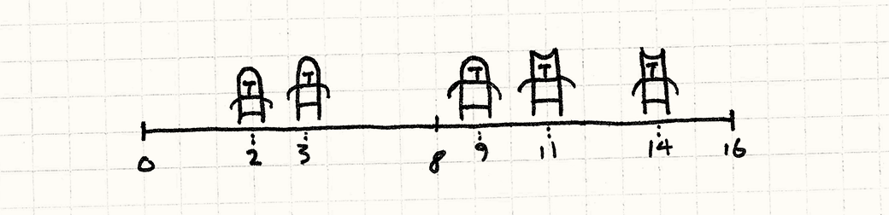
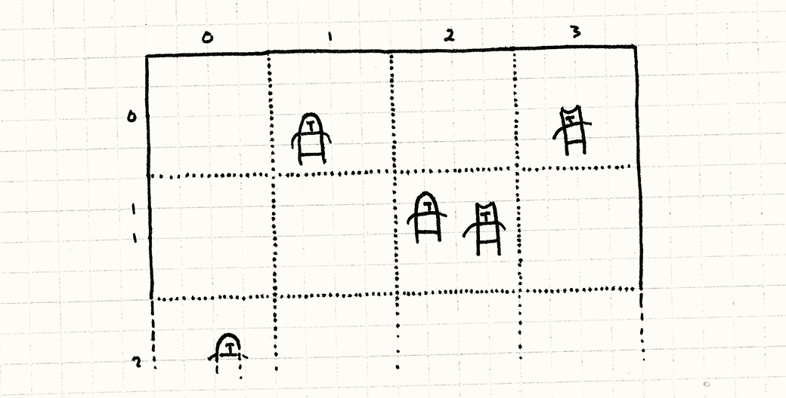
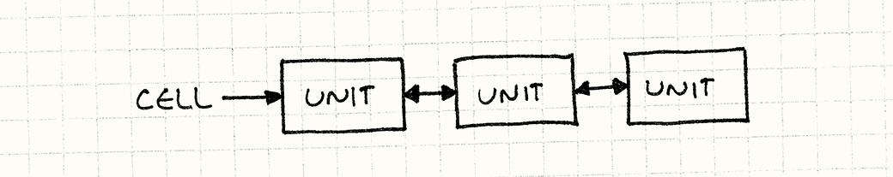
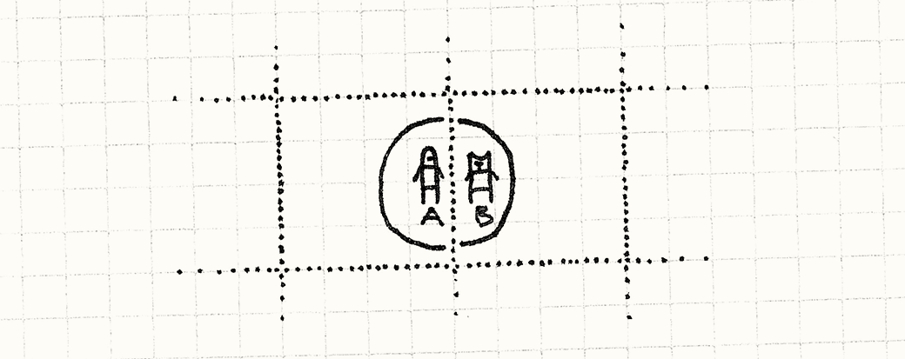
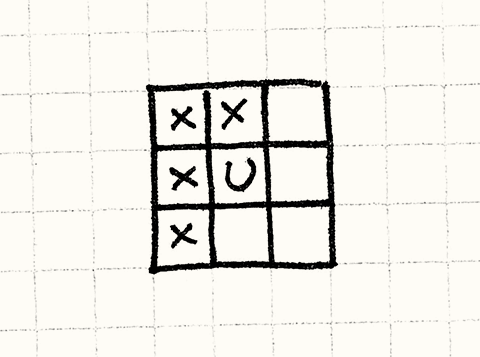
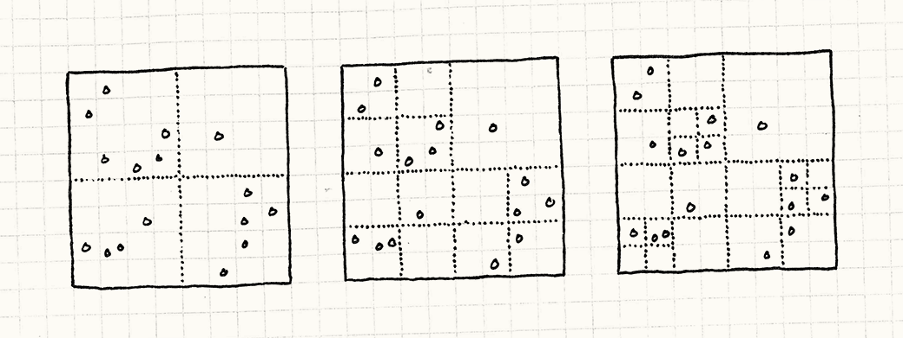

# Пространственное разбиение

## Задача

*Эффективный поиск находящихся рядом объектов с помощью сохранения их в структуре данных с организацией на основе их местоположения.*

## Мотивация

Игры дают нам возможность посещать другие миры, но зачастую эти миры не сильно отличаются от нашего. У них схожие с нашим миром физические законы и осязаемость. Именно поэтому мы можем так свободно себя в них чувствовать, несмотря на образующие их биты и пиксели.

Один из аспектов фальшивой реальности, на котором я хочу заострить внимание — это *позиция* (*location*). Игровой мир дает ощущение пространства и объекты находятся где-то в этом *пространстве*. Это декларируется множеством способов. Очевиднее всего физика — объекты движутся, сталкиваются и взаимодействуют. Но есть и другие примеры. Аудио движок тоже должен принимать во внимание расположение источников звука по отношению к игроку, потому что издалека слышимый звук должен быть тише. Сетевая часть может ограничиваться находящимися рядом игроками.

Это значит что вашей игре часто требуется отвечать на вопрос: "Что за объекты находятся рядом?". Если, чтобы ответить на это вопрос, придется тратить слишком много времени на каждом кадре, такой поиск станет узким местом производительности нашей игры.

### Боевые единицы на поле боя

Пускай мы делаем стратегию реального времени. Противоборствующие армии из сотен юнитов сталкиваются друг с другом на поле боя. Воинам нужно понимать, кого из находящихся рядом противников рубить мечом. Самым примитивным способом это узнать, будет перебор всех пар юнитов и проверка расстояния между ними:

```C++
void handleMelee(Unit* units[], int numUnits)
{
  for (int a = 0; a < numUnits — 1; a++) {
    for (int b = a + 1; b < numUnits; b++) {
      if (units[a]->position() == units[b]->position()) {
        handleAttack(units[a], units[b]);
      }
    }
  }
}
```

У нас получился цикл с двойным вложением, обходящий на каждом из циклов все юниты на поле боя. Это значит, что нам придется выполнить количество проверок, равное *квадрату* количества юнитов. Каждый дополнительный юнит придется сравнивать со *всеми* уже существующими. Когда юнитов будет достаточно много, такое решение выйдет из под контроля.

> Внутренний цикл на самом деле не проходит все юниты. Он обходит только тех, кого еще не посетил внешний цикл. Таким образом, мы исключаем повторное сравнение юнитов и сравнение юнитов самих с собой. Если мы уже обработали коллизию между `A` и `B`, нам не нужно проверять ее между `B` и `A`.

> В нотации `Большой O` такой алгоритм все равно остается со сложностью *O(n&sup2;)*.


### Отрисовка боевых линий

Проблема, с которой мы столкнулись, заключается в том, что в основе расположения юнитов в массиве не заложено никакого порядка. Чтобы найти юнитов возле какого-то определенного места, нам нужно обойти весь массив. Давайте немного упростим себе задачу и упростим нашу игру. Пускай вместо `2D` *поля* боя у нас будет `1D` *линия* боя.




В таком случае, мы можем упростить себе задачу, *отсортировав* массив юнитов по их позиции на линии боя. Как только мы это сделаем, мы сможем использовать что-то наподобие [бинарного поиска](http://en.wikipedia.org/wiki/Binary_search) для обнаружения соседних юнитов без необходимости сканировать весь массив.

> Сложность бинарного поиска составляет *O(log n)*. А это значит, что сложность поиска среди сражающихся юнитов снизилась с *O(n²)* до *O(log n)*. Если применить *поиск со списком* ([pigeonhole sort](http://en.wikipedia.org/wiki/Pigeonhole_sort)), ее можно снизить вообще до *O(n)*.


Думаю, урок очевиден: если мы будем хранить свои объекты в структуре данных, оптимизированной по их местоположению, мы сможем искать их гораздо быстрее. Шаблон занимается тем, что применяет эту идею к пространствам с большим чем единица количеством измерений.

## Шаблон

Есть набор **объектов**, каждый из которых обладает **позицией в пространстве**. Сохраняем объекты в **пространственной структуре данных**, организованной на основе их позиций. Эта структура данных позволяет вам **эффективно запрашивать объекты, находящиеся возле указанной позиции**. Когда позиция объекта изменяется, **обновляем позиционную структуру данных** и поиск можно продолжать.

## Когда использовать

Этот шаблон часто используется для хранения как живых, подвижных объектов, так и статичных декораций и геометрии игрового мира. Сложные игры обычно имеют сразу несколько структур пространственного разбиения для различных типов содержимого.

Базовым требованием для этого шаблона является наличие набора объектов, каждый из которых обладает подобием позиции и вам приходится выполнять много запросов для поиска этих объектов, от чего может пострадать производительность вашей игры.

## Имейте в виду

Пространственное разбиение существует для того, чтобы заменить операции со сложностью *O(n)* или *O(n²)* на что-то более простое. Чем *больше* у вас объектов, тем полезнее такое решение. И наоборот, если `n` достаточно малое — связываться с такими вещами не стоит.

Так как этот шаблон предполагает организацию объектов по их местоположению, с объектами, которые *меняют* свою позицию, работать тяжелее. Вам нужно будет реорганизовывать структуру данных, чтобы отслеживать объекты на новых позициях, что в свою очередь добавляет сложности *и* требует траты процессорного времени. Так что убедитесь в том, что затраты окупятся.

> Представьте себе хэш-таблицу, в которой ключи хэшированных объектов могут произвольно меняться и вы сможете себе представить, как это сложно.


Пространственное разбиение требует и дополнительной памяти для хранения структуры данных. Подобно другим оптимизациям, это компромисс между использованием памяти и скоростью выполнения. 

## Пример кода

Сущность шаблонов крайне *переменчива*: каждая реализация может добавлять что-то свое и пространственное разделение не является исключением. В отличие от других шаблонов, многие вариации этого шаблона подробно задокументированы. Академики обожают публиковать статьи, доказывающие их эффективность. Так как я хочу показать вам всего лишь общую концепцию шаблона, я покажу вам простейший пример пространственного разбиения: *фиксированную сетку*.

> Список наиболее часто используемых в играх разновидностей пространственного разбиения вы сможете найти в конце данной главы.

### Листок бумаги в клетку

Вот базовая идея: представьте себе все поле боя целиком. А теперь наложите на него сетку с фиксированным размером ячеек, наподобие тетрадного листка в клетку. Вместо хранения юнитов в одном массиве, мы будем помещать их в ячейки сетки. Каждая клетка будет хранить список юнитов, позиции которых находятся внутри границы клетки.



Когда мы будем обрабатывать сражение, мы будем заботиться только о юнитах, находящихся в одной клетке. Вместо сравнения каждого юнита со всеми остальными юнитами в игре, мы *разбиваем* поле боя на множество более мелких полей боя, на каждом из которых гораздо меньше юнитов.

### Сетка связанных юнитов

Хорошо, перейдем к коду. Для начало немного подготовительной работы. Вот наш базовый класс юнита:

```C++
class Unit
{
  friend class Grid;

public:
  Unit(Grid* grid, double x, double y)
    : grid_(grid), x_(x), y_(y)
  {}

  void move(double x, double y);

private:
  double x_, y_;
  Grid* grid_;
};
```

У каждого юнита есть позиция (в `2D`) и указатель на `Grid`, в которой он находится. Мы делаем `Grid` `friend` классом, потому что как вы скоро увидите, когда позиция юнита изменяется, ему придется выполнить сложный танец, чтобы сетка могла правильно обновиться.

Вот набросок сетки:

```C++
class Grid
{
public:
  Grid() {
    // Очистка сетки.
    for (int x = 0; x < NUM_CELLS; x++) {
      for (int y = 0; y < NUM_CELLS; y++) {
        cells_[x][y] = NULL;
      }
    }
  }

  static const int NUM_CELLS = 10;
  static const int CELL_SIZE = 20;
private:
  Unit* cells_[NUM_CELLS][NUM_CELLS];
};
```

Обратите внимание, что каждая ячейка — это просто указатель на юнит. Теперь мы дополним `Unit` указателями `next` и `prev`:

```C++
class Unit
{
  // Предыдущий код...
private:
  Unit* prev_;
  Unit* next_;
};
```

Это даст нам возможность организовывать юниты в [двусвязный список](http://en.wikipedia.org/wiki/Doubly_linked_list) вместо массива.



Каждая ячейка в сетке указывает на первый юнит в списке юнитов данной ячейки и каждый из юнитов указывает на юнит, находящийся в списке перед ним и за ним. И скоро мы увидим для чего это нам нужно.

> На протяжении всей книги я избегал использования встроенных типов коллекций стандартной библиотеки `C++`. Я хотел минимизировать необходимые для понимания примеров в книге знания и как честный маг "ничего не прячущий в рукаве" сделать код *максимально* понятным. Дело ведь в деталях, особенно когда речь идет о паттернах, связанных с производительностью.

> Но такой выбор я сделал исключительно для *демонстрации* шаблонов. Когда вы будете *использовать* их в реальном коде, избавьте себя от лишней головной боли и используйте удобные коллекции, встроенные практически во все современны языки программирования. Жизнь слишком коротка, чтобы тратить ее на программирование с нуля связанных списков.

### Выходим на поле боя

Первое, что нам нужно сделать — это удостовериться, что новые юниты попадают в нашу сетку при создании. Пусть это делает `Unit` в своем конструкторе:

```C++
Unit::Unit(Grid* grid, double x, double y)
  : grid_(grid), x_(x), y_(y)
  , prev_(NULL), next_(NULL)
{
  grid_->add(this);
}
```

Метод `add()` определяется таким образом:

```C++
void Grid::add(Unit* unit)
{
  // Определяем в какой ячейке сетки мы находимся.
  int cellX = (int)(unit->x_ / Grid::CELL_SIZE);
  int cellY = (int)(unit->y_ / Grid::CELL_SIZE);

  // Добавляем в начало списка найденной ячейки.
  unit->prev_ = NULL;
  unit->next_ = cells_[cellX][cellY];
  cells_[cellX][cellY] = unit;

  if (unit->next_ != NULL) {
    unit->next_->prev_ = unit;
  }
}
```

> С помощью деления на размер ячейки мы преобразуем мировые координаты в координаты в пространстве ячеек. И, приводя результат к `int` и отбрасывая дробную часть, мы получаем индекс ячейки.

Деталей многовато, как и в коде со связанным списком выше, но базовая идея простая. Мы ищем ячейку, в которой сидит юнит и потом добавляем его в начало списка ячейки. Если там уже есть список юнитов, мы ставим его после нового юнита.

### Звон мечей

Как только все юниты размещены в своих ячейках, мы можем позволить им атаковать друг друга. С использованием новой сетки, главный метод обработки боя будет выглядеть таким образом:

```C++
void Grid::handleMelee()
{
  for (int y = 0; y < NUM_CELLS; y++) {
    for (int x = 0; x < NUM_CELLS; x++) {
      handleCell(cells_[x][y]);
    }
  }
}
```

Он обходит каждую клетку и затем вызывает для нее `handleCell()`. Как вы видите, мы уже разбили пространство поля боя на маленькие изолированные схватки. Каждая ячейка обрабатывает бой таким образом:

```C++
void Grid::handleCell(Unit* unit)
{
  while (unit != NULL) {
    Unit* other = unit->next_;
    while (other != NULL) {
      if (unit->x_ == other->x_ &&
        unit->y_ == other->y_)
      {
        handleAttack(unit, other);
      }
      other = other->next_;
    }

    unit = unit->next_;
  }
}
```

Посмотрите, что мы проделываем с указателем на связанный список и обратите внимание, что это практически тоже самое, что и наш примитивный метод обработки боя: он сравнивает каждую пару юнитов и проверяет, находятся ли они в одной позиции.

Единственное различие заключается в том, что нам теперь не нужно сравнивать между собой *все* юниты, принимающие участие в битве, а только те из них, что находятся в одной клетке. Вот в чем заключается оптимизация.

> На первый взгляд может показаться, что мы только ухудшили производительность. Мы перешли от цикла обхода юнитов с двойным вложением к циклу с тройным вложением, который обходит сначала ячейки, а потом юниты. Хитрость здесь заключается в том, что два вложенных цикла теперь работают со сравнительно малым количеством юнитов, что полностью окупает появление дополнительного цикла обхода ячеек.

> Однако, это всё еще зависит и от дробности ячеек: если они будут слишком мелкими, влияние внешнего цикла станет более заметным.

### Идем в атаку

Мы решили нашу проблему с производительностью, но создали себе новую проблему. Юниты застряли в своих ячейках. Если мы переместим юнит за границы ячейки, в которой они находятся, юниты в ячейке его больше не увидят, как и никто другой. Наше поле боя получилось *слишком* разбитым.

Чтобы это исправить, нам нужно делать небольшую работу каждый раз, когда юнит двигается. Если он пересекает линии границ ячеек, нам нужно удалить его из одной ячейки и перенести в другую. Для начала мы добавим в `Unit` метод для изменения позиции:

```C++
void Unit::move(double x, double y)
{
  grid_->move(this, x, y);
}
```

Предположительно, он будет вызываться кодом `AI` для управляемых компьютером юнитов и обработчиком пользовательского ввода для юнита игрока. Все, что он делает — это передает управление сетке, которая в свою очередь делает вот что:

```C++
void Grid::move(Unit* unit, double x, double y)
{
  // Смотрим в какой ячейке находимся.
  int oldCellX = (int)(unit->x_ / Grid::CELL_SIZE);
  int oldCellY = (int)(unit->y_ / Grid::CELL_SIZE);
  
  // Смотрим в какую ячейку перемещаемся.
  int cellX = (int)(x / Grid::CELL_SIZE);
  int cellY = (int)(y / Grid::CELL_SIZE);
  
  unit->x_ = x;
  unit->y_ = y;
```
```C++
  // если ячейка не меняется =- мы закончили
  if (oldCellX == cellX && oldCellY == cellY) return;
  
  // Убираем юнит из списка старой ячейки.
  if (unit->prev_ != NULL) {
    unit->prev_->next_ = unit->next_;
  }
  if (unit->next_ != NULL) {
    unit->next_->prev_ = unit->prev_;
  }
  
  // Если это голова списка — удаляем ее.
  if (cells_[oldCellX][oldCellY] == unit) {
    cells_[oldCellX][oldCellY] = unit->next_;
  }
  
  // Добавление обратно в сетку в новую ячейку.
  add(unit);
}
```

Довольно много кода, но ничего сложного в нем нет. Первая часть проверяет, пересекали ли мы вообще границу ячейки. Если нет — мы можем ограничиться просто обновлением позиции юнита.

Если юнит *покинул* текущую ячейку, мы удаляем его из списка этой ячейки и добавляем обратно в сетку. Как будто мы добавляем новый юнит, мы вставляем юнит в связанный список новой ячейки.

Вот поэтому мы и будем использовать двухсвязный список: мы можем легко добавлять и удалят юниты из списка, переназначая всего несколько указателей. Когда у нас за кадр будет двигаться много юнитов — это важно.

### На расстоянии вытянутой руки

Выглядит просто, но все-таки я немного смухлевал. В примере, который я вам показал, юниты взаимодействуют только тогда, когда находятся *в одной и той же* позиции. Для шахмат и шашек это нормально, но не очень подходит для более реалистичных игр. Поэтому нам обычно придется учитывать *дистанцию* атаки.

В этом случае шаблон все равно работает. Вместо простой проверки равенства позиций, мы будем использовать нечто наподобие:

```C++
if (distance(unit, other) < ATTACK_DISTANCE) {
  handleAttack(unit, other);
}
```

Теперь, когда в дело вступает дистанция, нам нужно подумать о крайних случаях: юниты в разных ячейках могут быть все равно достаточно близки для того чтобы взаимодействовать.




Здесь `B` находится в радиусе атаки `A`, несмотря на то, что их центральные точки находятся в разных ячейках. Для обработки этого нам нужно сравнивать не только находящиеся в одной ячейке юниты, но и юниты в соседних ячейках. Для этого мы начнем с разделения внутреннего цикла `handleCell()`:

```C++
void Grid::handleUnit(Unit* unit, Unit* other)
{
  while (other != NULL) {
    if (distance(unit, other) < ATTACK_DISTANCE) {
      handleAttack(unit, other);
    }

    other = other->next_;
  }
}
```

Теперь у нас есть функция, которая берет один юнит и список других юнитов и проверяет их пересечение. Дальше мы изменяем handleCell() таким образом:

```C++
void Grid::handleCell(int x, int y)
{
  Unit* unit = cells_[x][y];
  while (unit != NULL) {
    // Обработка остальных юнитов в ячейке.
    handleUnit(unit, unit->next_);

    unit = unit->next_;
  }
}
```

Обратите внимание, что теперь мы передаем внутрь координаты ячейки, а не просто ее список юнитов. Пока что никаких особых отличий от предыдущего примера нет, но мы его немного расширим:

```C++
void Grid::handleCell(int x, int y)
{
  Unit* unit = cells_[x][y];
  while (unit != NULL) {
    // Обработка остальных юнитов в ячейке.
    handleUnit(unit, unit->next_);

    // Теперь пробуем соседние ячейки.
    if (x > 0 && y > 0) handleUnit(unit, cells_[x — 1][y — 1]);
    if (x > 0) handleUnit(unit, cells_[x — 1][y]);
    if (y > 0) handleUnit(unit, cells_[x][y — 1]);
    if (x > 0 && y < NUM_CELLS — 1) {
      handleUnit(unit, cells_[x — 1][y + 1]);
    }
  
    unit = unit->next_;
  }
}
```

Этот дополнительный вызов `handleUnit()` проверяет столкновения между текущим юнитом и юнитами из восьми соседних ячеек. Если любой юнит в этих соседних ячейках находится достаточно близко к границе, чтобы попасть в радиус атаки юнита, пересечение засчитывается.

> Ячейка с юнитом обозначена как `U`, а соседние ячейки как `X`.



Мы осматриваем только *половину* соседских ячеек, потому что внутренний цикл начинается *после* текущего юнита, чтобы избежать сравнение каждой пары дважды. Представьте, что произойдет, если мы начнем проверять все восемь соседних ячеек.

Представим, что у нас есть два юнита в соседних ячейках, находящиеся на расстоянии удара друг от друга как в предыдущем примере. Если для каждого юнита мы будем осматривать все восемь окружающих ячеек, произойдет вот что:

1. Когда мы нашли столкновения для `A`, мы рассмотрим соседей справа и найдем там `B`. Таким образом мы зарегистрируем бой между `A` и `B`.

2. Далее, когда мы находим столкновения для `B`, мы смотрим на соседей *слева* и находим там `A`. И регистрируем бой между `A` и `B` *второй* раз.

Исправить это можно, если просматривать только половину соседних клеток. *Какую* половину рассматривать — не имеет никакого значения.

Есть еще один граничный случай, о котором нам нужно позаботиться. При этом мы предполагаем, что радиус атаки меньше размера ячейки. Если у нас есть мелкие ячейки и большой радиус атаки, нам придется сканировать гораздо больше ячеек.

## Архитектурные решения

Существует сравнительно небольшой список хорошо описанных структур данных разбиения пространства и можно было бы просто их перечислить. Но вместо этого я хочу попробовать организовать их по их основным характеристикам. Надеюсь после того, как вы узнаете про дерево квадрантов ([quadtrees](http://en.wikipedia.org/wiki/Quad_tree)), *двоичное разбиение пространства* ([binary space partitions, BSP](https://en.wikipedia.org/wiki/Binary_space_partitioning)) и прочие, это поможет вам понять, *как* и *почему* стоит выбирать именно их.

### Иерархическое или плоское разбиение?

Наш пример разбивает пространства на плоский набор отдельных ячеек. И наоборот, иерархическое пространственное разбиение делит пространство всего на несколько областей. Дальше, если одна из этих областей по прежнему содержит много объектов, она тоже в свою очередь разбивается. Этот процесс продолжается рекурсивно, до тех пор, пока в каждой области не окажется меньше объектов, чем установленный нами максимум.

> Обычно разбиение выполняется на две, четыре, восемь частей — любимые в программировании круглые числа.

**1. Если это плоское разбиение:** 

* *Это просто.* Плоские структуры данных проще для понимания и для реализации.

    > Об этом я говорил, и говорю практически в каждой главе: выбирайте по возможности самые простые решения. Одна из задач программирования — это борьба со сложностью.

* *Константное использование памяти.* Так как при добавлении новых объектов не нужно выполнять дополнительное разбиение, используемое пространственным разбиением количество памяти со временем не меняется.

* *Его проще обновлять, когда объект изменяет позицию.* Когда объект движется, структуру данных нужно обновить, чтобы найти объект в их новой позиции. Если вы будете использовать иерархическое разбиение пространства, для этого потребуется изменять несколько слоев иерархии.

**2. Если оно иерархическое:** 

* *Пустое пространство обрабатывается эффективнее.* Вспомните наш первый пример и представьте, что половина поля боя у нас пустая. У нас будет множество пустых ячеек, для которых все равно выделяется память и которые все равно нужно будет проверять на каждом кадре. 

    Так как иерархическое разбиение пространства не разбивает разряженное пространство, большие пустые пространства попадут в одну область. Вместо множества маленьких областей нам придется обходить несколько больших.

* *Плотно населенные пространства тоже обрабатываются эффективнее.* Это другая сторона медали: если у вас есть много объектов, скученных в одном месте, неиерархическое разбиение может оказаться неэффективным. Вы рискуете обнаружить, что в одних областях у вас находится куча объектов, а другие совсем пустые. Иерархическое разбиение адаптивно разобьет их на более мелкие области и вам снова придется иметь дело всего с несколькими объектами за раз.

### Зависит ли разбиение от набора объектов?

В нашем примере кода сетка была создана предварительно и только после этого юниты были помещены в ее слоты. Другие схемы разбиения пространства работают адаптивно: они выбирают границы областей на основе реального набора объектов и их расположения в мире.

Смысл заключается в *сбалансированном* разбиении, когда в каждой области содержится примерно одинаковое количество объектов для получения лучшей производительности. Представьте, что случится, если в нашем первом примере все юниты скучкуются в одном углу поля боя. Они все окажутся в одной ячейке, и наш код поиска столкновений снова вернется к изначальной проблеме *O(n²)* сложности, которую мы и хотели решить.


**1. Если разбиение не зависит от объектов:**

* *Объекты можно добавлять инкрементно.* Добавление объекта означает поиск нужной области и помещение его туда. Поэтому объекты можно добавлять по одному без всяких последствий для производительности.

* *Объекты можно быстро перемещать.* Когда разбиение фиксировано, перемещение юнита означает удаление из одной области и добавление в другую. Если в зависимости от набора объектов изменяются сами границы областей, перемещение хотя бы одного объекта может привести к изменению границ, что в свою очередь может привести к необходимости переноса еще многих объектов. 
> Это прямая аналогия с деревьями бинарного поиска (binary search trees) типа красно-черных деревьев (red-black trees) или АВЛ деревьями (AVL trees): когда вам нужно добавить один элемент, вы можете закончить тем, что вам потребуется пересортировать все дерево и посмещать еще кучу узлов.

* *Разбиение может быть несбалансированным.* Очевидным недостатком такого разбиения является то, что оно эффективно, только когда ваши объекты распределены более-менее равномерно. Если объекты сосредоточены в одном месте, у вас начнутся проблемы с производительностью, и вы будете впустую тратить память на пустые пространства.

**2. Если разбиения адаптируются к набору объектов:**

Пространственное разбиение типа `BSP` и `k-мерных` деревьев (k-d trees) делит пространство рекурсивно на половинки таким образом, чтобы в каждую попадало примерно одинаковое количество объектов. Для этого вам придется подсчитывать сколько объектов попадет в каждую из областей, и выбирать подходящую плоскость в качестве границы. Иерархия ограничивающих объемов (Bounding volume hierarchie) — это еще один тип пространственного разделения, оптимизированный для специфических наборов объектов в мире.

* *Вы можете быть уверенными, что разбиение сбалансировано.* Мы получаем не слишком хорошую, но зато *стабильную* производительность: если в каждой области примерно одинаковое количество объектов, вы можете рассчитывать на то, что все запросы в мире будут выполняться с примерно одинаковой скоростью. Когда вам нужно поддерживать стабильную частоту кадров, такое постоянство может быть поважнее чистой производительности.

* *Выгоднее выполнять разделение пространства для всего набора объектов целиком.* Когда набор объектов влияет на границы между объектами, лучше сначала получить полный набор объектов и только затем выполнять разделение. Вот почему такое разделение пространства лучше подходит для статичной геометрии, которая остается постоянно на протяжении всей игры.

**3. Если разбиение не зависит от объектов, а *иерархия* зависит:**

Этот тип разбиения пространства стоит особого упоминания потому, что он объединяет лучшие черты фиксированного разбиения и адаптивного: квадратичные деревья (quadtree).

> Квадратичное дерево разделяет `2D` пространство. В `3D` его аналогом является *октадерево* (octree): он берет *объем* и делит его на восемь *кубов*. За исключением одного дополнительного измерения, работает также, как и плоский родственник.

Квад-дерево начинает с одной области, занимающей все пространство. Если количество объектов в области превышает заданный порог, она делится на четыре меньших квадрата. *Границы* этих квадратов фиксированы: они всегда делят пространство на равные части.

Далее, мы повторяем тот же самый процесс для всех четырех получившихся квадратов, до тех пор, пока во всех квадратах не окажется сравнительно небольшое количество объектов. Так как мы рекурсивно делим только наиболее населенные квадраты, разбиение адаптируется под набор объектов, но границы разбиения не *смещаются*.

На рисунке ниже слева направо показан пример работы такого разбиения:



* *Объекты можно добавлять инкрементно.* Добавление новых объектов означает поиск нужного квадрата и добавление объекта в него. Если после этого количество объектов в квадрате превышает максимум, он делится еще на четыре. Другие объекты в квадрате переносятся в четыре квадрата меньшего размера. Для этого нужно приложить некоторые усилия, но их количество *фиксировано*: количество объектов, которые нужно будет переместить, всегда будет меньше, чем общее количество. Добавление одного объекта никогда не вызовет больше одного дополнительного разделения. 

    Удалять объект также просто. Вы удаляете объект из квадрата и, если количество объектов в родительском квадрате теперь меньше заданного порога, мы избавляемся от дочернего разделения. 

* *Объекты быстрее удаляются.* Это следует из предыдущего пункта. "Перемещение" объекта — просто удаление и добавление, что работает в квад-деревьях с вполне приемлемой скоростью.

* *Разделение сбалансировано.* Так как в каждом из квадратов разбиения объектов меньше, чем некий установленный предел, даже если объекты скучены в одном месте, вам не потребуется иметь области с большим количеством объектов внутри.

### Хранятся ли объекты только в областях?

Вы можете считать разделение пространства тем *местом*, где живут объекты игры, или можете считать его всего лишь дополнительным кэшем, для ускорения поиска, тогда как сами объекты хранятся в другом списке объектов.

**1. Если это единственное место, где хранятся объекты:**

* *Таким образом мы избегаем дополнительного расхода памяти и сложностей поддержания двух коллекций.* Конечно, всегда проще хранить объекты в одном месте, чем в нескольких. Кроме этого, если у вас есть две коллекции, вам нужно следить за их синхронизацией. Каждый раз, когда объект создается или уничтожается, он должен добавляться или удаляться из обеих коллекций.

**2. Если для объектов есть еще одна коллекция:**

* *Обход объектов выполняется быстрее.* Если наши объекты "живые" и требуют обработки, вы можете обнаружить, что вам нужно будет часто посещать объекты вне зависимости от их местонахождения. Представьте, что в нашем первом примере большинство ячеек пустое. Поэтому обход всех ячеек будет просто пустой тратой времени. 

    Вторая коллекция просто хранит все объекты и позволяет вам выполнять их обход напрямую. У вас будет две структуры данных, каждая из которых оптимизирована под каждый случай.

## Смотрите также

* Я старался не обсуждать специфические детали структур разбиения пространства, чтобы оставить главу достаточно высокоуровневой (и не слишком длинной!), но дальше вам придется изучать эти структуры самостоятельно. Несмотря на устрашающие названия, все они довольно прямолинейны. Вот наиболее распространенные:

    * Сетка ([Grid](http://en.wikipedia.org/wiki/Grid_(spatial_index)))
    * [Квад-дерево](http://ru.wikipedia.org/wiki/Дерево_квадрантов) ([Quadtree](http://en.wikipedia.org/wiki/Quad_tree))
    * [Двоичное разбиение пространства](http://ru.wikipedia.org/wiki/Двоичное_разбиение_пространства) ([BSP](http://en.wikipedia.org/wiki/Binary_space_partitioning))
    * [K-мерное дерево](http://ru.wikipedia.org/wiki/K-мерное_дерево) ([k-d tree](http://en.wikipedia.org/wiki/Kd-tree))
    * Иерархия ограниченных объемов ([Bounding volume hierarchy](http://en.wikipedia.org/wiki/Bounding_volume_hierarchy))

* Каждая из этих структур данных для разбиения пространства чаще всего адаптирует идею хорошо известных структур для одномерного пространства на большее количество измерений. Знание их линейных родственников поможет вам легче понять как они могут решить вашу проблему:

    * Сетка — это разновидность блочной сортировки ([bucket sort](http://en.wikipedia.org/wiki/Bucket_sort)).
    * BSP, k-мерное дерево (k-d tree) и иерархия ограниченных объемов (Bounding volume hierarchy) — это разновидность бинарных деревьев поиска ([binary search trees](http://en.wikipedia.org/wiki/Binary_search_tree)).
    * Квад-деревья и окта-деревья — это просто деревья ([tries](http://en.wikipedia.org/wiki/Trie)).
    
